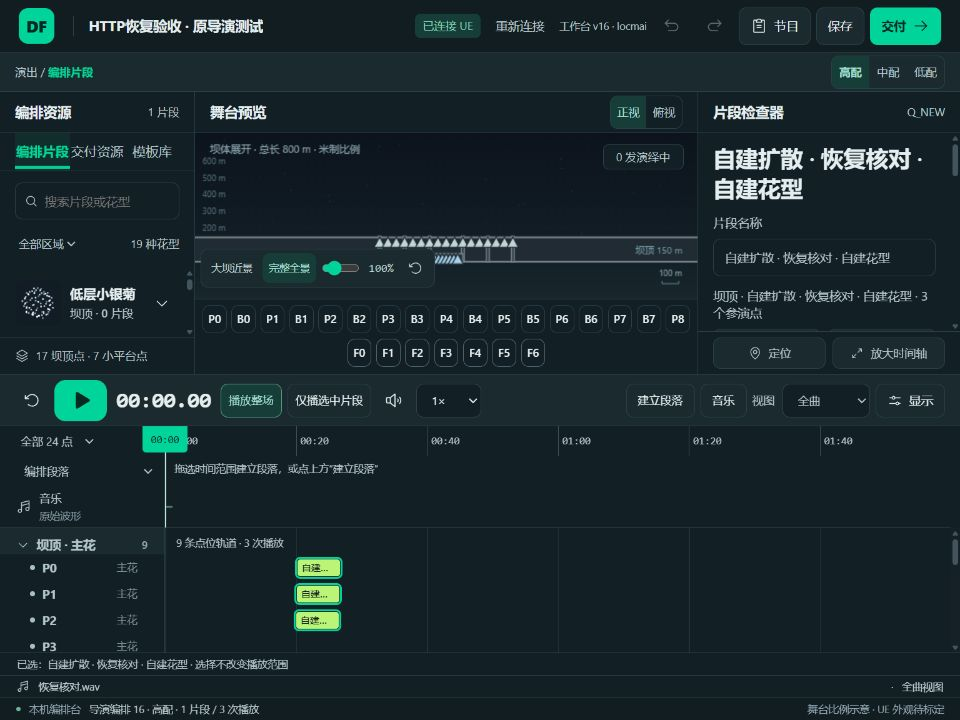
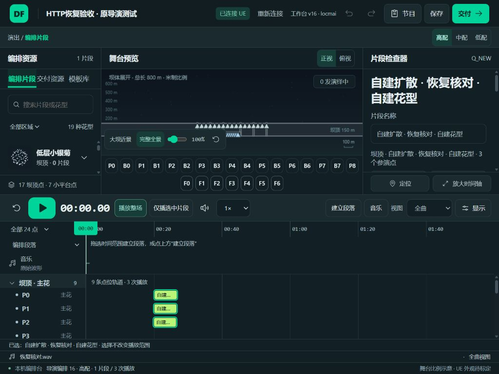
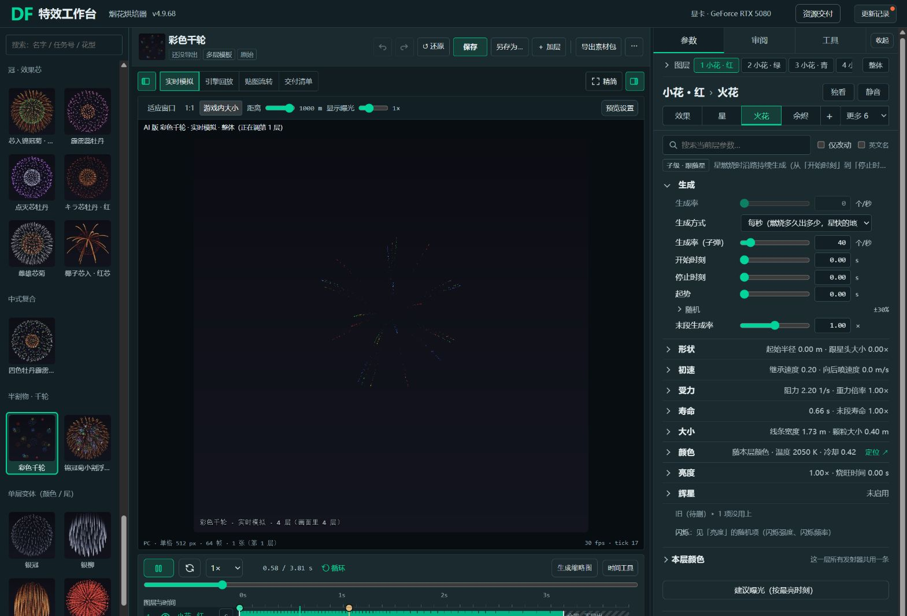

# HTTP恢复与原导演交付验收

2026-10-10，编排demo（24）。按用户最新要求，只走查HTTP，沿用原导演测试；不复制导演，不上传UE资产。限定自检完成，用户艺术验收未代签。

## 实际通过

| 项目 | 证据与结果 |
| --- | --- |
| 8034共源 | 实际HTML与tool/FireworkBaker.html及4个data响应逐字节一致，既有来源核对继续有效；本轮未改它们 |
| 8034实页 | 彩色千轮4层：暂停、时间轴Home/End到0/3.81秒、独看第2层只显示1层、恢复整体4层与重播；资源交付进入既有PC/手机包清单后返回。未调整或保存正式参数、未执行资源导入 |
| 实际HTTP保存 | 8025/release/?qa=http-acceptance-20261010独立草稿打开个人恢复测试dfshow，改名“HTTP恢复验收 · 原导演测试”，保存刷新后名称、1片段、19花型、4编排模板、固定引用及音乐恢复 |
| 三档与时间轴 | 页面高/中/低为3/2/1次播放；播放头Home/End到0/120秒；模板固定引用保留；当前完整备份只读文本落盘核对 |
| 音乐与空白 | 创建空白节目0片段/无段落/无音乐，撤销恢复；移除音乐保持片段时刻，导入恢复核对.wav、保存刷新后恢复，不自动创建段落 |
| 限定布局 | 编排1024×768截图直接审看，document宽度与scrollWidth均1024；舞台/右栏/轨道可见，默认视口已恢复。烘焙器截图为原默认1569宽度，不冒称1024检查 |
| UE实际导入 | 原Blueprint高/中/低三表分别实际写入、读回、保存；每档1子模板/1模板/1时序槽，模板Entries分别3/2/1，时长120秒，非特效字段逐项与备份一致 |
| UE限定实播 | 原关卡实例高配实际导入后，点击原生Debug Preview Show。日志CollectPoints有36效果点+1音频点，InitShowTick EffectEntries=6；3束Trail_Small和3次GreenPeony实际PlayEffect，逐点约0.1秒，球花晚尾缀约3.5秒 |
| 恢复 | 原生Debug Stop Show日志“预览已停止”；原Blueprint与关卡实例完整DefaultConfig均读回等于加载后备份，17子模板/43模板/3组/220.810806秒。Blueprint恢复保存返回True；未保存测试关卡、未创建导演 |

## 真实播放记录

| 时间（本机UE日志） | 资源 | 数量 |
| --- | --- | --- |
| 17:58:24.868 / 24.980 / 25.081 | P_EFX_FireWorks_NY_Trail_Small | 3 |
| 17:58:28.362 / 28.483 / 28.593 | P_EFX_FireWorks_GreenPeony | 3 |
| 17:59:06.939 | 原生预览已停止 | 1 |

保留原导演AudioTemplates，所以原音频事件仍由预览启动；测试只替换特效三表与时长。没有用旁边Cascade窗口的独立演示当作编排实播证据，实际主视口未对准效果，未测真实花高/直径。

## 发现与操作提醒

- 修改Blueprint默认配置不会立即替换已有关卡Actor的配置。验证现场播放时在交付“选择导演”明确选择关卡实例；实例导入要求由使用者保存关卡。此次恢复原值后未保存测试关卡，编辑器可能仍保留修改标记，不代表配置仍是测试节目。
- 完整配置恢复过程中，原生文本空数组`()`会被UE生成一个默认结构项。发现后用空数组的空值文本恢复并完整读回一致；生产导入始终只写特效三表和时长，三档导入没有该外部字段变化。临时恢复脚本与完整备份留本机，不变更生产序列化策略。
- UE预览的当前原生按钮可用；旧Typing中的EditorOnly函数名调用返回找不到函数。验收助手仅做只读备份核对，不封装猜测的播放API。
- 烘焙器日志有1条MutationObserver.observe参数非Node错误；当前HTML/data/src未找到MutationObserver来源，未确认是否工具或浏览器注入。已观察的播放、独看、交付功能可用，未宣称整页零错误，未改其他负责人的tool/src。
- 本轮下载等待未取得下载路径。只读完整备份已落盘，真实打开本机节目文件与音乐文件通过；不将可见备份文本等同实际下载文件往返。

## 未完成及边界

1. ResourceFX在UE的真实高度/直径/轨迹标定，尤其小平台；网页名义比例尺不能代替实测。
2. 完整演出的音乐与艺术效果、三档整场播放和性能验收。
3. 完整200%缩放、全流程键盘与真实读屏验收。本轮只做播放头键盘和一个编排窄屏状态。
4. D→F或file→HTTP浏览器个人历史迁移未做；需要时在旧入口下载dfshow，再到新入口打开。旧离线入口继续保留。用户已免测file，本轮不把它列为必验阻塞。

原导演备份和测试读回在本机analysis/local/WORKBENCH_HTTP_20261010，不提交UE资产或整个引擎日志。公开只留精简结果、数据摘要/哈希与HTTP页面截图。生产源码、成品、用户正式节目没有改动，不需要重新打包。

