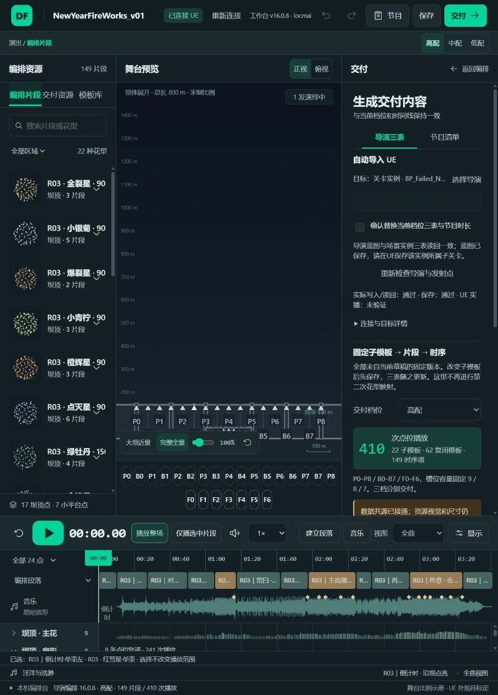

# 导演三表花型命名与实际导入核对

2026-10-10，工作台 v16.0.8；8025 / NewYearFireWorks_v01 / 当前 R03高配。

用户指出的直接问题：父模板内部引用虽然有 Lime，但父模板自身是 WB_R03_C018_P，UE 搜 Lime 时无法看到时序的父模板名称。本轮修改实际生成的名字和引用，解决这个可搜索性问题；不以引用有效代替命名需求。

三表现已统一：

| 子模板 | 父模板示例 | 实际时序引用及节目秒数 |
|---|---|---|
| Lime | Lime_P_C018_01、Lime_P_C056_01 | 16.7、30.6、87.1 |
| Crackle | Crackle_P_C022_01 | 25.0、43.3 |
| GoldCoreLime | GoldCoreLime_P_C033_01、GoldCoreLime_P_C094_01 | 48.4、99.9、140.0、167.0、189.6 |
| GoldChry | GoldChry_P_C039_01、GoldChry_P_C042_01、GoldChry_P_C072_01 | 同名父模板由时序直接引用，完整名称见JSON映射 |

格式为 `花型_区域_首次定义片段编号_同类序号`，例 `Lime_P_C018_01`。去重后的父模板可以被多个时序项复用，保留原有62个父模板及149个调用项。扇形名称按固定束数与方向区分；同花型不同配方不合并，名字冲突使用 V02/V03 后缀。

22个子模板：FanComet、FanSilver5、FanComet5、SilverChry、Strobe、Lime、OrangeGlitter、GoldCrackle、Crackle、FanComet9Left、FanComet9Right、GreenPeony、GoldCoreLime、GoldSpark、FanSilver9Center、GoldRayChry、GoldChry、FanSilver13、MultiLayerChry、PrismWheels、GoldKamuro、SilverStrobeChry。

唯一编译器在去重后原子更新子模板名、父模板名、父模板的子引用、时序的父引用。完整JSON、三张UE属性文本、下载与自动导入共源；交付的 mappingAudit 同步新名字。固定配方内部历史键（例如 NYR03_Lime@1）不是UE三表名字，保持原样以保留版本记录。

验证结果：

- 三档R03三表更新前后，真实两级播放展开完全相等：资源ID、数值、点位、数组顺序和时间不变；输入不被修改；再次命名结果幂等。旧三表完整备份保存在本机 analysis/local/NEWYEAR_V01/naming-original-{tier}.json。
- 8025当前真实交付JSON与高配文件逐数组一致，直接包含上述 Lime/GoldCoreLime 时序名字。
- 从8025的“自动导入 UE”执行；双对象读回均为22子模板/62父模板/149时序项，完整三表及节目时长与实际UI输出一致，其他 DefaultConfig 字段保留。蓝图保存回执通过。
- 正确蓝图为 BP_Failed_NewYearFireworks_ShowDirector_2。场景对应对象的内部实例名仍为 _7、ActorLabel 为 _2，所属完整class精确匹配导演_2；不靠名称尾号关联，不改独立模板BP。
- 140项核心、38项包装、5项Python发布检查通过。仓库成品和F/D固定离线入口同SHA：`20f87e956fc4641bb34c0fbad530b765d92335e2dd8eabe5763964ac38b833de`。

引擎检查阶段短暂连续超时，用户确认UE无弹窗；后续本机只读恢复，8025重新检查通过后才导入。在超时期间没有发送写入或猜测重试。没有据此断言模板数量或卡顿根因。

尚未验证：UE编辑器实际搜索操作、整场实播、保存子关卡后的重载往返及艺术效果。所属场景子关卡需用户在UE保存，本轮没有保存整张关卡，也没有改变工作台布局、示意图、节目原生配方或音乐编排。

完整映射与双目标读回摘要见 [JSON](director-naming-audit.json)。本机原生前后完整快照在 analysis/local/NEWYEAR_V01/naming-fresh-before.json、naming-after.json。实际入口回执：

