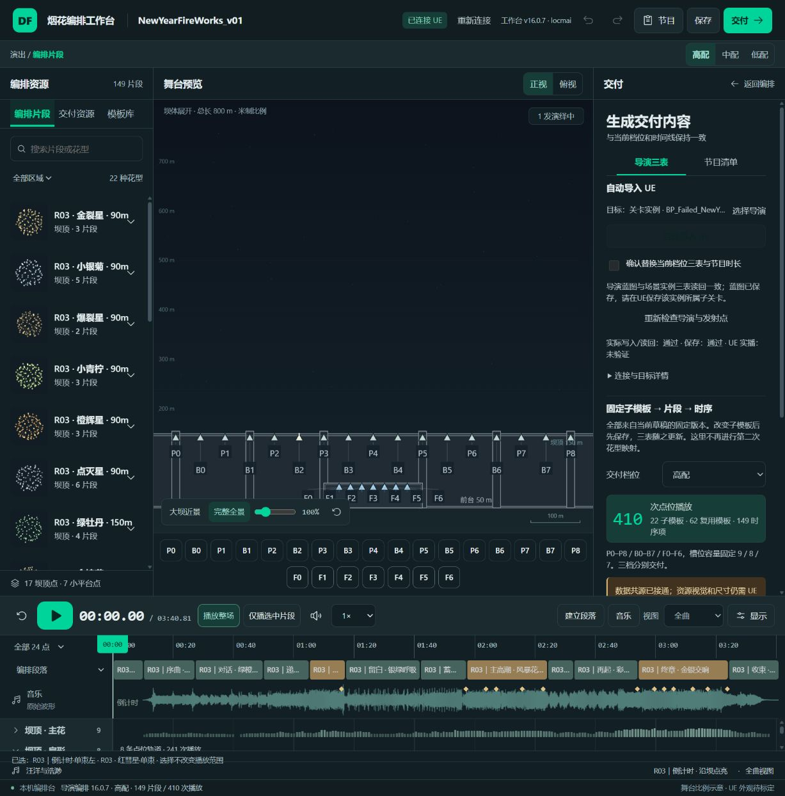

# 导演蓝图默认值漏更新 · v16.0.7证据

2026-10-10，编排demo（24）。用户截图证明打开的导演蓝图仍是旧库；上轮只完整核对场景实例，结论范围不完整。此次已从8025真实交付入口修复蓝图默认值并保存。

| 核对对象 | 修复前：子模板 / 模板 / 时序项 | 修复后 | 与当前R03高配三表完整比较 |
|---|---:|---:|---|
| 导演_2 Blueprint类默认值（CDO） | 17 / 43 / 252 | 22 / 62 / 149 | 一致 |
| 所属正式场景实例（显示名_2，内部名_7） | 22 / 62 / 149 | 22 / 62 / 149 | 一致，整个配置未变 |

原因是旧导入只更新所选对象：选场景实例时蓝图默认值不更新，选蓝图时已加载实例不更新。本次确定的是导演自己的CDO仍旧，并非另一份独立模板库导致。截图中的WB_S00_FanComet与修复前CDO完全对应。

## 原生资源字段核对

核对实际`Entries[].FXResourceId`，不是只看名称或数量。下面三项修复前CDO没有，修复后均存在：

| 子模板 | 球花资源ID | 同模板升空尾缀 |
|---|---|---|
| NYR03_Lime_v1 | P_EFX_FireWorks_Lime | P_EFX_FireWorks_NY_Trail_Small |
| NYR03_Crackle_v1 | P_EFX_FireWorks_Crackle | P_EFX_FireWorks_NY_Trail_Small |
| NYR03_GoldCoreLime_v1 | P_EFX_FireWorks_GoldCoreLime | P_EFX_FireWorks_NY_Trail_Medium |

两端完整三表及节目时长与实际8025生成内容一致，8025内容与磁盘`三表-R03-high.json`一致；当前节目仍R03/149片段/410次高配播放。20个基础ResourceId均进入CDO，外部导演设置完整保留，EffectTickInterval仍0.1秒。各资源对应实时ResourceFX的上一轮逐项证据见[引用核对](resource-reference-audit.md)。

导演Blueprint路径：`/Game/BluePrints/ShowDirector/Instance/Ma5_NewYearFireworks/BP_Failed_NewYearFireworks_ShowDirector_2.BP_Failed_NewYearFireworks_ShowDirector_2`。实例完整路径及两个原生读回结果摘要见[JSON证据](director-pair-import-audit.json)。

## 导入流程修复与真实执行

用引擎完整所属类关联蓝图及实例；既有确认、备份、预检、读回均覆盖两端。多个同类正式实例须选定其中一个，预览世界与不同导演排除。播放中或基线改变阻止写入；正确内容跳过重写。保留原布局、图示、粒子、点位和节目，不覆盖独立`BP_FX_FireWorksShow_Template`。

第一笔真实CDO写请求超过原15秒时限，工作台未重试或猜测回滚。原生读回确认请求已执行，CDO已与R03一致且实例未变；据此修复写入/保存时限为120秒，读取仍15秒。重新从8025检查后，两端已一致，跳过配置重写，仅执行蓝图SaveAsset；实际界面返回保存通过，随后原生完整读回再次通过。

蓝图已保存。工作台提示保存实例所属子关卡，本次未代替用户保存关卡。完整三对象修复前/超时后/保存后快照保留本机`analysis/local/NEWYEAR_V01/blueprint-sync-*.json`，修复前快照可恢复。

8项新回归先复现失败再通过，覆盖双目标关联、并发/播放阻止、传播/不传播、第二端失败恢复、超时后重读跳写、20秒写入/保存；最终发布137核心、38包装、5Python通过，F/D固定离线入口与8025已更新。独立模板BP完整配置未变，R03节目及三表源文件哈希写入JSON。

此次验证的是原生数据与保存回执。没有验证重新加载UE资产后的持久化往返、UE编辑器搜索画面、实际粒子外观、整场播放或性能，也不代替用户验收。关闭再打开导演蓝图可让编辑器重建详情显示；此刷新建议不等于本轮已操作UE编辑器。
