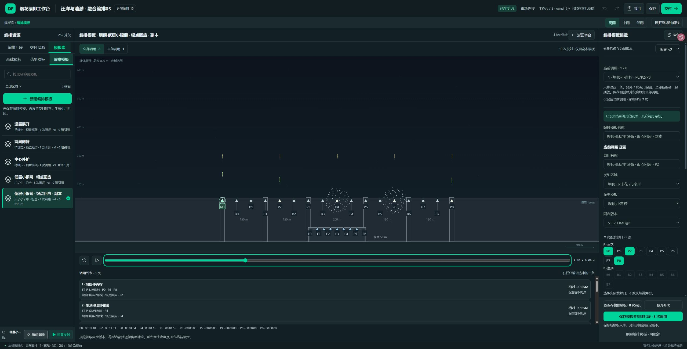
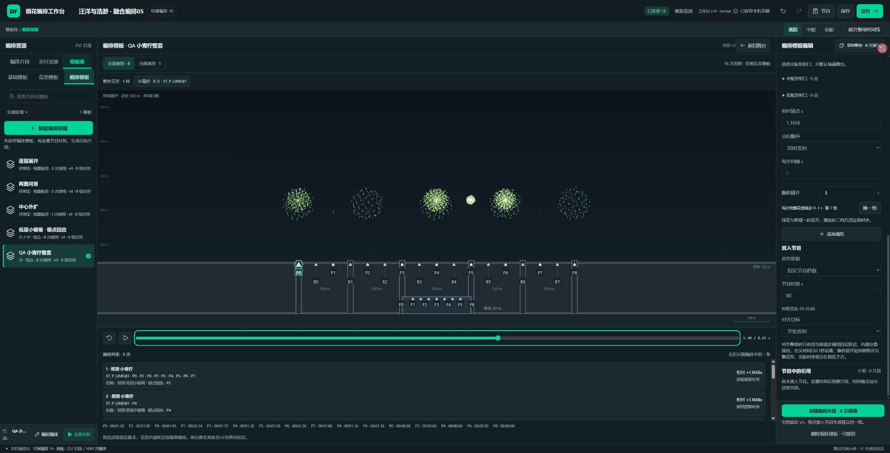
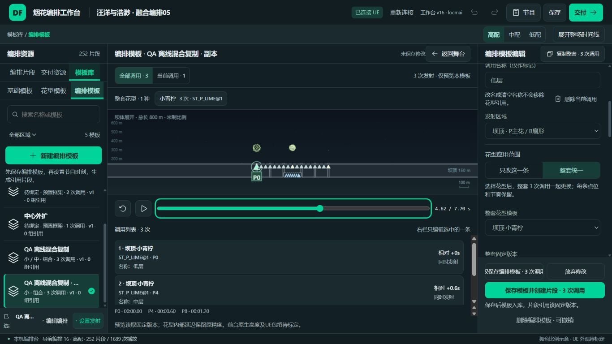

# 整套花型替换与复制引用走查 · v16

上一轮v15区分了当前/全部预览并修了捕获偏移，但没有提供直观的实际整套替换。用户本轮的8调用截图中只有第1条换成小青柠，另外2条低层小银菊和5条金芒菊仍存于复制模板。新建单调用没有这个混淆。调用名称不决定花型绑定，清空名称不会删调用。此次补实际替换与删除入口，不能只藏住另外7条预览后宣称已修。

按Product Design audit先截图再有界走查，writing-plans记录执行。复制明示整套数量，花型旁有「只改这一条 / 整套统一」，混合编排有「整套改用当前花型」快捷操作。画布顶部显示实际花型组成、数量与固定版本，点组成可定位调用；删除当前调用放在名称旁，原保留/恢复入口继续存在。全部预览、保存和创建均使用同一份实际绑定。

## 六步结果

| 步骤 | 实测结果 | 边界 |
| --- | --- | --- |
| 1 复现 | 隔离QA沿用此前8调用混合副本，第一条变小青柠，其余2银/5金继续出现。用户补充从零创建无旧引用与模型一致。 | before图时间2.70，仅作旧混合结构及活动预览证据；不伪称5.5秒球花截图。 |
| 2 整套替换 | 第一条9点、其它7条各1点；整套应用小青柠→8调用/16发，真实绑定全部P_LIME和ST_P_LIME@1；点位、相对时序、三档点集、确定性随机保留。恢复可回到原混合草稿。 | 不自动删除个人旧版；恢复按钮明确恢复整套替换前草稿。 |
| 3 单条、删除和错误 | 只改第2条→7小青柠+1小银菊；只留当前→1，恢复→8；清空名称仍8，删除当前8→7，恢复7→8；放弃恢复已保存小青柠。P点整套换B扇形被原子拒绝，报调用号和点位，没有部分改动。 | 当前范围兼容过滤沿用既有规则；整套任何不兼容不删点位。错误用实际DOM与纯模型核对，早截图03/05取帧不含错误，未作错误视觉证据。 |
| 4 保存和时间轴 | 保存v3→刷新仍8小青柠，v2原混合保持。80秒创建8片段，252/1689→260/1705，固定v3同组8，撤销恢复原节目。 | 刷新不保存会话Undo；旧实例仍固定原版，显式更新才升级。 |
| 5 实际节目文件 | 页面真实下载文件被磁盘解析确认，v3八条全小青柠、252节目片段、旧版仍在；文件含音频因此只在私有QA档案，不新增上传大文件。 | 下载等待超时并重置自动化会话，但实际文件成功。重新导入被扩展文件权限挡住，未绕过，不计通过。 |
| 6 最终HTML与限定布局 | 最终稳定HTML同字节HTTP实页：混合3调用保存后复制整套→全小青柠→保存刷新仍3个固定绑定；全部预览只有小青柠。1366截图已直接审看，控件可达、选中及错误文本有效。 | 1366舞台空间紧凑，比例/艺术外观不是本轮验收；无读屏/200%/移动端认证。直接file先前自动审批拒绝未重试，HTTP不冒充双击。 |

## 真实数据修复规则

replacePatternTemplate深复制当前草稿，先校验所选范围、版本所属花型与全套点位兼容，再一次替换对应templateId/recipeRef。不同花型删除旧eventAdjustments，不改源字段、时间顺序、点集或随机种子。整套快捷按钮能再次应用已经选中的小青柠，覆盖其它真实绑定；同花型单条重选仍保留所固定旧版本。所有旧不可变版本和已有节目实例不静默迁移。

## 截图

修改前仍包含小银菊/金芒菊：

保存后全部八次调用16发，仅使用小青柠，工作台v16：

最终离线HTML同字节HTTP预览，1366窗口：

## 检查和交付

生产116核心+37包装全过；独立公开25（8互通+9预览+8整套替换）全过。新8回归首次7项因API不存在失败，后补第8项同花型固定版本检查；实现后8通过，不写成旧绑定叠加的8个断言失败。原Site4不在本轮。纯模型覆盖三档共用确定性时序，源UI本轮未重做完整三档操作认证。

8025先改、正式build一次生成最终HTML（迭代中曾生成初版，最终只使用最后通过版本），稳定历史v12文件夹不新建；同名HTML/ZIP/说明覆盖，ZIP3内容与稳定文件逐字一致、音乐不打包。DB与draft key保持，包装测试验证个人内容优先及旧文件兼容，最终HTML保存刷新另验证；本轮未重做v15→v16同HTTP路径覆盖实验。

原current-v1.dfshow SHA256 8cfc31b2b337235561f522a9ba8ca7e9fcc1a0cf1e1554c6eb3deceda9f85f2a不变。公共只含编译工具、共享适配/纯模型闭包/25检查/指纹与证据；完整私有React源、before/diff、82MB QA音频文件在本机pattern-flower-scope-20261010，不能说全量上传。未改tool/src、共享DF tokens、艺术源或旧Site，0UE写入/保存/实播。执行与限定AI自检完成，用户验收false，实际UE外观/高度/尺度和艺术继续独立待验。
