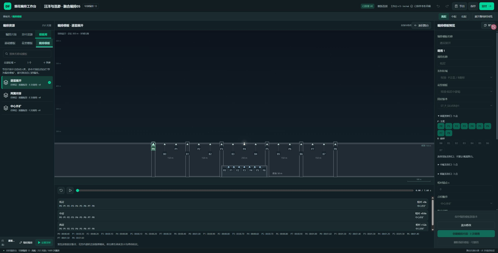
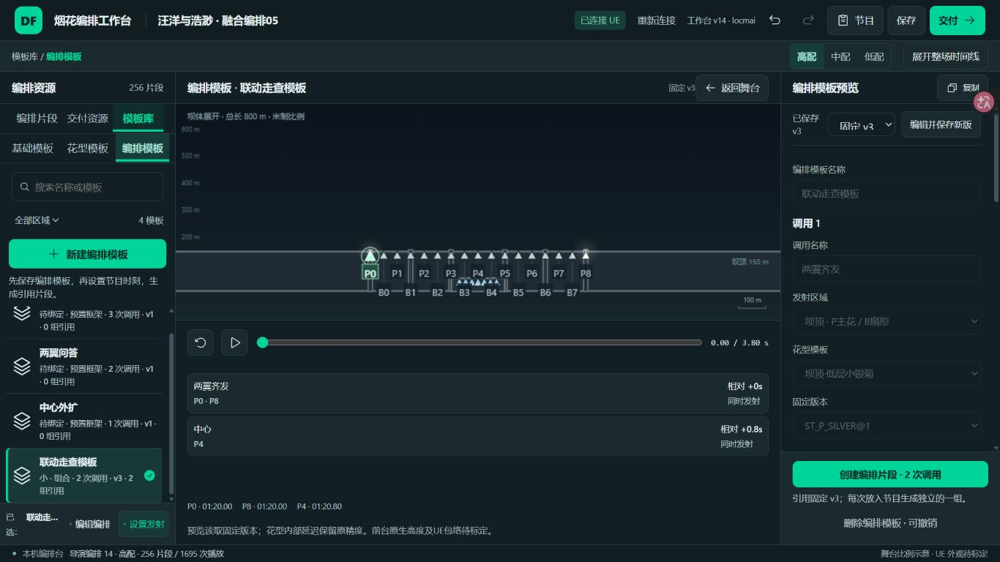
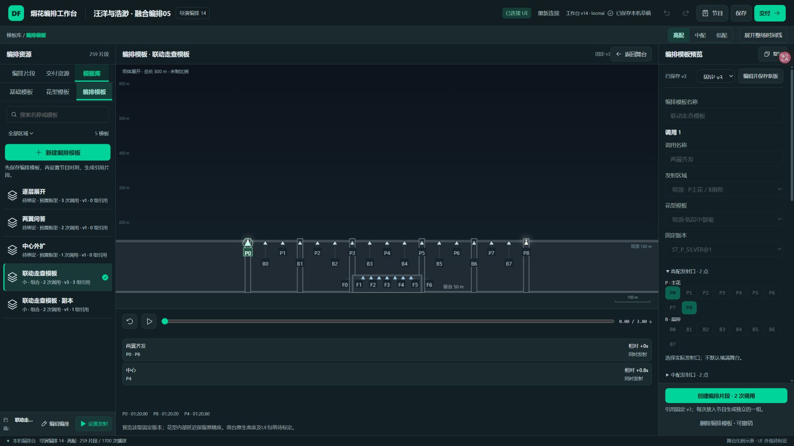
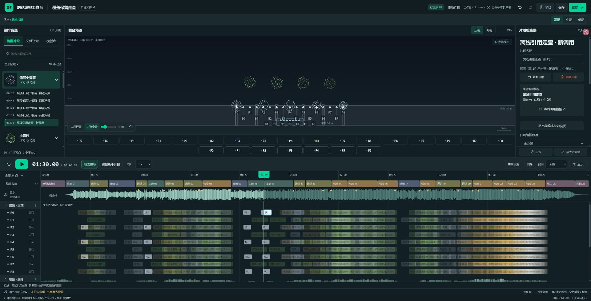
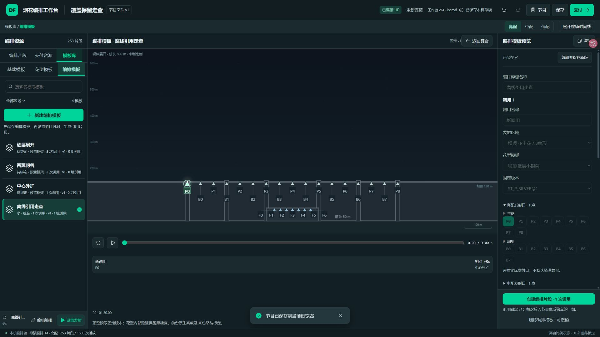
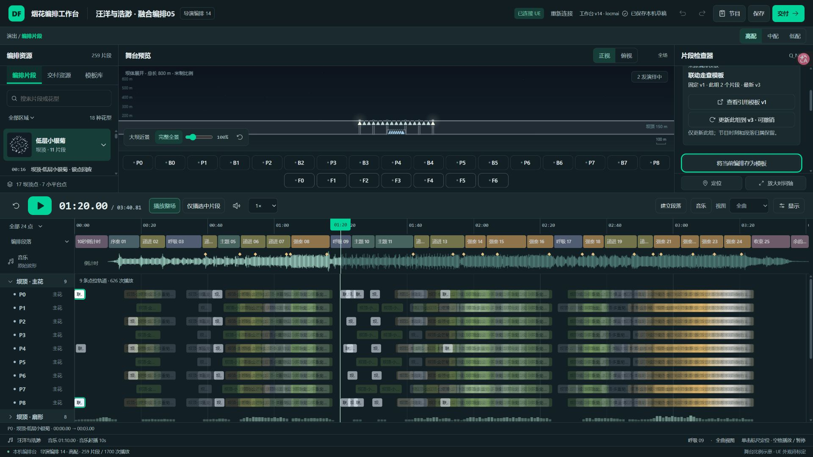

# 编排模板互通走查 · v14

2026-10-10，烟花编排工作台（24）。Product Design audit，实际8025及同字节离线HTML静态HTTP，Chrome隔离QA；先截图、操作、保存并检查截图。源程序修改、AI自检完成，用户验收待定。

用户要的是“可复用的编排来源 → 节目里的引用实例”，需要知道自己编辑哪一个版本、它用在哪里，以及保存后是否真的进库。此前三个预置框架与252个独立节目片段不是一一对应关系。

## 步骤与修复结果

1. **进入库和新建：通过。** 原“＋新建”混在筛选行中，缺少优先级；预置框架看起来像已绑定编排。现在“新建编排模板”独占一行，用原DF filled primary和完整名称；框架标“待绑定”，明确配置动作。1366×768及1920×1080检查动作可达，保留紧凑列表/底部所选操作。
2. **编辑和保存入库：通过。** 新模板保存后计数3→4，并选中、清理阻挡它的筛选。只保存不放置；“保存模板并创建片段”先产生真实固定版本，再原子放置。实页发现保存时发射锚点80秒被版本变化重置为0，已修到保存仍保留80秒。失败不留下半组片段或无用新版本。
3. **设置发射和节目引用：通过。** 每次调用生成一个片段，同次放置形成独立的一组。时间轴和左栏都出现，片段显示来源/固定版本/同组数量；“查看引用模板”进入准确旧版。源QA模板两次调用，80秒；最终HTML一个调用，90秒，252→253。
4. **模板定位、版本更新：通过。** 模板列出真实引用组/时间，点“定位”回到节目。新版v3保存不改旧v1/v2；用户明确更新当前组后才改，撤销/重做恢复对应版本。同调用ID保留片段身份、节目锚点、段落与音乐绑定。调用重排、增删和层对齐由模型检查；不完整、独立调整或单条复制的组会阻止整组覆盖。版本选择器可回看v1。
5. **复制、删除、三档：通过。** 单片段副本与原引用组分离，复制→删除→撤销恢复；模板副本先保存再在110秒生成2个引用。低配不能改模板，高配可以；原三档参与规则沿用。原节目独立片段可以显式存为模板后复用，原片段不伪造来源。
6. **保存刷新与原文件覆盖：通过（HTTP范围）。** 旧v13节目改名“覆盖保留走查”并保存，同一静态文件覆盖为v14，刷新保持名称/252片段。新建引用后保存刷新仍253及固定v1。离线v1存储标识未换，永久节目文件与会话Undo分开。原HTML/ZIP/说明在历史v12文件夹覆盖，ZIP锁在用户关闭解压窗口后解除、覆盖核对完成。

## 实际画面

图1：修复前，小“新建”与缺少关联说明。只用于问题定位，不代表当前版本。

图2：1366×768的新建主动作、已保存v3及紧凑底部操作。

图3：源QA新增及复制后5模板；显示v3、调用、真实引用数量，旧框架仍明确待绑定。

图4：最终HTML90秒引用片段及来源固定v1；波形是未附音乐的节奏参考。

图5：最终HTML库由3→4，新增条目固定v1/1组引用，主色新建入口可见。

图6：同一模板已保存v3，旧引用组仍固定v1；只在明确点击后升级当前组，可撤销。Tab焦点清楚可见。

## 交互与可访问性

主动作强调依据Material filled button角色： https://developer.android.com/develop/ui/compose/components/button 。颜色继续消费原DF唯一tokens，主色#00d49b；没有改全局色板或把整个模板行变成大按钮。选择态、焦点、禁用与保存结果沿用现有状态层；新入口40px实际高度，紧凑桌面场景。键盘Tab能到来源和升级按钮；低配禁用与框架配置有文字解释。截图和DOM不能证明完整读屏、200%缩放、全部触控与WCAG合规，本轮不作这些声明。

窄画布/时间轴比例导致右栏需要滚动，来源卡可通过Tab显露；本轮保持用户批准的整体布局。早期转场截图出现旧花型、旧片段或空白，已拒绝，不作为结果证据。02-before-draft、03-created、06-linked-cue没有作为版本卡证据；升级/撤销/重做结论来自实际DOM状态和对应纯模型回归，不以某张静态图冒称完成全流程。

## 自动检查与数据范围

- 99项生产核心、37项包装/连接/文件检查通过，0失败；另4项旧Site检查不在本轮。
- 新增8项引用模型：原代码RED为5失败，当前8通过；公开独立model也8通过。覆盖原子保存放置、固定key与内容一致、升级锚点/绑定、调用ID重排新增、复制隔离、拒绝不完整编辑组、文件往返与输入不变。
- npm run build通过后自动生成一次HTML；私有备份/完整diff/构建日志在pattern-linkage-20261010。公开model是纯逻辑依赖闭包与测试样本，编译HTML/共享适配/指纹不是全量私有React源。
- 原current-v1.dfshow原件SHA256 8cfc31b2b337235561f522a9ba8ca7e9fcc1a0cf1e1554c6eb3deceda9f85f2a，252片段/1689高配事件/18花型原件保持。测试改动只在隔离QA节目；没有大批自动迁移原独立片段。
- HTML2560330字节，SHA256 368583d7b1fff4c8d25f81960ec4f77b0820013475093ab93cf625b19a893130；ZIP365505字节，SHA256 437f709642c6e3a538658ddd4afd14cdcbce4747221a7b36f694d5ad8c2c1277。ZIP内三文件与稳定交付文件逐字节一致，无音乐。

## 明确未验范围

file://直接打开曾被自动安全审查拒绝，本轮没有重试或绕过；HTTP测试不等于双击离线验收。0次实际UE写入/保存/实播，只有已有自动只读连接探测；未复核全部36个引擎点。原生前台高度、实际粒子尺度、艺术节奏和BP/Seq仍按原待验。未部署旧公开Site、未改烘焙器tool/src/共享tokens/艺术源。用户尚未验收。

## 接收者操作

保存并关闭旧工作台，将同名ZIP解压覆盖到原文件夹，重开原烟花编排工作台.html；顶栏应显示v14。模板库→编排模板→新建编排模板，选花型与实际发射点，可仅保存或保存并创建片段。长期版本仍下载.dfshow；换浏览器/电脑/文件位置时导入该文件。

远端核实：产物提交 e78d1bc4b27910dc67f37e4aaa8ba773f5f50299 已包含在origin/main。HTML blob 6325694b0abf5c8d2528fb71e2e018ae542c0674、ZIP blob bc71e44cf759b9d44037fc4ea5032da4b11a0f71 与本机对应文件一致；推送前安全rebase保留全部并行烘焙器和状态内容，无强推。
