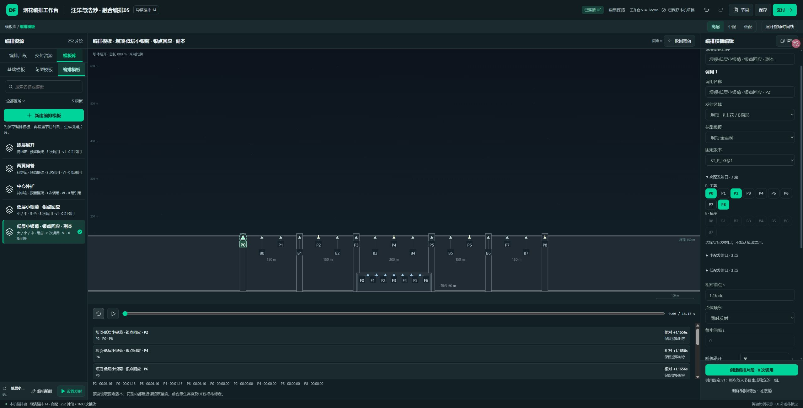
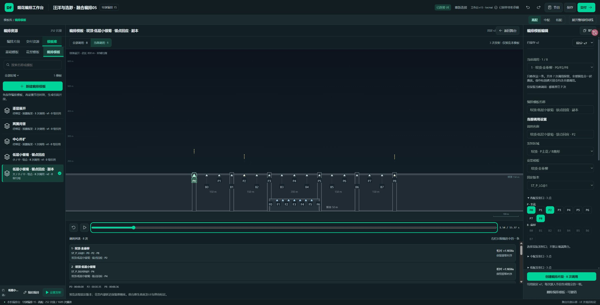
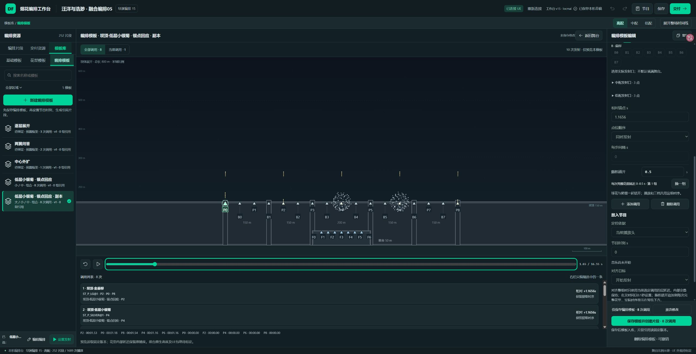
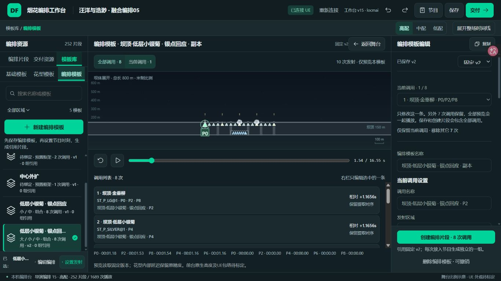
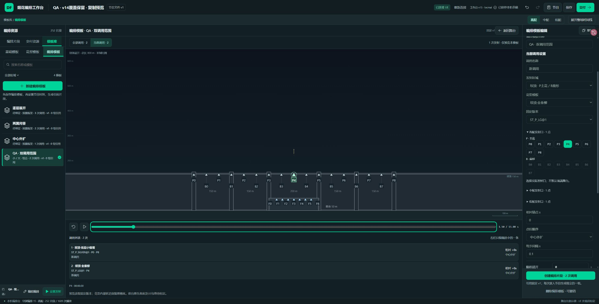

# 复制编排模板播放范围走查 · v15

结论：复制8次调用后，右栏只改第1条，另外7条继续存在并参与整套播放。已确认不是原节目或播放器残留。另查到替换花型仍继承捕获片段的scale/dz/tilt，及放弃区域修改后UI区域未恢复；两项已修。现有模板旧版和用户草稿不自动删改。

原截图与原数据只作证据，没有把截图中文字当成授权。使用 Product Design audit 的截图先行、六步有界走查；正式8025独立QA，未操作用户实际草稿、UE写入或音乐。执行和限定AI自检通过，用户通过未标记。

## 六步交互结果

| 步骤 | 结果 | 证据与范围 |
| --- | --- | --- |
| 1. 复制与定位问题 | 通过 | 实际从M4Q003/M4Q004捕获8调用，复制后替换第一条为金垂柳，另外7条低层小银菊/金芒菊仍在；新列表显示真实flower/ref/point，保留原自定义名称。01截图是结构证据，0秒没有活动粒子，不用它证明多余动画。 |
| 2. 当前/全部播放 | 通过 | 当前第一条3发P0/P2/P8，整套8调用10发；02/03实际有金尾及仅整套出现的P4/P6银花。换调用2显示低层小银菊/P4且只1发。新模型mock cues/events为空，原节目不能混入。切换/编辑/档位重置局部播放头。 |
| 3. 区域/花型/三档与错误 | 通过 | 坝顶→前台过滤P点，未选兼容花型/点时禁止完整保存；前台小银菊F0/F6正确选择，换回坝顶金垂柳重新选择点。替换清旧捕获变换，同花型保留确切版本；显式重置处理旧包微调。中低过滤共同时序，低配当前调用2无参演点显示空而非回退。 |
| 4. 保留/恢复/放弃 | 通过 | 8→仅保留1→恢复8，第一条已改花型/点/随机保持。先真实复现放弃后数据P点恢复但区域仍front，修后区域dam及P0选中恢复。保存/版本切换清临时状态；不自动精简。 |
| 5. 保存/固定引用/放入节目 | 通过 | QA副本保存v2，v1仍可查看且保留旧捕获偏移；80秒创建完整8片段，252/1689→260/1699，再撤销恢复252/1689。当前试听不缩减实际保存/放入范围，模板数量5、新旧固定版刷新仍存在。1366截图控件可达；1920仅控件检查，非完整响应式验收。 |
| 6. 同源离线更新 | 通过（HTTP） | 108核心+37包装、公开纯模型17全过。稳定HTML/ZIP原文件覆盖，ZIP内3项与稳定文件逐字一致。v14同HTTP入口保存个人名称，覆盖v15恢复该名称及252/1689；最终HTML新建双调用、保存/当前调用2只1发。file双击与实际UE另验。 |

## 实现边界与使用方式

画布上方选择「当前调用」，右栏下拉选想试听的一条。想把复制模板变成单一新花型时，点「仅保留当前调用 · 移除其它N次」，再「仅保存编排模板」，保存前可恢复。保存和创建按钮始终写明全套调用数，独听不等于删除其它调用。

replaceCallTemplate深拷贝并仅替换这一条；换花型删除eventAdjustments，保留精确相对时序/随机和其余调用。buildPatternPreview仅用所选模板的空节目mock；完整保存另做validatePattern，不让单条试听绕过其它错误。全高档确定起止，中低仅筛选。旧版本与已放置片段引用不迁移。

## 前后截图

旧编辑范围没有数量/试听隔离，调用名称无法辨认真正花型：

当前模式只显示三点金尾；调用列表仍明确显示其他花型：

整套模式保留其余调用，P4/P6银花来自调用2/3：

1366紧凑视口与最终离线HTML：

## 检查准确范围

新增9模型检查首次因新模块不存在加载失败；实现后9通过，不宣称9项旧断言均失败。源UI放弃区域残留真实复现后复测通过。一次切档/只读状态和generic选择器测试请求失败，按新DOM纠正后成功，不算产品运行失败，也不把失败算通过。控制台error列表空。

完整私有before/diff/测试日志在pattern-preview-20261010。公共含已授权原节目样本、纯模型和编译HTML，仍不等于全部私有React源。原current-v1.dfshow SHA256 8cfc31b2b337235561f522a9ba8ca7e9fcc1a0cf1e1554c6eb3deceda9f85f2a未改；无音乐字节，v1离线存储key/DB不变，个人草稿优先。

直接file://实页先前自动审批拒绝，禁止绕过后未重试；HTTP不是file双击证据。0实际UE写入/保存/实播，不新增读屏/200%/移动端证明；原生高度、粒子尺寸、艺术和用户验收仍独立待验。
