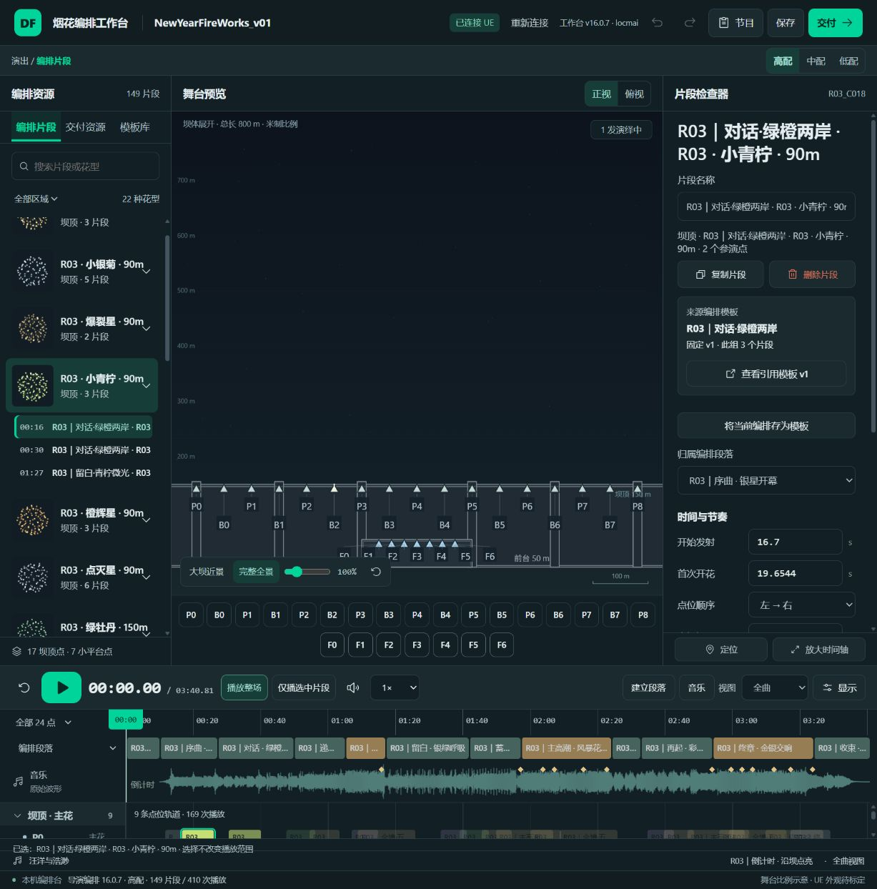

# 新资源是否进入播放时序 · R03只读核对

2026-10-10，编排demo（24），8025 v16.0.7 / NewYearFireWorks_v01 / R03 / 高配。

**历史只读结论：Lime、Crackle、GoldCoreLime存在有效调度引用。** 但这没有解决用户提出的“UE按花型名搜索时，时序中看不到父模板名”的问题。用户随后明确要求统一命名，v16.0.8已更新三表名字和引用，并实际双目标导入，最新证据见 [命名核对](director-naming-audit.md)。以下保留v16.0.7原生追踪记录。

| 资源（8025花型名） | 时序中的父模板 | 片段起点（节目秒数） | 片段数 / 单点调用数 |
|---|---|---|---:|
| Lime（小青柠） | WB_R03_C018_P、WB_R03_C056_P | 16.7、30.6、87.1 | 3 / 6 |
| Crackle（爆裂星） | WB_R03_C022_P | 25.0、43.3 | 2 / 4 |
| GoldCoreLime（金芯柠） | WB_R03_C033_P、WB_R03_C094_P | 48.4、99.9、140.0、167.0、189.6 | 5 / 8 |

以上包含开场10秒倒计时。片段起点是开始升空；球花按子模板的升空衔接延迟出现，不与发射时刻混算。

## 可直接核对的第一组Lime

`P组 16.7秒 → WB_R03_C018_P → Entries.SubTemplateName=NYR03_Lime_v1 → Entries.FXResourceId=P_EFX_FireWorks_Lime`

- P0在16.7秒发射，球花配置时刻约19.65秒；P2错开0.3秒，约19.95秒。均为配置展开时间，本轮未做UE实播计时。
- ResourceFX实际解析为`/Game/Effects_HD/Props_HD/FireWorks_HD/P_EFX_FireWorks_LimeStar_HD.P_EFX_FireWorks_LimeStar_HD`，原生类型ParticleSystem，4个发射器。
- 两个参演点均在当前正式子关卡找到唯一P组槽位绑定。
- 8025左栏“小青柠”展开为00:16、00:30、01:27三片段；第一片段检查器发射16.7、首次开花19.6544、间隔0.3，与引擎调度展开一致。

## 数据证据与边界

导演Blueprint CDO及显示名导演_2的正式实例分别读取，三表与R03高配完整比较均一致。两端20个基础ResourceId都被调度引用，库中未被引用的ResourceId为0。所查三款的全部调用点均有唯一绑定，各级准入字段一致为PlatformFlags14、VeryLow；资源表延迟0，三款FxSP均能读到ParticleSystem及非空发射器。具体路径、原生浮点时间、父/子模板、资源ID、绑定及准入字段见[逐项JSON](schedule-resource-audit.json)。完整原始回复保留本机`analysis/local/NEWYEAR_V01/schedule-resource-*.json`。

时序列表记录的是父模板名，父模板名本身没有Lime字符串，故仅在时序列表搜Lime不能判定是否引用。当前并未发现缺失引用；本轮不改名字、布局、节目、粒子或UE配置，也不重复导入。

此次证明原生数据连接完整，不证明真实播放已触发或粒子外观符合预期。若在对应时刻实际看不到，应进一步核对实际运行导演/运行配置、触发与资源显示，不能仅通过重编音乐时间表解决。

## 编排判断

当前Lime只分布在16.7–87.1秒的3片段，Crackle只在前43.3秒的2片段，GoldCoreLime5片段跨全场。引用完整与艺术分配充分是两个判断；用户希望新花型更明显时，应保留已定音乐锚点和固定子模板，针对段落替换或增加这些花型的片段/参演点，无需重新制作基础库或重新分析整首音乐。本轮只回答引用问题，不擅自覆盖节目分布。UE实播和艺术验收继续待做。
