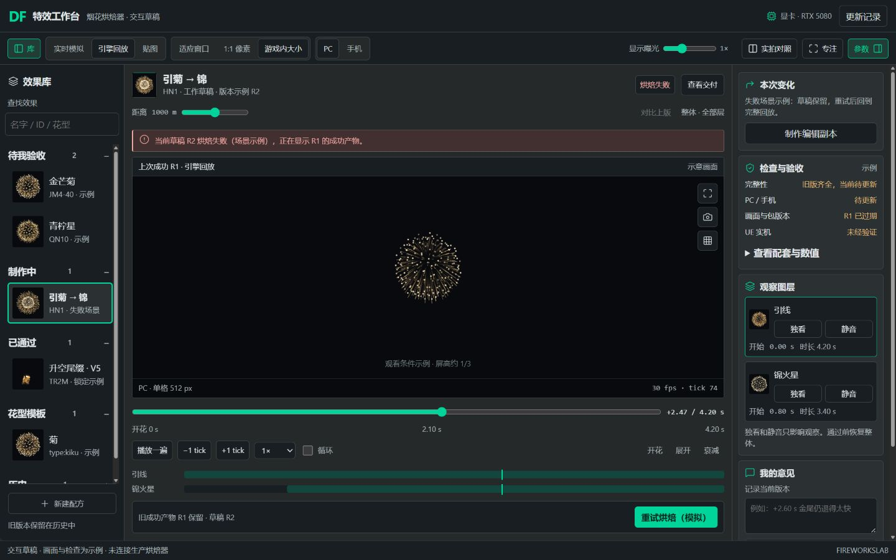

# 烟花烘焙器交互设计草稿

> **状态（2026-10-02 标注）：** 草稿的主要部分已在烘焙器 4.0.3–4.0.5 实现；之后的界面问题以 `协作/走查_4.2_2026-10-02.md` 为准。本文件留作设计依据。

2026年10月1日。作者：对话框9。供用户评审的交互与视觉提案，未接入生产烘焙器。

这版把工作入口围绕审阅、制作、贴图和交付组织起来，让用户持续看清三个问题：正在看哪个效果和版本，当前画面来自什么产物，下一步该做什么。画面居中，时间轴统一，参数跟随当前图层；检查状态和用户的艺术验收分别呈现。可点击草稿使用示例画面、数值和检查结果，不能作为真实效果的质量证据。

## 参考经验如何迁移

已读取聊天“重新设计 FX Copier 交互”的初稿、体验评审和后续修订。以下是从该聊天中提取的经验，以及本轮提出的对应设计。

| FX Copier 经验 | 烘焙器中的设计提案 |
| --- | --- |
| 查看某项和勾选参与执行要分开 | 打开条目、编辑草稿、提交检查、用户通过分别有独立状态。选中图层只代表正在调它，独看和静音只改变观察。 |
| 多入口改名必须同步 | 条目名、草稿名、交付清单来自同一份数据；任何会改变包内容的操作都让旧交付检查过期。 |
| 改名后不能沿用旧确认 | 验收意见绑定条目及完整版本。配方、默认值、算法或产物改变后，旧意见仍保留在原版本，新版本重新检查、重新验收。 |
| 失败后保住已完成项和输入 | 烘焙失败保留草稿和上次成功产物，显示两者版本；成功的层和平台可复用，但最终整包仍要重新检查。 |
| GPU 待办跨批次保留 | 烘焙任务归属于条目、版本和平台。切条目只是换观察对象，不能把旧任务的结果发布到新条目。 |
| 父级导航不能过小过弱 | 库分组标题采用15px半粗体，子项14px。按用户本轮反馈，效果以缩略图卡片展示，当前项用完整边框标识。 |
| ID选择不能偷偷带入乱填参数 | 已有效果点击后只打开；制作副本是明确动作。花型模板明确载入完整配方，空白配方明确为空。烘焙器需要完整参数，因此不照搬FX Copier的“只载入ID”规则。 |
| 填名称后先看最终资产名 | 交付页展示包内实际文件、平台、层及延迟，说明正式UE资产名由导入工具生成。ZIP下载是可逆操作，不额外增加确认弹窗。 |

视觉按用户后续确认与DF特效工作台保持一致：主底色#25292a、面板#2b3032、输入与侧栏#181e21、边线#424b4e、正文#e0e6e8、次要文字#adb8bc。青绿色强调色使用DF实际的#00d49b，悬停#36e4b0，主按钮文字#07291f，避免上一稿偏灰的绿色。按这套参考保留深色外观；烟花本身的金、红、青柠色由内容承担。

## 六个角色的工作需要

| 角色 | 常见任务和顾虑 | 本轮设计 |
| --- | --- | --- |
| 最终验收者 | 打开就知道哪里变好，不替AI找实现错误 | 默认引擎回放、游戏内大小、1000m。右侧先给本次变化、检查缺项和未验证事项，再给通过与修改意见。制作中的失败项留给负责人处理。 |
| 效果制作人员 | 连续调参时保住结构、随机种子和比较基线 | 按形态、轨迹、光点、颜色、输出组织参数；数值输入和滑杆并用。锁定比较版本，撤销一组改动；调参后草稿即时保存，正式候选保持原状。 |
| 技术美术和引擎接入人员 | 看到的回放必须对应导出的包，PC与手机都能追查 | 画面来源、平台、距离常驻；贴图张数、单格、帧号和时间一处可查。交付清单展开每层每段及delay，显示包指纹和UE实测状态。 |
| 素材使用人员 | 找到能用的效果，导出后知道去哪导入 | 已通过库优先按效果名和花型查找；一个效果一个完整包，输出文件清单可复制。内部条目ID与正式导入名分开说明。 |
| 批量制作和协作人员 | 多条任务正在烘焙，切页和失败不能丢工作 | 库条目显示任务阶段；任务列表独立于当前视图。部分成功保留，重试只计算需要更新的产物；全包检查不因局部成功跳过。 |
| 交互设计和维护人员 | 用户理解稳定，新的效果不用再造一个页面 | 一套查看器、一个时间轴、一份当前图层选择。以能力清单决定控制是否可用；不可用时解释原因，避免按效果名写页面特例。 |

这些角色是情境走查的视角，不是新建六套页面或权限。首版保留一套界面，以工作入口调整信息优先级。

## 工作台的空间安排

顶部放产品名、准确的程序版本、当前条目、当前版本和新建入口。顶部不长期占用空间显示显卡型号和技术日志。用户真正需要处理的任务状态显示在当前条目附近。

左侧是效果库。沿用待我验收、制作中、已通过、历史，新增明确的花型模板入口。分组可折叠并记住偏好；搜索名字、ID和特征，但搜索和刷新不得改变当前图层或草稿。条目采用56px缩略图配名称与简要状态，桌面侧栏224px；缩略图展示固定代表时刻的完整组合，不受临时独看、静音影响。选中卡片用完整2px青绿色边框，文字保持正常正文颜色；不再使用左侧色条。完整检查在右侧展开。待我验收仅收本版本标准检查全部通过的一个推荐候选。已有通过版本的效果持续留在已通过库；新候选和编辑副本分别出现，不能让可用的通过版本因新一轮制作而消失。

中间是画面和全局时间轴。审阅、制作、贴图、交付是同一条目下的工作入口，保留当前时间、图层、平台和观察条件。画面来源始终写明实时模拟或引擎回放；贴图入口直接显示产物。实拍对照和版本比较由当前画面打开，不把它们塞进另一套工具页。

右侧跟随工作入口。审阅显示变化、检查、意见；制作显示当前层参数；贴图显示所选层的帧和规格；交付显示整包清单。层选择器始终引用同一个当前层。单层就是只有一行的图层表，尾缀、组合和素材回放沿用这套结构。

底部只突出当前的主要操作。未烘焙或参数已变时是烘焙并检查；失败时是重试；结果齐全时可查看引擎回放或导出。日志、版本差异和完整报告按需展开。

## 四个工作入口

### 审阅

点击待我验收候选，直接进入引擎回放，显示实际导出平台和版本。默认PC、游戏内大小、1000m、显示曝光1倍。提供连续播放、慢放、关键时刻和逐tick检查。首次打开保持暂停，避免自动循环干扰判断。

右侧先写“本次改了什么”，再显示完整性、画质检查、版本一致性以及未经UE验证的内容。检查通过只表示具备交付条件，不自动判艺术通过。意见可记录当前秒数、平台和观察距离，复制时附条目与版本，避免只得到一句脱离上下文的反馈。

通过按钮只针对当前版本，且要求回放产物匹配、检查通过、画面处于完整组合。用户在实时模拟、独看某层或改变显示曝光时，保留操作自由，同时就地显示恢复标准审阅条件的入口。需要修改可先记录意见，无须完成通过条件。历史版本上的通过记录不会因新版本被覆盖。

### 制作

已有候选或已通过效果先创建编辑副本再改；副本明确标来源，原版本保持锁定。从花型新建明确载入该模板的完整参数；空白配方的名称、图层和参考为空，必要字段未填前说明下一步，不偷偷复制上个条目的数据。

图层表显示名称、开始时间、持续时间、可见和独看。多层的时间以效果开花时刻为共同零点；修改delay或参数会更新整体。头尾异色时标同一模拟来源；结构变化需在配方层处理，不能让颜色选项隐式另造一组轨迹。

日常面板先给形态、轨迹、星头与火花、颜色四组，再按需打开模拟、取景和烘焙设置。完整参数仍全部可达。参数显示原生单位、合法范围和当前值；尺寸低于有效分辨率时解释会产生什么变化，不能留下调了没反应的滑杆。批量变号数、随机微调尊重锁定项，并明确列出会改变的参数。

实时模拟跟随输入，昂贵的全尺寸烘焙默认由用户松手后的明确操作触发；自动更新回放可作为可选偏好。颜色和显示条件按依赖更新，但凡改变交付内容都必须重新生成或核实对应产物、版本和检查。显示曝光只影响观察，固定烘焙曝光属于配方，标签和位置分别说明。

### 贴图

同屏展示当前层的整张贴图、放大的当前格和帧号曲线。一个时间轴驱动三者，显示全局帧号、贴图张数、RGBA通道、格子号和该帧有效时间。长序列按实际段数显示，不把A/B两段写死。

PC和手机切换到各自的实际贴图；平台缺产物时直接标缺失。图层切换保持全局时刻，在层尚未开始或已经结束时标明时段，不把另一层上一帧当成当前层。贴图画面不借实时模拟补空。

### 交付

页面面向整包，列出每层每段的贴图、Ramp、Cutout、cascade.json和cascade_mobile.json，以及延迟和尺寸。只有实际需要的文件才列为必需；可选的4K母版由用户主动选择，不能冒充引擎交付规格。PC和手机都要检查；手机的接力格式依据UE实测决定。

包名称与文件清单即时同步，最终导入名称由本机导入工具决定。点击导出时先冻结当前完整版本，再生成文件和检查；下载只使用这份被冻结且通过检查的快照。导出过程中改参数会产生下一份草稿，不能混进正在生成的包。保存配方和下载已有历史包仍是独立操作。

## 状态如何衔接

| 状态 | 用户看到的内容 | 主操作及限制 |
| --- | --- | --- |
| 无产物 | 当前配方尚未烘焙；实时模拟可用 | 烘焙并检查；必要信息缺失时定位对应字段。 |
| 参数已变 | 当前草稿与上次成功烘焙同时写明版本 | 可以观察旧回放；当前草稿不能沿用旧通过、旧检查或旧包。 |
| 正在烘焙 | 当前任务、条目、版本、平台和阶段 | 可切条目；任务结果仅发布给其所属版本。停止语义写明是立即取消还是当前单元后停止。 |
| 烘焙失败 | 常驻原因、当前草稿和旧产物版本 | 重试、保存配方、查看错误。草稿和成功结果保留，不自动循环重试。 |
| 产物齐全但未检查 | 回放可以观察，检查待运行 | 运行完整检查；未检查不能显示绿色通过。 |
| 部分检查未通过 | 按层和平台写明数值、底线与问题 | 跳到问题字段或帧；不能进待我验收、不能导出当前交付包。 |
| 全部检查通过 | 当前回放与产物版本一致 | 可导出、提交一个推荐候选；艺术通过仍由用户决定。 |
| 用户已通过 | 通过时间、版本及当时观察条件 | 查看、导出对应包或制作副本；原版本及原参数锁住。 |
| 底层升级 | 锁定产物仍可查看；新渲染版本单独列出 | 旧版本保持兼容或明确重新验收，不能自动把新产物标为已通过。 |

实现时将条目阶段、配方版本、产物版本、任务状态、检查状态、观察状态和用户意见分开保存。它们相关，但不能用一个绿色标签代替。一个产物必须能指回条目、完整配方、默认值、算法版本和平台；共享时间轴及图层选择只是一份界面状态。

独看、静音、距离、缩放、参考偏移和显示曝光属于观察状态，不写入配方。验收意见记录这些条件。修改图层delay、颜色、烘焙曝光、尺寸或种子属于内容改动，必须更新版本。名字变化需重新核对交付清单，避免把旧目录或旧文件名混进新包。

## 保留标准中的约束

所有条目保留实时模拟、引擎回放与游戏内大小、贴图与流转、完整参数、整包导出和有参考时的实拍对照。多层一个查看器、一个包。引擎回放按30fps tick取整，不混帧；不新增引擎材质或代码，帧号仍走Dynamic Parameter第3通道。

PC单格至少512px、手机至少256px，这是下限；面板展示512、1024、2048等可选方案及对应成本，不固定每个效果使用同一格子。引擎贴图最大2048，4K是另选母版。帧不够时增加张数，不能暗中缩小格子。燃烧12fps、淡出8fps显示为当前建议起点，等待用户实测确认。观察距离800至1200m、默认1000m；1080p屏幕条件标明为当前测量假设，可在观察设置中核对。

已读到远端9689a69：4.0.2正调整按运动分配的帧预算。草稿不把全程30个独立贴图帧每秒设为唯一方案；播放tick为30fps，素材有效帧密度作为另一个量显示。新算法的实际质量和是否满足标准由负责人检查，本提案不替其作结论。

## 视觉和响应布局

建议使用4和8px的间距节奏、4至6px的轻圆角、细分隔线。正文14px，分组15px半粗体，当前效果18px；数据采用等宽数字，次要字不小于12px。DF同款青绿色用于选中框和主要操作，警告橙和错误红配文字；通过、缺失和过期均不只靠颜色区分。

桌面宽屏显示库、画面、右栏三列，可调面板宽度。窄窗口先把右栏排到画面下方；更窄时库改为可折叠入口，先保留画面与时间轴。控制行允许换行，按钮不挤成只有图标，全部功能仍可达。键盘保留空格播放、左右逐tick、数字输入和原有专注操作；输入字段获得焦点时快捷键不抢按键。减少动态时仍能手动拖到每个时刻。

## 情境走查

以下是针对方案的走查场景，正式实现时应由真实数据和返回结果验证。原型中的示例成功不代表生产检查通过。

| 场景 | 应出现的结果 |
| --- | --- |
| 点待验收候选 | 引擎回放、游戏内大小和版本可见；不需要用户先寻找正确预览页。 |
| 改头部大小后立刻切贴图 | 仍标上次成功版本；新图尚未生成时不能假装已更新。 |
| 修改某层delay再看整体 | 整体时间及当前层同步；旧产物过期，参数不被切页重置。 |
| 在A烘焙时切到B | A完成不会写B的格子、参数、检查或画面。 |
| 烘焙失败后重试 | 草稿与成功结果保留，不无限重试；只发布成功且版本匹配的结果。 |
| 单独观察尾巴后导出 | 整包仍含全部配方层；用户通过前先恢复完整观察。 |
| 手机包缺失或检查失败 | PC成功保留，手机问题显式显示；不能把PC包复制为手机包后变绿。 |
| 搜索、刷新、切回条目 | 草稿名、参数、图层、时间和意见保留；存储失败有可导出配方的恢复入口。 |
| 复制意见权限失败 | 提供当前意见原文供手动复制，不能显示已复制。 |
| 更新算法后打开旧通过项 | 旧通过版本可追溯；新算法产物需要自己的检查与验收记录。 |
| 载入实拍或调整开花时刻 | 按全局开花后秒数同步；偏移只作用于参考，不移动配方时序。 |
| 修改交付名称或烘焙中改参数 | 清单对应新名称；当前导出的快照保持完整，后续改动进入下一版。 |

## 落地顺序

第一步建立统一的版本、任务和观察状态，修正默认审阅入口以及过期、失败的显示。第二步把图层、时间轴、贴图流转和完整参数接到同一个查看器，逐类验证单层、组合、尾缀和素材。第三步接入整包检查、名称清单、意见及恢复，再统一外观和快捷键。每一步复用现有模拟、渲染和导出核，按仓库标准构建与回归，不在界面改版中悄悄重调效果。

本轮可评审的是上述信息结构、行为和视觉草稿。真实烘焙耗时、真实效果画质、UE导入与压缩结果仍由生产实现和实测验证。

可点击稿已在浏览器走查320、375、736、1024px窗口：没有横向溢出；确认后台模拟烘焙切条目后仍更新所属版本、原候选保留、键盘数值编辑使回放过期、逐tick推进、层未开始时不显示当前格、交付名称同步每层文件名、独看阻止通过且还原后恢复。未用真实烘焙产物、参考视频或UE导入做质量验收。

## 用户参考图的独立演绎稿

用户要求保留当前版，再按生成的参考设计图另出一版。原缩略图框选稿完整保留，第二稿独立保存为本轮对话中的参考演绎；两稿的观察和草稿记忆分别保存。以上方案仍描述原版，下面补充第二稿的视觉选择。

参考演绎采用紧凑DF品牌栏和独立工具标题，把当前效果的缩略图、名称、草稿版本及状态集中在画面上方。中间预览改成带版本标题、画面工具和规格页脚的完整窗口；右侧用细边框卡片组织本次变化、检查、观察图层和意见。图层加入代表时刻小图，选中整行框选，独看与静音继续只影响观察。桌面左栏208px、右栏276px，保持画面居中；736px窗口把右栏排到画面下方，320px窗口改为单列和可折叠效果库。

颜色继续使用实际DF工作台的#00d49b和深灰底色，成功数值用#81d8b6，禁止通过的按钮用灰色。保留完整缩略图框选。参考图中的人物背景、纹理和装饰斜线不作为信息底图，避免影响文字及烟花判断。未接入的全局模块不增加可点击入口。

画面工具提供展开大画面、构图网格和记录当前帧。大画面暂时收起库与详情，保留时间轴和返回入口。画面记录把实际显示的产物版本、当前草稿版本、时间、来源、平台、距离、观察大小及图层条件写进意见；截图只留在当前会话内，不随状态保存，意见文本可恢复。初始失败场景显示“草稿R2失败，正在看R1成功产物”，主要操作为重试，当前版本不能通过。当前时刻统一由30fps整数tick生成，初始tick74对应+2.47s；轴上2.10s只是中点刻度。

浏览器已检查320、736、1024px无横向溢出；大画面、网格、记录帧及版本信息、失败重试后切条目、独看禁止通过、新建直接进入实时制作、贴图流转和窄屏交付清单可用。旧稿文件校验值与本轮开始一致；新稿脚本语法和浏览器错误检查通过。两稿都使用示例画面、模拟任务和示例清单，未验证真实烘焙画质或UE结果。

## 按浏览器工作区修订（2026年10月2日）

用户指出参考演绎稿纵向过高、中央画面偏窄，要求沿用原工具条，右上继续放显卡与更新记录，新建配方放左侧效果栏最下方。此前两稿保留；本轮另存可直接用浏览器打开的 `协作/烟花烘焙器浏览器草稿.html`。以下布局取代上一节中的独立工具标题和四入口导航建议，原稿作为设计过程留档。

顶部只保留一行DF品牌与工具身份，去掉重复的“烟花烘焙器 / FireWorksLab”标题带。右侧显示RTX 5080和更新记录；显卡是草稿示例字段，正式接入时读取实际设备。全宽工具条直接切换实时模拟、引擎回放、贴图，随后是适应窗口、1:1像素、游戏内大小以及PC、手机。显示曝光、实拍对照、专注和参数在工具条右侧。查看交付保留在当前效果区域。

宽屏按浏览器可用高度排布：左栏200px、右栏264px，中间画面填充剩余空间，时间轴和主要操作保持可见；右侧详情独立滚动。左栏只滚动效果列表，新建配方固定在列表下方、效果栏底部。缩略图、完整青绿色选中框和DF实际配色继续保留。1180px及以下窗口把右栏排到中间下方，更窄时改为单列及可折叠库，避免横向挤压。

切到实时模拟只改变查看方式，不自动生成编辑副本；候选和已通过项的参数保持只读，点击制作编辑副本后才可改。显示曝光只影响观察，偏离1倍时当前版本不能通过。失败仍显示草稿与旧成功产物的版本差异，保持禁止通过；新建直接进入可编辑的实时模拟。独看和静音继续只影响观察。

已在实际1440×900与1920×1080浏览器窗口检查整页比例，中央画面、时间轴和主要操作可同时看到，左栏底部按钮可见。320、736、1024px没有横向溢出；直接切换、平台、观察大小、曝光、贴图流转、库与参数折叠、更新记录及新建操作已走查，脚本语法和修复后的运行错误检查通过。此文件仍是示例交互草稿，生产查看器、真实烘焙结果和用户验收状态未改。

## 给云端负责人的应用评估留言

2026年10月2日00:56，对话框9。收件人：云端烘焙器负责人；当前共享源码负责人为对话框2，以 `协作/状态清单.json` 的最新认领为准。用户要求先推送本轮草稿，请负责人评估是否能应用。状态：**待云端评估**；本轮任务是评估可行性及接入方案。

请以 [浏览器草稿](烟花烘焙器浏览器草稿.html) 和上一节“按浏览器工作区修订”为评估对象。文件已随 `fa07305` 推送，可直接打开；本文前面的四工作入口、顶部新建和隐藏显卡日志等早期提案均已被用户后续反馈修订，不能当作最终接入要求。下面是实际1440×900浏览器预览，供云端直接查看布局。

用户明确提出的方向：沿用实时模拟 / 引擎回放 / 贴图及观察大小、PC / 手机的直接切换工具条；去掉重复工具标题；右上保留显卡和更新记录；左栏保留缩略图、完整选中框，配色对齐DF工作台；新建配方在左侧效果栏最下方。宽屏以浏览器空间为主，让中央画面与时间轴同时可见。草稿中的200px / 264px栏宽和1180px断点是设计建议，可按真实参数面板调整。

请结合当前生产代码给出以下判断：

1. 哪些布局和视觉可直接采用，哪些与现有查看器、素材页或多层参数面板冲突，需要如何调整。
2. 示例交互对应哪些真实状态与数据：编辑副本、候选只读、草稿与旧成功产物的版本提示、烘焙失败、意见及用户通过。草稿的示例检查、任务和导出不能直接代替生产逻辑。
3. 如何保留 `协作/标准.md` 的六项能力，以及全部条目共用查看器、30fps整数tick、PC / 手机实际产物、完整图层导出和锁定已通过版本的要求。
4. 哪些建议需要先补状态或数据能力，再做界面；建议改哪些文件、按什么顺序接入，以及宽屏、窄屏和各类条目的验证范围。

请把结论写回本节后面：逐项标明“可直接采用 / 调整后采用 / 暂不采用”及理由，列出主要风险和建议的第一步。当前已验证的是示例页面的浏览器布局和交互，生产接入尚未验证。正式接入由共享源码负责人按仓库协作及构建、回归规则执行。

### 对话框2（云端烘焙器源码负责人）的评估 · 2026-10-02

按现有生产代码（4.0.2：`tool/src/body.html`、`style.css`、`70_ui.js` 参数 / 组合面板、`79_library.js` 左栏和审阅卡、`80_render.js` 视图和流转、`77_assets.js` 素材页）逐项看过草稿和 1440×900 预览。**结论：方向可以用，先做纯界面的部分；草稿里的「编辑副本 / 只读 / R1·R2 版本 / 通过门槛」要先补状态和数据，不能直接套。**

| 草稿内容 | 结论 | 理由 / 怎么接 |
| --- | --- | --- |
| 顶部一行（品牌 + 当前条目，右上显卡和更新记录） | 可直接采用 | 生产已经有这些元素，只是排版和配色不同。 |
| 工具条（实时模拟 / 引擎回放 / 贴图、适应窗口 / 1:1 / 游戏内大小、PC / 手机、显示曝光、实拍对照、专注、参数） | 可直接采用 | 和生产一一对应（`#viewSeg` 等），只改样式，不改逻辑。观察距离滑杆在生产里也在工具条上，草稿放到画面上方也行。 |
| DF 配色（#25292a / #2b3032 / #181e21 / #00d49b …） | 可直接采用 | 生产颜色都是 `style.css` 里的变量，换一组值即可；烟花金色只留给内容和必要强调。 |
| 左栏改成「待我验收 / 制作中 / 已通过 / 花型模板 / 历史」上下分组（可折叠、56px 缩略图、完整选中框），新建配方在底部 | 调整后采用 | 生产是四个页签 + 下面「工具 · 组合编辑器」「工具 · 花型」和底部三个按钮。改成分组只动 `renderLib()`。要保留：搜索、标准 ✅/❌ 徽标、已通过同时出现在两组的规则（4.0.2 刚改）、历史按效果折叠。「云端配方预览」「4.0 对照橱窗」「打开结果文件夹」收进「工具」组，不能删（橱窗是新旧对照的唯一入口）。 |
| 栏宽 200 / 264 px | 调整后采用 | 右栏放参数时 264 太窄：生产参数行是「锁 + 100px 标签 + 滑杆 + 70px 数值」，中文标签长，至少 340。建议审阅卡片 280–300，切到参数时 360，或允许拖宽。左栏 200–224 可以。 |
| 画面上方的效果条（缩略图、名称、版本、烘焙状态、查看交付） | 调整后采用 | 版本先用已有的版本指纹（8 位）和本地烘焙序号（`state.gen`），不另造 R1 / R2。「查看交付」先做成只读清单（见下）。 |
| 失败横幅「草稿 R2 失败，正在显示 R1」 | 可直接采用（文字） | 生产已有同样的状态（`syncBakeError`：保留上次成功的烘焙，写明是哪一代失败），换成草稿的措辞和样式即可。 |
| 画面工具（放大、记录当前帧、构图网格） | 调整后采用 | 「放大」= 现有「专注」；网格是纯显示叠层，好做；「记录当前帧」写进意见要先有下面的意见上下文。 |
| 时间轴：开花 0 s、±1 tick、播放一遍 / 循环、每层一条时段条 | 调整后采用 | ±1 tick 和循环开关容易加；每层时段条用组合层的 delay / 时长 / 时间倍率画。要和 4.0 分张后的各段、`trimLead` 后的发射器延迟一致，单层时只画一条。 |
| 右栏卡片：本次变化 / 检查与验收 / 观察图层 / 我的意见 | 调整后采用 | 「本次变化」「检查」对应现有审阅卡和 `stdCard()`（标准检查结果），再加回放检查结果（导出任务的 `回放检查.json`）。「观察图层」对应组合页的图层卡：独看 / 静音要做成只影响观察（现在组合页的层开关会改组合本身）。单层条目就是一行的图层表。 |
| 候选、已通过只读，点「制作编辑副本」才能改 | 暂不采用（先补状态） | 生产现在任何条目都能直接调参，用 `lib.sig` 标「你改过参数」；改过的参数只在当前页面里。做只读要先有「草稿」这层数据：存在哪（浏览器本地）、怎么交回给 AI（复制配方 / 意见）、和条目版本怎么对应。用户自己不在仓库里建条目，所以「副本」更像本地草稿。 |
| 通过门槛（检查全过、显示曝光 1×、完整组合、不在独看） | 调整后采用 | 通过按钮已在审阅卡；加这些条件容易，但「检查全过」要读到对应版本的标准检查和回放检查——数据已有（`standard.js`、导出清单的版本指纹），要先把它们按版本对上。 |
| 意见带时间 / 平台 / 距离 / 观察条件 | 可直接采用 | 意见已按「条目 + 版本」存；多记几项观察状态即可。 |
| 交付清单（每层每段的贴图、Ramp、Cutout、两个 cascade.json、延迟） | 调整后采用 | 生产导出时才算出分张，界面上要先「烘焙后从烘焙结果列清单」，没烘焙时只能列层。导出前「冻结版本快照」是新逻辑，放到状态那一步做。 |
| 帧率写 12 / 8 fps | 需要更新 | 标准 2.3 已在 2026-10-01 按用户实测暂定燃烧段 ≥ 10、淡出段 ≥ 7.5；草稿的说明文字跟着改。 |

**六项能力和标准约束**：草稿没有拿掉任何一项。要注意的是素材条目（`77_assets.js`，引线 / 尾缀 V6 用）、尾缀 V5、组合编辑器这三类页面在草稿里没画，接入时要让它们进同一个布局（右栏卡片 + 工具条），不能因为改版变得找不到；30 fps 整数 tick、PC / 手机实际产物、完整图层导出、已通过版本锁定都在渲染和导出代码里，界面改版不碰。

**主要风险**：一次全换会同时动左栏、右栏、工具条、组合页，回归面太大；参数面板变窄后中文标签挤压；组合页和单层查看器现在是两套面板，草稿的「观察图层」假设已经是一套。

**建议的顺序（每一步单独推送、单独可回退）**：
1. 只换外观：DF 配色变量、顶部一行、工具条样式、左栏分组和完整选中框、新建在底部、栏宽（右栏 300 / 参数 360）。改 `style.css`、`body.html`、`79_library.js`。
2. 时间轴：±1 tick、循环、每层时段条、失败横幅措辞。改 `body.html`、`80_render.js`、`90_events.js`。
3. 右栏卡片化：审阅卡拆成本次变化 / 检查（标准检查 + 回放检查）/ 观察图层（独看、静音只影响观察）/ 意见（带观察条件）；通过门槛。改 `79_library.js`、`70_ui.js`。
4. 状态层：本地草稿 / 只读 / 编辑副本、版本显示、交付清单和导出快照。新建一个模块，改动前先写清楚数据结构给用户看。

**验证**：每步都跑 `界面冒烟.py`（本机显卡，花型模板 / 待验收 / 多层 / 尾缀 / 素材 / 左栏四组，每处四个视图）、`ui_shots.py` 在 1440×900 和 1920×1080 各截一遍，再看 736 / 1024 宽不横向溢出；离线检查（`motion_plan_check` 等）和 `烘焙器回归.py --legacy` 证明渲染、导出没变。

**第一步**：等用户点头后，先做第 1 步（纯外观），截图给用户对比，再往下。

**进度（2026-10-02，对话框2）**：用户 06:27 说「帮我做界面外观」，第 1 步已做成烘焙器 4.0.3（见 `tool/CHANGELOG.md`）：DF 配色、顶部一行、全宽工具条、左栏上下分组 + 56 px 缩略图 + 整圈选中框、新建配方在底部、工具收进「工具」组、栏宽 232 / 340、≤1180 右栏下移、≤760 单列。第 2–4 步没动。

### 对话框2：交互稿逐项对照（2026-10-02 09:xx，烘焙器 4.0.5）

用户 08:36 问「有没有严格按交互稿做、有没有亲手用过」。之前没有在浏览器里点过，只看了文字和 1440 截图；这次用浏览器把稿子的每个按钮点了一遍（截图在云端会话里），再逐项对照生产烘焙器 4.0.5。

| 交互稿 | 现在（4.0.5） | 结论 |
| --- | --- | --- |
| 顶部一行、全宽工具条、DF 配色、显卡 / 更新记录在右上 | 照稿（4.0.3） | 照稿 |
| 左栏分组可折叠、缩略图、整圈选中框、新建配方在底部 | 照稿；多了「我的版本」「工具」两组 | 照稿 + 补充 |
| 画面上方效果头：名称、版本、状态徽标、查看交付 | 照稿；同一行加了版本下拉、保存 / 另存为 | 照稿 + 补充 |
| 画面框：标题（看的是哪版 · 视图 · 整体 / 独看）、右上工具（大画面 / 记录当前帧 / 网格）、脚注（平台 · 单格 \| 30 fps · tick） | 照稿 | 照稿 |
| 时间轴：播放一遍、±1 tick、速度、循环、开花 / 展开 / 衰减 | 照稿；← → 也能 ±1 tick | 照稿 |
| 每层时段条 + 播放头 | 照稿；点时段条可以跳到那一刻 | 照稿 + 补充 |
| 查看交付：画面换成素材包文件清单（层、段、平台、单格、延迟） | 照稿，按真实烘焙推算；导出按钮在这里 | 照稿 |
| 检查与验收四行（完整性 / PC 手机 / 画面与包版本 / UE 实机）+ 查看配套与数值 | 照稿（标准检查 / 导出回放 / 版本一致 / UE 未验证）+ 标准检查明细可展开 | 照稿 |
| 观察图层：独看 / 静音只影响观察 | 照稿；每层开始时间可以直接改 | 照稿 + 补充 |
| 通过门槛：独看 / 静音时不能通过 | 照稿；加了显示曝光 ≠ 1×、看的是改过的参数时不能通过 | 照稿 + 补充 |
| 我的意见 + 记录当前帧 | 照稿；意见在「审阅」页（稿子放在右栏底部，会把参数挤下去） | 调整 |
| 候选只读，点「制作编辑副本」才能改，副本进左栏「制作中」 | **没照搬**：打开就能改，改了标「参数已变」；保存后进左栏「我的版本」，AI 版随时能切回 | 调整（理由：用户说「我会另外保存」，少一步；AI 版不会被改；改过的版本不能点通过） |
| 编辑副本里的参数（稿子是 3 个示例滑杆） | 选中层的完整参数（和单层条目一样） | 生产必须 |
| 新建配方弹窗（起点 + 名称 + 开始制作） | 花型库大图网格挑模板，名称在保存时起 | 调整（有缩略图和说明更好挑） |
| 失败横幅「草稿 R2 失败，正在显示 R1」+ 重试 | 生产原来就有（保留上次成功烘焙 + 重试），资产栏多了「烘焙失败 · 保留上次成功」 | 照稿 |
| 底部操作条（状态 + 主按钮） | 没单独做一行：状态在资产栏，导出在查看交付 | 调整（省一行给画面） |
| 对比上版 | **没做** | 待做：要同时烘两版，下一步做成 A/B 分屏 |
| 320 px 单列 | 760 px 以下单列；320 没专门调 | 部分 |

**改进建议（稿子里没有、做的时候发现的）**
1. 你的版本只存在这台电脑的浏览器里。建议：「导出配方文件」默认存进仓库 `analysis/用户配方/`，本机后台脚本每 30 分钟推送时一起推上来，AI 不用你贴就能拿到。
2. 对比上版做成 A/B 分屏（左上一版 / 右当前），同一个时间轴。
3. 时段条上画出每帧停几个 tick（帧预算），一眼看出哪段帧率低。
4. 参数面板很长：加「只看改过的 / 搜索参数」。
5. 资产栏的「参数已变」点开能直接看改了哪些（现在在「⋯ → 复制我的改动」里）。

## 对话框9：4.1.1 产品与交互复核（2026-10-02）

**评估结论**：4.1.1 已采用最新版草稿的主要空间结构、DF 视觉和查看工具，并补上真实制作能力；不能称为完整落实了草稿的行为设计。它已是可以继续迭代的内部专业工具，按供使用者独立完成制作与交付的商用工具标准，版本可信度、工作恢复、整体验收和比较闭环还需要补齐。

**基线与证据范围**：基于 main `abf1485` 中的 4.1.1 源码、4.1.1 更新记录，以及本机 GPU 后台已留存的 UI7 / SMOKE7 截图与报告，对照本文件「按浏览器工作区修订」和 `烟花烘焙器浏览器草稿.html`。已检查真实函数的离线状态行为；没有亲手操作当前生产浏览器，也没有测得浏览器 FPS、GPU 耗时或 UE 实播结果。本会话的 file 页面访问限制仍然遵守，截图属于既有证据。

早期稿里的四工作入口、独立标题带、顶部新建与较窄原生窗口比例已被用户修订，不计为当前缺项。后续用户要求的工具条回中央、隐藏顶部长路径、调参黑屏修复在 4.0.6 已实现。对话框2记录的 14:46 新反馈——每个资产自己的风格参数、轨道真实拖动、全部使用渲染缩略图、播放重算修复和命名同步——仍在处理，不能把认领或待办当作4.1.1已实现，也不把这些反馈重复包装成此次新增意见。

### 和最终草稿逐项比较

| 维度 | 最终草稿的意图 | 4.1.1 实际情况 | 判断 |
| --- | --- | --- | --- |
| DF 配色、效果缩略图、完整框选、新建位置 | 同一品牌体系、可辨认效果、左栏底部新建 | 颜色变量一致，分组库和整圈框选、新建底部均已实现；现有部分缩略图仍含实拍 | 主体已采用，缩略图来源是用户后续修订项 |
| 浏览器比例与工具条 | 宽屏三栏，中央画面和时间轴同时可见，右上GPU与更新 | 已实现三栏、可拖宽；232 / 340px取代草稿200 / 264px；4.0.6工具条回中央；4.1.1顶部另加全局风格 | 栏宽调整合理；工具条文字被隐藏和换行仍需优化 |
| 当前资产、版本与画面工具 | 当前对象可辨认，网格、记录帧、大画面可用 | 资产栏、版本下拉、保存、画面标题与脚注、三个工具已实现 | 已采用 |
| 待验收打开路径 | 默认引擎回放、游戏内大小、1×，首次暂停；优先看到变化与检查 | 右栏默认参数；打开多层条目强制实时模拟；初始自动播放、循环默认开启 | 行为有明显差异；应按制作与验收情境设默认，完整参数仍保留 |
| 编辑候选 | 原候选保护，编辑副本有自己的状态 | 直接调参，明确保存后进入「我的版本」，AI基线可重新载入；改版通常阻止通过 | 有意调整。用户要求直接迭代资产、另外保存，少一步合理；恢复和草稿身份仍不完整 |
| 时间轴与观察图层 | 同一时间，逐tick、跳点，独看/静音仅观察 | 已有逐tick、循环、跳点、各层轨道；新加阶段点、入出点和轨迹联动 | 大部分采用并扩展；入出点当前用按钮设置，实际拖动尚待用户反馈修正 |
| 版本比较 | 从当前效果直接对比上版，共用观察条件与时间 | 老单层工具有A/B；多层隐藏工具入口，当前整朵和上版不能直接比较 | 当前资产工作流仍未完整实现，不能说完全没有A/B代码 |
| 失败保留与任务 | 保住草稿/旧成功结果，明确画面来源，跨条目任务可追查 | 预览烘焙有代号保护、失败横幅和重试；主要依赖全局状态，部分新联动/风格烘焙失败只短暂提示 | 部分实现；未形成统一的条目任务和分层/平台恢复流程 |
| 检查与用户通过 | 检查、回放、版本匹配和完整标准观察共同决定是否可通过 | 检查四行已有；按钮仅检查独看/静音、曝光、个人版/参数变化，缺检查与产物条件 | 部分实现，属于核心缺口 |
| 交付清单 | 实际产物清单、版本快照、两平台一致，改名同步 | 整包与规范命名更完整；清单仍是推算，手机导出时另烘；部分产物只提示以导出的包为准；导出缺完整冻结与检查准入 | 部分实现，技术交付能力增强，可信流程尚未完成 |
| 保存与意见 | 工作可恢复，意见绑定完整版本与观察上下文 | 本地保存、配方导入导出、复制意见/改动、记录帧均有；工作草稿不持续落盘，存储失败无明确反馈 | 部分实现，跨AI协作仍靠手动交接 |

4.1.1新增的入出点、跨张流转、文件命名、层轨道阶段、轨迹联动、单束导出，以及4.1.0的循环层+粒子发射器，都是原稿示例没有实现的真实生产能力。这些方向值得保留；当前问题在于新增能力还未统一进入版本、保存、检查和恢复流程。

### 商用工具标准下的主要意见

**1. 先解决“通过的是什么”——最高优先级。**

`79_workbench.js gateReasons()`没有读取标准检查、PC/手机回放检查、导出是否过期、烘焙失败/等待状态、实际画面来源和观察大小。`79_library.js checkRowsHTML()`读取的是仓库导出记录，其“一致”并未实时对照当前工作配方。离线运行真实函数，在合成的标准检查失败状态下，实时模拟、贴图、引擎回放三个模式均返回空的禁止理由。这证明条件缺失；不是声称在当前浏览器实际点击验收成功。

风格层还暴露了完整版本模型的缺口：`styledP()`能让火花尺寸变成2倍，但 `wbSnap()`不包含风格设置，配方快照没有变化，通过限制也没有相应变化。当前风格和交付自定义名称分别存在浏览器独立字段中，保存/导出的个人配方不能单独还原全部当前工作条件。14:46要求将风格改成每资产参数后，也要一起补入保存、完整版本与检查失效规则，不能只搬滑杆。

建议当前资产常驻一条明确状态，例如：“工作草稿 · 基于HK10 · 已保存本机 · 回放仍为上次成功版本 · 当前交付检查待更新”。艺术通过绑定被冻结的完整版本及其实际产物；检查失败、缺平台或版本不匹配时阻止提交正式验收，同时给出恢复标准观察的直接入口。实验导出仍可服务调参，但必须明确其检查状态，不能与通过检查的正式交付包混淆。UE未验证单独记录，不擅自改变仓库现有验收标准。

还离线运行了真实 `exportMaster()` 控制逻辑：在贴图编码的等待点改变颜色状态后，贴图沿用原烘焙，后续Ramp和参数表读取了改后的颜色。PNG/ZIP编码用桩替换，这仅证明导出缺少完整内容快照，不是当前浏览器下载包的实际损坏复现。导出冻结需包括整朵各层参数、颜色、风格、名称和平台规格。

已通过库也需保护准确入口：`renderLib()`的「已通过」组和「待我验收」组复用同一 `effRow()`与 `openEffect(ef)`；后者按效果当前阶段选择候选，并不按点击的分组选择通过版。因此有效果正在新一轮待验收时，从已通过组点它也会打开新候选。离线运行真实选择函数的合成金芒菊状态（通过JM3、候选JM4-40）打开的是JM4-40。应让已通过组明确打开已通过版，并分别显示其缩略图、检查与版本；不能只有两个分组标题而对象相同。

**2. 参数迭代应能放心试——恢复能力是商用工具的基础。**

当前「保存」和「另存为」有实际价值，但它们不等于正在编辑的工作会自动恢复。`wbLoadAI()`直接丢掉相应编辑状态再打开源版；没有统一的未保存草稿保护。`75_iter.js store.set()`吞掉存储异常，调用者仍可提示“已保存”。数值框还能超出滑杆范围，必须由参数自身校验合法值，不能把“允许扩展专业范围”和“非法值导致失败”混在一起。

建议每个资产自动保存工作草稿并显示最后成功时间；用户命名保存作为明确里程碑；提供完整资产的撤销/重做，联动多层作为一次可撤销操作。存储失败必须可见并提供导出配方的恢复入口。已存在的单层手动版本回滚应保留，但不能代替整朵效果的连续撤销。

**3. 参数齐全与参数好找要同时成立。**

现有参数面板能把完整能力交给使用者，是4.0.4之后最有价值的进步。UI7的1440px截图中，图层选择后先出现多段解释，再出现具体控制；层名称和时长被截断，常用标签偏小。制作人员要反复读说明、找一项参数，会抵消直接调参带来的效率。

建议按用户任务呈现“时序与接力、形态与运动、星头与尾迹、颜色与亮度、取景与输出”，完整高级参数仍可达。补参数搜索、只看改过的、收藏常用参数、改动列表；面板顶部用一行显示当前层和受联动影响的层，解释放到就地帮助。对一次会影响多层的动作，用户应在操作前知道影响范围，并能一次撤销。

**4. 默认入口应该替用户完成准备。**

验收者从「待我验收」打开候选，应该直接看到标准引擎回放、当前版本及本次变化，用户可随时展开完整参数继续修改。制作中与我的草稿可以保持参数优先、实时模拟。无需恢复早期四个导航页，也无需禁止直接调参。

当前意见按候选版本保存，记录帧也会附上上下文，这两点很好。但个人版本仍只能向AI复制/导出，再由AI重新提交候选；应该把这条“我的改版 → 交给AI继续 → 新候选”的路径显示清楚，并附完整配方、差异、时刻和观察条件。不要让用户只发一句“我改好了”后，接收方无法复现。

**5. 比较能力决定制作效率。**

当前多层效果缺少整朵上一版和当前草稿的直接对比，需要记住前一版再切换，颜色、尾长和衰减时机容易误判。建议在当前资产栏直接选比较基线，两个版本共享时间、平台、距离和曝光；支持整朵比较与同层比较，并保留到下次打开。现有单层A/B和3.7/4.0对照橱窗是可复用能力，但不能让使用者去另一套工具里寻找当前资产的上版。

**6. 桌面布局需要稳定的信息密度。**

三栏和大画面方向正确，右栏340px比草稿264px适合真实中文参数。工具条回中央后，`@container vb (max-width:1240px)`隐藏文字的规则仍保留，因此1440px截图中显示曝光、实拍对照、专注、参数等变成滑杆或纯图标；工具条还会换行。这是布局变化与原压缩规则没有共同调整产生的体验问题。

建议在常见1440×900、1920×1080以及浏览器125%缩放下，常用控件保留文字并采用稳定的两行组织；次要操作按需展开。顶部维持工具身份、GPU和更新记录；内容参数回到当前资产。减少同一个“通过”动作在多个位置的竞争，让当前状态和下一步动作更清楚。缩略图须用完整组合的代表渲染时刻，而不是临时独看状态；长名称应易于查看完整文字。

拖阶段点已有与右栏数值参数互补的基础。应扩大交互区域、显示明确的拖动提示/数值与选中状态，保留直接数值设置；入出点也要有清楚的时间和范围。这里的判断不是宣称已完成WCAG审计；拖动功能提供替代操作是可借鉴的[W3C交互要求](https://www.w3.org/WAI/WCAG22/Understanding/dragging-movements.html)。

**7. 稳定播放和任务恢复优先于继续加功能。**

4.1.1仍保留快门采样被误判倒放而从头重算，以及主循环50ms截断播放时间的问题。沿用之前的真实Sim/采样与时钟诊断，在临时时钟桩里补上4.1新增的 `isEmit=false`（HK空中花型不走emitset），三个守卫仍失败；8秒处连续向前三帧仍重建3次模拟并执行11622次物理步。受控10fps下真实4秒仍只推进2秒。它们是代码行为复现，不是浏览器实测帧率；旧HK10E2素材的帧密度也不能当作4.1.1新导出的测量。

原诊断脚本未适配4.1 helper时会报 `isEmit is not defined`，这是离线诊断装配遗漏，不能当作生产页面异常或直接引用为三项回归失败。本次已用明确补桩的临时运行分别验证，仓库诊断脚本未修改。

已有SMOKE7报告 `ok=false`，58步中的风格点击超时；同任务 `done.json ok=true`只代表任务跑完。这个结果必须由负责人核实，不能称冒烟全过，也不能仅凭自动化点击超时断言产品按钮本身不可用。全局风格会被后续移除，仍需以新步骤完成真实验证。

重烘目前在调参约380ms后自动启动，缺少完整的更新偏好和任务控制。建议用户可选自动更新或手动烘焙，实时显示先保持可用；所有层/平台的进度、失败和重试进入统一任务状态。任务完成必须等于结果成功且版本匹配，后台任务和切换条目时也遵守同一规则。

### 从使用者和交付角色判断

| 视角 | 已有价值 | 仍妨碍独立完成工作的地方 |
| --- | --- | --- |
| 日常效果制作 | 单层/多层完整参数，层时序、联动、入出点与真实输出 | 缺整朵比较、连续撤销、常用参数入口和可靠草稿恢复 |
| 最终验收 | 候选分组、检查四行、版本意见、记录帧 | 默认实时和参数优先，检查条件未完整控制通过，观看版本不够可信 |
| 技术美术/引擎接入 | PC+手机整包、规范命名、延迟清单、单束与新发射器形式 | 清单推算与实物的区别、当前包完整版本、引擎未验证项还需更具体 |
| 新使用者 | 大画面、缩略图分组和直接视图切换容易识别 | 专业术语、纯图标、长说明和多个保存概念增加学习成本 |
| 人与AI协作 | 可复制差异、意见和配方文件，原始AI配方可恢复 | 本机保存与项目同步边界不清，完整工作条件未全部随配方交接 |
| 长时间批量工作 | 失败可保留旧成功烘焙，部分任务有代号保护 | 播放性能、跨条目任务、部分失败恢复和保存异常仍不够稳固 |

评审依据以本仓库标准和实际代码为主；商业可用性的通用原则参考[Nielsen可用性启发式](https://www.nngroup.com/articles/ten-usability-heuristics/)中的状态可见、用户控制、错误预防、识别优于记忆与高频操作效率。这里是专业判断，不是已完成使用者测试或正式合规认证。

### 建议的处理顺序与验收场景

- **第一优先**：完成用户已交给负责人的纠正；统一完整版本、当前画面与检查/包的对应关系；补齐通过准入与保存失败反馈；修复播放重算和时钟。先让“看、改、存、交”的承诺可靠。
- **第二优先**：整朵A/B、撤销/重做、草稿恢复、参数搜索/改动筛选、候选默认审阅入口和一键恢复标准观察。
- **第三优先**：工具条稳定排布、文字与解释层级、统一各产物交付摘要、任务中心和AI交接入口；依据真实高频任务调整细节。

建议验证具体工作，而不是统计按钮数量：

1. 打开HK候选即可确认看到哪版真实回放；改一层并让联动生效，整朵A/B可比较，全部改动能一次撤销。
2. 修改风格、颜色、delay、输出规格或包名后，相关检查正确过期；个人配方文件能在干净会话中还原完整工作条件。
3. 未保存时切版本或刷新，工作草稿可恢复；模拟本地存储失败，界面不能报“已保存”。
4. 某层或手机烘焙失败，旧成功结果明确可看，失败长期可追查且能按所属版本重试；检查失败不能提交正式通过。
5. 稳定连续播放到HK后段；分别记录浏览器帧耗时、时间轴真实速度与素材有效帧密度，避免把三者都标成“30fps”。
6. 导出期间切条目或改变参数，实际ZIP、名称、配方和检查保持同一快照；检查报告的失败正确反映到任务结果。

原草稿自身也需要反思：264px右栏对完整参数过窄；强制先建副本不适合用户直接参与迭代的习惯；最初把审阅、制作等做成顶级入口增加切换；示例稿没有覆盖真实的手机烘焙成本、新产物和复杂联动。因此成熟实现应保留当前生产能力和用户偏好，补全状态与工作闭环，不能把是否逐像素照抄草稿作为产品优劣的标准。

离线证据：`analysis/probe/交互评审_4.1.1_2026-10-02.json`、`analysis/probe/播放负载_HK10_4.1.1_2026-10-02.json`。本轮只评审和记录，生产源码、艺术参数、标准与用户验收状态均未修改。

## 对话框9：右侧参数区深化建议（2026-10-06，4.9.2 源码基线）

### 范围与证据

用户通过 Product Design 要求评估最新右侧参数模块，参考成熟引擎和商用工具，重新梳理深层诉求。基线 main `da018f3`，源码与 CHANGELOG 4.9.2。浏览器清单中现有烘焙器标签标题仍为 4.5.7，不能据此认定用户已加载最新构建。已询问评估版本，默认按仓库最新分析。

本轮是源码结构分析、需求研究和设计建议，**不是已完成的实页 UX/视觉审计**。本地 file 页面此前被浏览器工具访问策略拒绝；本轮只读浏览器清单，不重试、不换服务或浏览器绕过。Product Design audit 要求当前轮有效截图，不能以旧截图或源码代替完成实页审计。未测点击耗时、实际滚动距离、对比度、GPU 性能，也没有制作或验收新视觉原型。

依据：70_ui.js、71_panel43.js、style.css、body.html、发射器表、参数/交互宪章、5.0 需求梳理，以及用户四份配方的既有差异分析。四份配方仅证明用户用过这些控制，不能当作操作频次或全部使用偏好的统计。10-04 隔离参数稿中的说明主动打开偏好，已被 10-05 用户“停留 1.5 s 淡入、点名钉住”的后续决定更新，本提案遵循后者。

### 重新表达目标

希望把右栏做成适合持续创作的参数工作区：面对画面中的一个问题，能迅速找到对应对象和参数；看懂何时生效、继承谁、改动影响谁；连续微调时保持观察条件；能比较和撤回；制作完成后明确哪些值进入素材和 Cascade。保留完整控制，同时减少寻找、记忆与反复切换的负担。

深层诉求（推断，需在后续实际任务中验证）：

- **表达权**：物理提供可信起点，仍保留单独调寿命、阻力、下坠等艺术表达能力。金曜菊-A 等配方已分别调整这些量，不能用单个粒径滑杆取代。
- **因果可见**：知道“改了没反应”是当前阶段还没发生、参数跟父级、输出不支持，还是数值太小。几种原因不能都变成灰色。
- **观察连续**：比较前后时，种子、时刻、机位、显示曝光保持可控，否则很难判断改变来自哪里。
- **空间记忆**：标准模块位置稳定，个人快捷入口也稳定；不根据最近操作自动大幅重排。
- **安全试错**：一次拖动形成一次撤销，自动联动的改动和它一起撤销，恢复时明确恢复哪个基准。
- **能力对等**：子发射器同样可控；“九个标题齐全”与“实际能力齐全”要分别说明。

### 4.9.2 已具备与仍值得改进的结构

已具备：发射器/模块分组、跨发射器搜索和只看改过的、随机折叠、联动链条、部分大小/亮度寿命曲线、旧参数提示、身份和素材包新旧状态；不把这些重新列为缺失。

源码可确认的机会：

1. 发射器用换行胶囊标签平铺；父子信息在选中后的说明里。对象增多后难以同时读出来源、事件和所属层。建议紧凑层级选择器，常态只保留当前路径，展开才看整树；不在窄右栏再永久塞一列树。
2. `selectEmitTab` 会清空搜索与“只看改过的”。建议明确“当前对象 / 当前层全部对象”的搜索范围，切对象保留筛选并显示范围；无结果说明原因，由用户显式清除。
3. `exColorHTML` 把“去掉发射器”放进颜色模块。应迁到对象标题的菜单，颜色区只管颜色。删除继续复用已有撤销命令。
4. MOD_EMPTY 有“闪烁在亮度的随机下面”等跨模块说明。模块名字与实际控件落点需一致；物理上不存在、继承、当前未启用三种情况要分别显示，继承项提供跳转来源。
5. 当前曲线通过时刻:倍数文本编辑，且不同对象曲线能力存在差别。短期保留用户已选的数值输入方案，增加清晰的时刻/值表、只读小曲线和输入校验；拖点编辑器仍属于后续阶段。
6. 时间联动提示已实现，但 7 秒后消失的提示不宜成为唯一解释。可把这一笔被联动改变的字段放入改动详情，并与撤销合为一笔。

### 专业工具参考：分别借鉴，不整套搬用

| 参考 | 借鉴 | 在本工具中的边界 |
| --- | --- | --- |
| Unreal Niagara | 系统/发射器/粒子的责任分层与模块组织 | 我们的九模块是编辑分类，不等同 Niagara 的执行栈；不能让拖拽分类顺序暗示会改变模拟顺序。仍输出 UE4.24 Cascade |
| Houdini Parameter Editor | 引用来源、计算值与表达式的区别；局部恢复、参数搜索、锁定编辑对象 | 不引入完整节点网络和表达式语言的学习成本；现有链条应继续扩展来源可追溯性 |
| Unity Particle System Inspector | 固定值、随机范围、寿命曲线有一致的控件表达 | 烘焙器某些随机/曲线是叠乘修饰，不可为了统一外观强制改成互斥模式 |
| After Effects Properties | 围绕当前选择集中常用属性，减少反复展开 | 用来设计个人常用参数区和选择联动，不把整套视频剪辑界面搬进来 |

官方参考：
- https://dev.epicgames.com/documentation/unreal-engine/system-and-emitter-module-reference-for-niagara-effects-in-unreal-engine
- https://www.sidefx.com/docs/houdini/network/parms.html
- https://docs.unity.cn/cn/current/Manual/varying-particle-system-properties-over-time.html
- https://helpx.adobe.com/after-effects/desktop/animate-in-after-effects/animate-using-the-properties-panel/properties-panel.html

按当前信息架构，最接近 Niagara 的发射器模块组织；具体控件操作可向 Houdini/Unity 学习。DF 深灰青绿外观继续作为自己的设计系统。外观相似不代表功能、性能或专业成熟度相当。

### 建议的右栏结构

从上到下：当前层/发射器路径与对象操作 → 紧凑结构选择器 → 搜索与筛选 → 可折叠“我的常用” → 九个标准模块 → 按需出现的参数说明。

- **结构选择器**：层、模拟发射器、输出层分别标明；同一模拟拆色形成两个输出层时显示共享模拟来源，不能让人误以为两批独立粒子。时间轴选中对象同步定位右栏，独看/静音继续明确仅影响观察。
- **我的常用**：用户主动固定参数，可跨模块，行上带所属对象；只引用原字段、不存另一套值。可提供“尾迹调节”初始组合供选择：生成率、寿命、阻力、下坠、大小、亮度、冷却、起势。不会自动替用户永久排序。完整模块随时可达。
- **模块导航**：九模块顺序稳定，选中对象恢复上次展开状态和阅读位置；模块标题可显示简短当前摘要。确实没有的模块继续保留带原因的紧凑标题，符合既定宪章。
- **参数行**：名称、数值、单位、调整控件有稳定对齐；随机范围就近展开；联动显示实际值和来源，直接改断开，接回可撤销。恢复到模板默认、恢复打开时、恢复联动来源分别命名。
- **曲线和时间**：明确效果秒、发射器起点和粒子寿命 0–1 的差别。数值表与曲线始终编辑同一数据；超出引擎/渲染可表达的点数时明确提示，不暗中丢点。
- **反馈**：编辑时保持选中对象和播放时刻；能即时更新的即时更新，需重算的保留上次画面并清楚标“旧画面/更新中”；过时结果不得覆盖新参数结果。实时画面与旧引擎回放不可混称当前版本。
- **说明**：沿用后来确定的 1.5 秒悬停与点击钉住，限制占高；短说明先回答“影响什么、调大怎样、什么时候无效”，单位和引擎细节按需展开。键盘也能主动打开，关闭返回原焦点。
- **视觉**：沿用 #25292a / #2b3032 / #181e21、#00d49b；少量强调色指选中和主动作，联动/只读/不生效同时用文字和图标区分。减少连续胶囊和层层卡片。宽度沿用可拖动机制，1440 宽可先试 380–420px、1920 宽 420–460px，仅为原型起点，须按浏览器缩放实测。

不建议增加顶级“新手/专家”模式：用户已有专业控制需求；用渐进展开和个人固定更合适。也不建议先做全节点图、自动猜意图改多项、或只换皮肤。

### 用真实任务验收方案

1. 鸿巢红点出现时间：识别实际控制来源，改时刻、看到联动项，在同一时刻比较，撤销后所有受影响值一起恢复。不能假设当前配方必然由一个独立红点发射器完全控制。
2. 引菊转锦接力：选中对应层，连续调起势/密度/寿命，保留机位与时间，切层再回来不丢位置。
3. 金曜菊-A 两层：固定常用值，分别改寿命和阻力，确认没有因“物理默认”被强制绑定；复制某模块时说明作用范围。
4. 调参后保存、刷新、导出 PC/手机，核对参数与产物版本，不仅测试折叠按钮。

记录完成任务的时间、切换/滚动次数、误改对象、误判旧画面、撤销恢复结果，和当前版本对照；本轮未获得这些测量。第一批先处理选择层级、筛选连续性、动作归属；第二批再做个人常用、曲线表和持续联动反馈；之后才扩展跨层批量与模块预设。建议待现有 5.0 批次稳定后，在独立交互稿验证，不抢占对话框15源码或改现有标准。

## 对话框9：4.9.3 与交互宪章逐条复核（2026-10-06 上午）

### 本轮基线与结论边界

用户要求读4.9.3交互宪章，对照上一轮建议并重新执行完整需求分析。基线 `8ad5329`，`10_types.js` VERSION=4.9.3。与上一轮提交 `05a0dfc` 比，交互宪章、参数宪章、70_ui.js、71_panel43.js、79_undo.js、style.css均无变化。4.9.3主要更新多层模板的序列时长/曝光；上一轮后另有4.9.2预览泛光显式开关和素材包一致性排除此显示项的补充。不能把4.9.3称为右栏重新设计。

已重新读取宪章全文、最新CHANGELOG、状态/认领、看板、需求梳理7.1和参数源码，复查四种专业工具官方资料。当前“新花型第二批/缩略图”临时认领优先于较早看板的“没有认领”叙述，本轮不动源码。此前本地file目标访问限制未解除，没有本轮实页截图；按Product Design audit规则，实页审计未执行，以下是文档/源码复核与方案，不是屏幕实测。上一轮浏览器4.5.7标签不作为本轮当前版本证据，按用户指定4.9.3。

### 与上一轮方案的冲突、重合和补充

| 上一轮建议 | 宪章条款 | 判断与本轮修订 |
| --- | --- | --- |
| 结构选择器替换平铺标签 | §1第一屏发射器标签；§2加发射器在标签末尾 | 直接替换存在冲突。保留发射器主入口，仅增加可展开的层级关系辅助；若未来替换需先修订宪章 |
| “我的常用”放完整模块上方 | §1第一屏直接发射器与模块；§2九模块固定顺序 | 存在空间竞争。改成用户主动固定、按需展开的快捷视图，不默认撑开大面板，不重排完整模块；引用同一字段/命令 |
| 删除移到发射器标题菜单 | §2明确写在颜色模块内 | 确实冲突，属于建议改宪章，非开发违反宪章。建议改为“对象操作位于对象标题，颜色只承载颜色” |
| 不适用模块压缩显示 | §2没有参数也列出 | 保留标题与短原因，不删除；区分不适用、继承、未启用。可展开详细说明，不能用空壳伪装独立控制 |
| 联动来源、直接覆盖、接回 | §2已有链条规则 | 主要重合，不能当新功能要求。只补来源跳转、作用范围、联动改动明细和撤销归组 |
| 数值表+曲线预览，拖点后续做 | §2数值曲线先行 | 一致。小预览/表格也是新交互工作，需单列，不等于当前已实现；拖点继续留到后续 |
| 稳定筛选、滚动位置、同条件比较 | 宪章未细定 | 补充。当前切发射器清筛选属实现行为，不是违背明文；需明确搜索范围及退出规则 |
| 固定说明区 | §3.5悬停1.5秒、点名钉住 | 触发方式继续遵循现行宪章；补占高上限、键盘入口、焦点返回，不恢复已被用户后续决定取代的“仅主动打开” |

### 宪章本身建议补齐的内容（候选条文，尚未采用）

1. **对象与作用域**：先定义效果、编辑层、模拟发射器、导出发射器/输出层的关系；允许一对多，不能都用“层/发射器”混称。每个控件表明影响当前对象、共享层或整个效果。颜色共享时提供到层颜色的定位入口，并说明受影响对象；不能摆多个看似独立、实际改同一字段的色条。
2. **能力而非空标题**：“每个值三种填法”建议改为“适用的可调数值，按真实能力提供固定值、随机、曲线；不适用的类型明确说明，继承值显示来源”。数量、种子、枚举、名称等不应机械套寿命曲线。九模块顺序保持；跨模块说明如“闪烁去亮度随机里找”建议归位或提供明确定位。此项需宪章负责人评估，不擅改现有参数能力。
3. **值的含义**：定义默认值、当前手填值、联动计算值、相对打开时改动、素材包对应值；“只看改过的”必须写比较基准。随机说明取样对象/时刻，曲线说明时间域与乘法/覆盖关系，不能仅凭控件样式暗示其含义。
4. **操作事务与撤销**：一次指针拖动从按下到松开是一笔；一次数值确认是一笔；本笔引发的自动联动一起撤销；换字段不能意外合并。源码79_undo.js目前用600ms停手合并，因此连续拖动中停顿或快速连改不同字段存在边界风险，未实页复现，不写成已确认丢数据。导航/折叠/收藏参数不改效果指纹；删除、复制等对象命令复用现有历史体系。
5. **导航连续性**：搜索范围明示“当前层全部发射器/当前发射器”；默认延续当前跨发射器检索范围，切选择不静默清空。无结果显示范围、原因和显式退出入口。普通浏览恢复对象展开/滚动位置；搜索定位可以临时展开，退出后回原状态。快捷区固定的是参数身份，不是第二份数值；对象删除或类型不兼容时说明失效原因，不能悄悄指向别的参数。
6. **观察与制作分离**：选择对象、独看/静音、禁用发射器各有不同语义。预览泛光已显式化，应补显示设置、烘焙参数、交付参数的影响边界。对比时保持明确的种子、时刻、距离/机位、显示曝光、平台；“引擎回放”不等于UE实测。需要重算时旧画面保留且标旧，过期计算结果不得覆盖新结果。
7. **编辑稳定性**：后台烘焙完成、说明出现、校验提示，不应抢焦点或挪动正在拖的参数；滚轮浏览不意外改数值。错误输入保留可修正文案，说明实际有效范围与滑杆常用范围的区别；超出建议范围不等于无效。提示颜色之外必须有文本/图标，键盘可达。
8. **宪章与实现状态分开**：长期原则保留在宪章；实现版本/证据/待办继续由状态和检查记录追踪。每条用一个实际任务判定，不能以出现九个标题或一条toast作为整条交互完成的证据。§5“所有发射器按寿命曲线未做”应明确哪些已做、哪些待做，避免与4.8.0记录产生歧义。

### 重跑原需求后的产品定位与参考

定位建议：**为烟花制作而定制的参数编辑工作台**，面向有审美判断、会精调、需要可靠Cascade交付的使用者。核心路径是“找到对象 → 调整少量相关变量 → 同条件观察 → 比较/撤回 → 保存/交付”。

深层诉求不只减少参数数量，而是降低四种负担：找对象/参数；理解时序与依赖；判断画面变化来源；恢复和交付时确认版本。用户既有配方支持保留独立寿命、阻力、下坠等控制；但不足以证明每个人都要默认常用面板。所谓趁手应由真实任务验证，不做伪精确评分。

专业参考重新核对：
- Niagara仍是对象与模块组织的主参考，注意它的模块有执行组和执行顺序，我们九模块是编辑分类，不能用相似外观暗示相同计算语义。https://dev.epicgames.com/documentation/unreal-engine/system-and-emitter-module-reference-for-niagara-effects-in-unreal-engine
- Houdini是参数引用、局部恢复、数值精调与锁定编辑对象的参考，不引入整套节点编程。https://www.sidefx.com/docs/houdini/network/parms.html
- Unity粒子Inspector是常量/随机/曲线表达参考；真实支持能力决定控件，随机与曲线的叠乘语义不能靠换UI改变。https://docs.unity.com/en-us/engine/6000.0/manual/visual-effects/particle-systems/varying-particle-system-properties-over-time
- After Effects Properties支持按当前选择集中属性，可启发可选个人快捷区。https://helpx.adobe.com/after-effects/desktop/animate-in-after-effects/animate-using-the-properties-panel/properties-panel.html

从四个角度判断：制作者重连续精调和比较；技术美术重范围/单位/导出可表达性；验收者重预览条件和产物一致；长期维护重稳定参数身份、单一命令与可回归行为。外观继续DF深灰青绿、小面积选中强调与稳定对齐；字体/面板宽度不从显示器物理分辨率直接推，应按浏览器CSS视口和缩放实测，不再把上轮380–460px当硬规范。

### 收敛后的布局与实施优先级

常态右栏：紧凑当前层信息 → 发射器选择（首屏核心）→ 搜索/筛选 → 选中发射器九模块。层级关系按需展开；“我的常用”默认收起、固定后可展开，主路径不依赖它。模块颜色项指向唯一的层颜色编辑器；说明沿用1.5秒与钉住。对象选择、输入格式、已有名字、DF配色保持一致。

第一批补规则与关键行为：对象作用域、删除归属、筛选延续、撤销事务、同条件观察与旧画面状态。第二批再做个人固定参数、曲线数值表与小预览、联动改动详情。跨层批量、模块预设、完整拖点编辑器不塞进本次收尾。粒径默认来源按最新梳理7.1仍为A/B待决定，不由本提案改选B或重拟模板。

验收任务：鸿巢识别红点真实控制来源并改出现时机；引菊转锦连续调起势/密度并切层返回；金曜菊两层独立寿命/阻力对照；每项至少验证同条件比较、完整撤销、保存刷新和导出身份。另用“拖动中停顿超过0.6秒”“0.6秒内连续改两个字段”核对事务边界。记录任务耗时、跨对象切换/滚动次数、误改对象、误读旧画面和恢复结果，前后采用同一个真实效果、浏览器视口与缩放。没有实测之前不宣称效率提升。

本轮只形成合并建议，未改正式交互宪章、参数宪章、生产源码或他方任务。建议把上述候选条文评估并入同一份宪章，避免另起一套相互竞争的规则。

### 配套视觉探索（2026-10-06，待选择）

按用户“出套设计稿”生成三个独立静态图，显示编号对应本轮聊天图片顺序：

1. [顺手调参](设计稿/参数区_4.9.3_2026-10-06/01_顺手调参.png)：九模块连续折叠，多个相关模块可同时调。
2. [快速定位](设计稿/参数区_4.9.3_2026-10-06/02_快速定位.png)：九模块索引+当前详情；这是需验证的导航变体，不代表已修改宪章。
3. [个人常用](设计稿/参数区_4.9.3_2026-10-06/03_个人常用.png)：用户主动展开四个固定参数，保留完整模块和曲线数值表。

内置ImageGen生成，提示与来源在同目录 `生成提示.txt`；引用历史用户截图和10-04设计图作视觉依据，按本轮结论重新组织，不是4.9.3实页截图。宽屏、DF配色、显卡/更新在右上、新建在左下、发射器优先；生产源码不变。最新用户07:56定粒径A（846c31a），不加粒径。

生成稿仅用于布局选择，名称、参数值、随机项等示例需在选定后按唯一参数表校正；第1张误含“琥珀色”文字应删。图片中的烟花不算模拟/导出证据，也未实现控件行为。待用户选择后，先收敛选定图的文字和真实能力，再进入隔离可操作稿。
