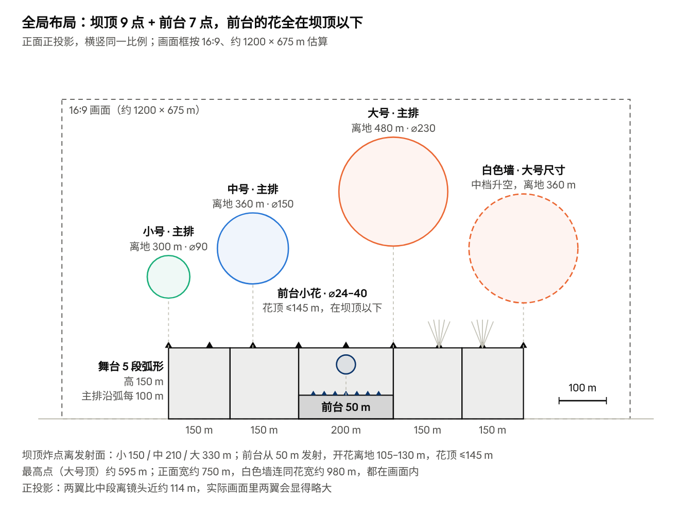
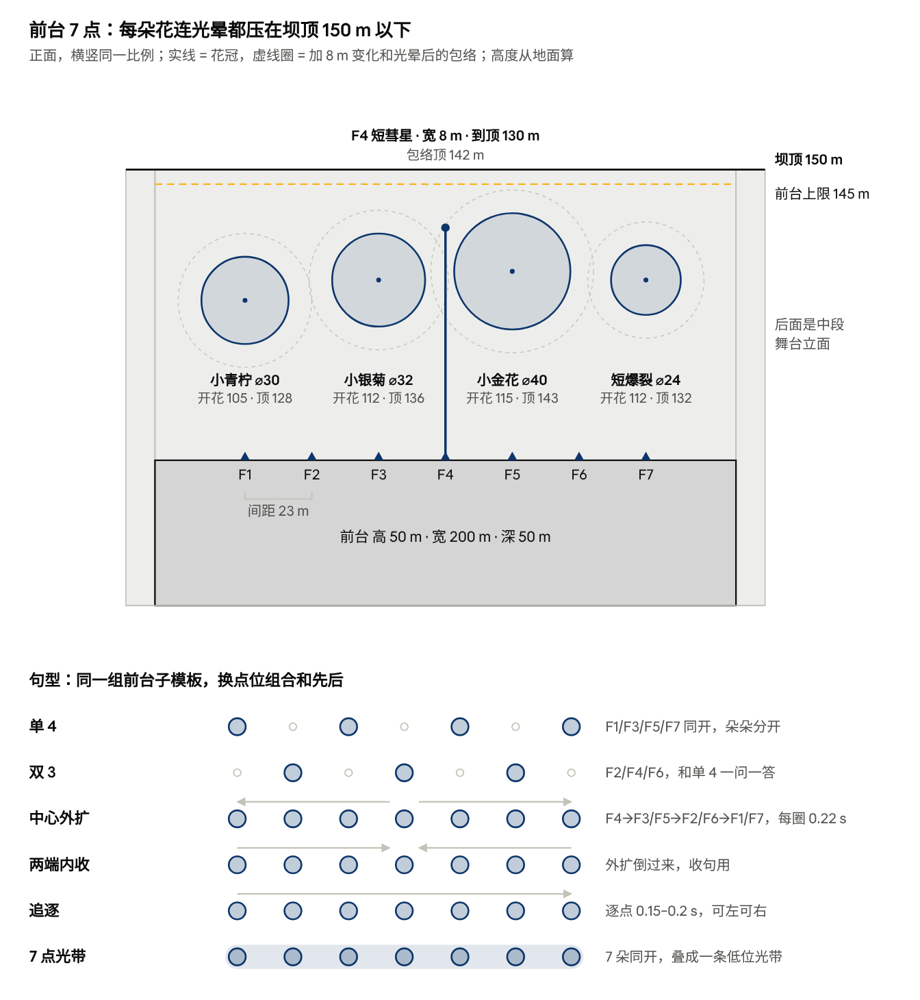
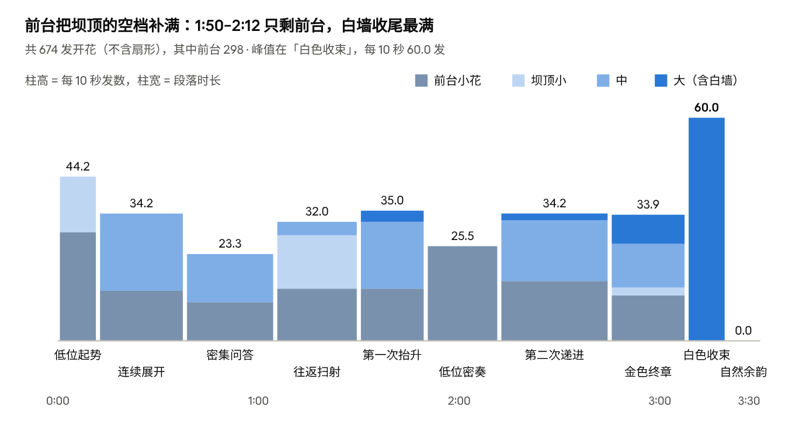
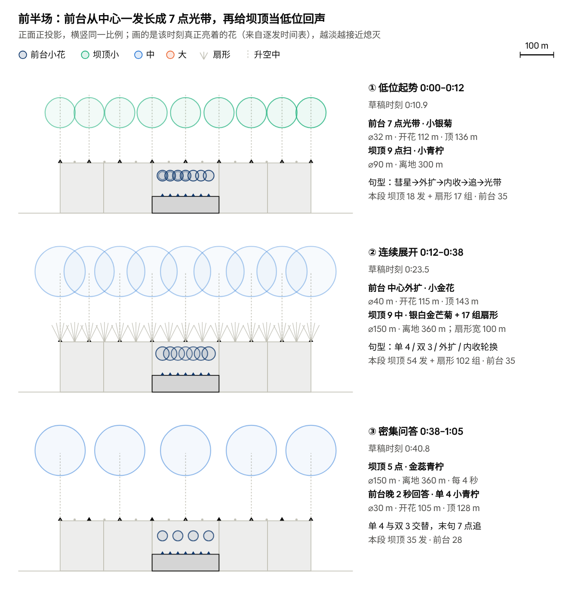
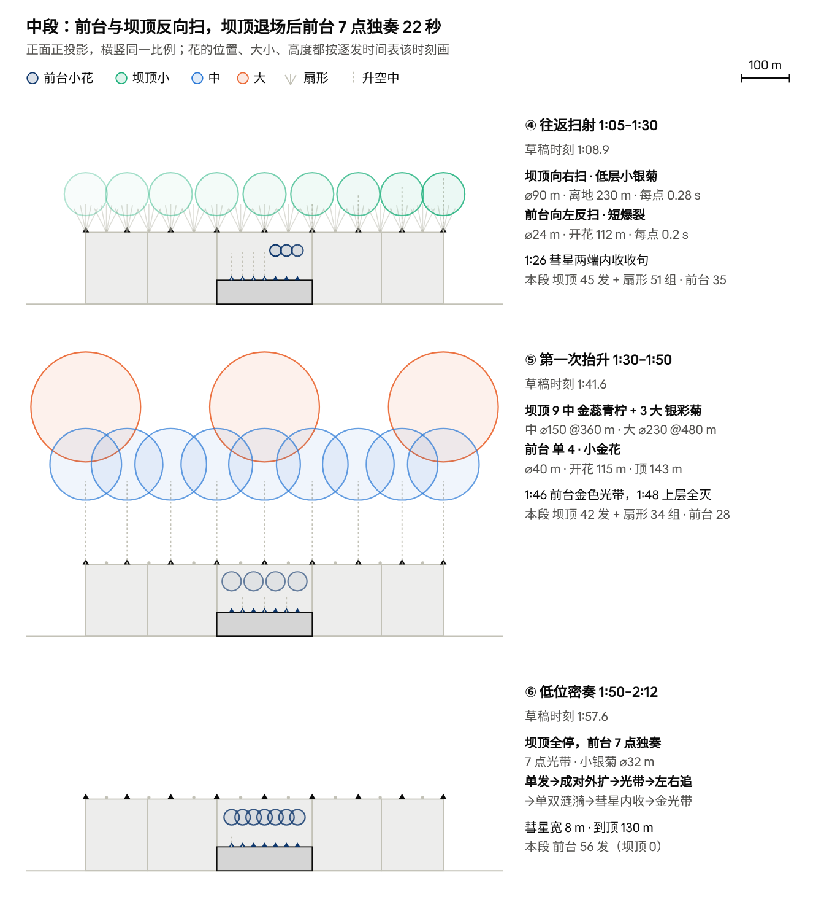
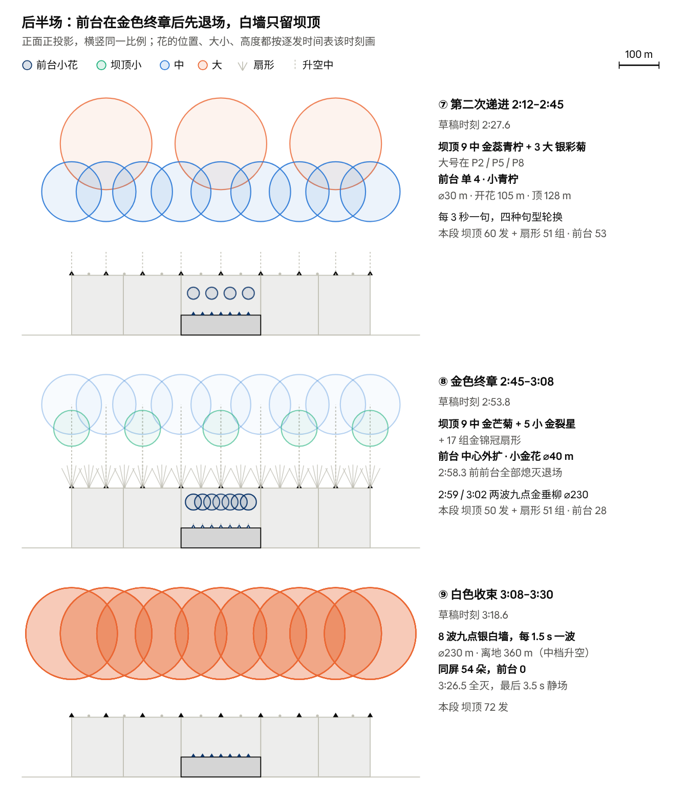
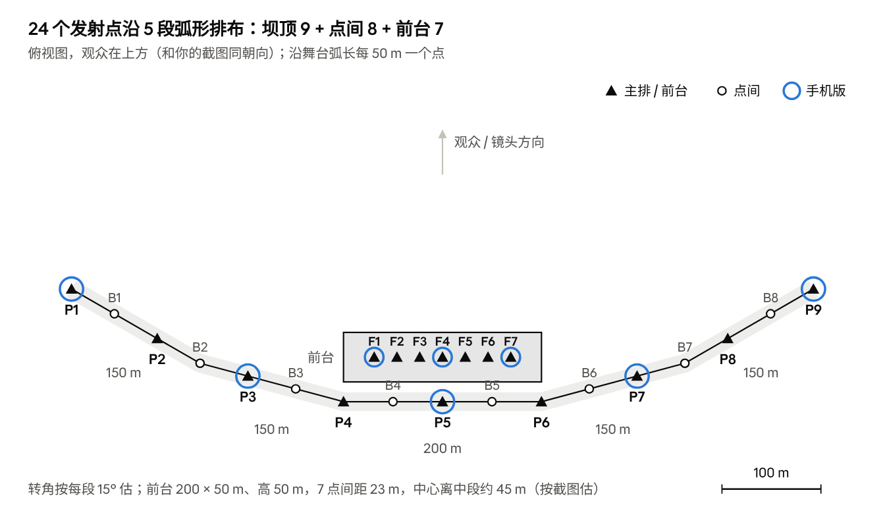

# 跨年烟花秀编排计划书（3 分 30 秒 · 前台低位 7 点版）

2026-10-07 · 对话框22（接对话框24 的加密版，前台改 7 点）

> 在线版（图可交互、可评论，以在线版为准）：https://claude.ai/code/artifact/7af886ef-6a6f-4249-be42-00d66cedb354 。上一版（对话框24，前台 3 点、850 次）在 `归档/跨年烟花秀编排计划书_2026-10-07_对话框24密集版.md`，10-05 版在 `归档/跨年烟花秀编排计划书_2026-10-05.md`。

**结论：前台改成 7 个点（间距 23 m），只放 5 种专用小花（⌀24–40 m），每朵连光晕都压在 145 m 以下，低于 150 m 坝顶。坝顶管上层、前台管坝顶以下，两层不再抢同一个高度。全片 3 分 30 秒十段，共 980 次播放：坝顶 682（开花 376 + 扇形 306 组），前台 298。前台开场先起、坝顶齐射之间回应，1:50–2:12 坝顶全停时独奏 22 秒，2:58 前退场，白墙只留坝顶。**

参考：[長岡花火 復興祈願フェニックス 2025](https://www.youtube.com/watch?v=0aaYtL4XIlI)（AQUA Geo Graphic，高层屋顶视角）。凤凰是长冈花火最有名的一段：沿信浓川近 2 km 宽的宽幅 Star Mine，配平原绫香《Jupiter》，以金色为主，一波接一波地铺满整个河面（[Live Japan](https://livejapan.com/en/in-tohoku/in-pref-niigata/in-joetsu_uonuma_yuzawa/article-a3000355/)、[国交省多语解说](https://www.mlit.go.jp/tagengo-db/common/001557354.pdf)）。

**限制**：没看到视频画面（YouTube 限流），秒数是游戏版模板，还没对音乐。草稿是按逐发数据画的比例示意，不是 UE 回放。坝顶部分沿用对话框 24 的加密圆冠版（10-07），这次只改前台和与它配合的节奏。

**怎么用**：先看「前台」一节的尺寸图和句型，再看「各阶段构图草稿」；节奏表和数量是逐发数据的汇总，UE 一节给点位坐标、子模板和编队。

## 目标画面：开场与结尾

开场和结尾用同一排发射点，差别只在开花尺寸：开场中号，花与花之间留缝；结尾大号，互相叠成一整面墙。

**开场**（图 2）是三层同时亮：

- 高层：9 发菊花一字排开，高度略有起伏，白金带淡紫，单朵分得清。直径约为发射点间距的 1.5 倍，相邻的只叠边 → 中型\_B\_金芒菊\_银白，缩小后直径 150 m，9 点间距 100 m 正好 1.5 倍；高低交替，相差 30 m。
- 中层：约 1/3 高度一排暗淡的小花 → 小型\_F\_小银菊，不带尾缀，炸点离舞台顶约 80 m（比标准小号低 70 m，升空时间相应缩短）。
- 低层：全宽一排金色扇形，17 组（P1–P9 + 点间 B1–B8）交叉成网 → 小型\_A\_金锦冠扇形：P5 用「中心」，P2–P4、P6–P8 和点间用「中间」，两端用「外左 / 外右」，扇面朝外张开。
- 节奏：0:00–0:12 前台 7 点先起势；0:11 坝顶 17 组扇形预告，0:12 九点中号齐射（升空 5 s，0:07 发射），就是这张图的画面；之后每 4 秒一波，银白 / 金色交替。中层小花现在由前台在坝顶以下补（开场 0:10.4 的 7 点光带）。

**结尾**（图 1）是一面连续的白墙：

- 9 发大号同时开，直径约为间距的 2.3 倍，互相吃进一半，看不出单朵；花比开场大、下缘垂得更低 → 大型\_C\_金芒菊\_银白：大号尺寸（⌀230 m，SizeScale 11.5）配中档升空（5 s、离舞台顶 210 m），9 点间距 100 m 正好 2.3 倍。
- 墙下面还能看到 9 条正在上升的尾缀：这一波还亮着，下一波已在路上 → 每 1.5 s 一波、连打 8 波共 72 发，墙从 3:08 连续亮到 3:26.5；这时前台已经退场。
- 河面有一层被照亮的烟。游戏里可选：舞台顶放一层受光雾片。

**由此定下的两个参数**：

- 发射点间距 100 m：弧形舞台沿弧共 800 m，放 9 个点。尺寸整体缩到 0.8 后，开场 150 ÷ 100 = 1.5 倍、白色墙 230 ÷ 100 = 2.3 倍，和两张参考图一致。
- 两张图的粉紫色是烟和相机白平衡带来的；配色用银白偏暖（如 #fff0f4）即可。

## 场地与分工

坝顶管上层、前台管坝顶以下。坝顶 P1–P9 沿 5 段弧形每 100 m 一个点，点间 B1–B8 只放扇形；前台 F1–F7 七个点、间距 23 m，只放专用小花，花连光晕都压在 145 m 以下，比坝顶低 5 m。

| 区域 | 发射点 | 放什么 | 尺寸 |
| --- | --- | --- | --- |
| 坝顶主排 | P1–P9，弧长每 100 m，发射面 150 m | 小 / 中 / 大花、九点齐射、三点压顶、白墙 | ⌀90 / 150 / 230 m；开花离地 230–480 m |
| 坝顶点间 | B1–B8 | 金锦冠扇形，和 P 点合成 17 组 | 扇宽约 100 m |
| 前台 | F1–F7，X = −69 … +69 m，间距 23 m，发射面 50 m | 5 种前台专用小花（下一节） | ⌀24–40 m；开花离地 105–130 m；包络顶 ≤145 m |

## 前台：7 个点，只放小花

前台从 3 个点加到 7 个点，不再放坝顶的花型（中号、千轮、银彩菊、扇形都拿掉），只放 5 种专用小花。最大的小金花 ⌀40 m、花顶 143 m，算上 8 m 变化和光晕仍低于 145 m。外侧 F1 / F7 在 ±69 m，最大的花加包络外缘到 ±97 m，还在 200 m 宽的前台以内。

7 个点用同一组子模板，靠换点位组合和先后做出 6 种句型（图下半）。间距 23 m 时，单 4 / 双 3 朵朵分开；7 点同开连成光带（⌀32 m 是间距的 1.4 倍）。

| 子模板 | 花型 | 直径 m | 开花离地 m | 包络顶 m | 升空 s | 开花后 s | 初速 cm/s | 阻力 | SizeScale |
| --- | --- | --- | --- | --- | --- | --- | --- | --- | --- |
| F\_SILVER | 小银菊 | 32 | 112 | 136 | 1.7 | 2.3 | 13993 | 1.988 | 1.6 |
| F\_LIME | 小青柠 | 30 | 105 | 128 | 1.6 | 2.3 | 13196 | 2.114 | 1.5 |
| F\_GOLD | 小金花 | 40 | 115 | 143 | 1.8 | 2.8 | 13521 | 1.808 | 2 |
| F\_CRACKLE | 短爆裂 | 24 | 112 | 132 | 1.7 | 1.8 | 13993 | 1.988 | 1.2 |
| F\_COMET | 短彗星 | 宽 8 | 到顶 130 | 142 | 1.8 | 0.6 | 17919 | 2.019 | — |

**规则**：坝顶子模板不绑 F 点，前台子模板不绑 P / B 点；大小和高度的随机都收在包络里。UE 里逐个从发射到熄灭量完整包络：最高发光点 ≤ 14500 cm，横向不超 ±10000 cm；超了就缩花径或降开花点，不靠裁切。升空 1.6–1.8 s 是这次改的：原来 1.1–1.3 s 要阻力 3.4–4.4，尾缀一冲就停；现在阻力约 2，和坝顶低层小银菊（1.6）是同一类手感。初速和阻力按「升空结束正好到炸点顶点」算，SizeScale 按金芒菊实测「直径 ÷ 20」，换素材要重标。

## 节奏表（3 分 30 秒）

全片 3 分 30 秒分十段：低位起势 → 连续展开 → 密集问答 → 往返扫射 → 第一次抬升 → 低位密奏 → 第二次递进 → 金色终章 → 白色收束 → 自然余韵。主排 P1–P9 沿弧形舞台顶、弧长间距 100 m，P5 居中；前台 F1–F7 在中段正前方（高 50 m），只放花顶 ≤145 m 的小花。坝顶管上层、前台管坝顶以下：开场由前台先起，坝顶齐射之间前台回应，1:50–2:12 坝顶全停、前台独奏，2:58 前前台退场，白墙只留坝顶。发数都按开花时刻所在的段统计。

| 段 | 时间 | 坝顶开花 | 扇形组 | 前台 | 怎么打 |
| --- | --- | --- | --- | --- | --- |
| 低位起势 | 0:00–0:12 | 18 | 17 | 35 | 前台先起：F4 彗星 → F3/F5 彗星 → 外扩 → 内收 → 单 4 → 反向追 → 0:10.4 光带；坝顶 0:06 / 0:09 两遍九点小花扫入 |
| 连续展开 | 0:12–0:38 | 54 | 102 | 35 | 坝顶每 4 秒九点中花；前台插在两波之间：单 4 / 双 3 / 外扩 / 单 4 / 双 3 / 内收，0:36.5 光带 |
| 密集问答 | 0:38–1:05 | 35 | 0 | 28 | 坝顶每 4 秒五点；前台晚 2 秒用单 4 / 双 3 回答，1:04 七点追 |
| 往返扫射 | 1:05–1:30 | 45 | 51 | 35 | 坝顶四遍九点往返扫（每点 0.28 s）；前台每遍晚 2.5 秒反向扫（每点 0.2 s），1:26 彗星两端内收 |
| 第一次抬升 | 1:30–1:50 | 42 | 34 | 28 | 四轮九点中花 + 两轮三点大花；前台单 4 / 双 3 / 外扩轮换，1:46 金色光带，1:48 上层全灭 |
| 低位密奏 | 1:50–2:12 | 0 | 0 | 56 | 坝顶全停（预发也停）；前台独奏：F4 单发 → 成对外扩 → 光带 → 左右追 → 单双涟漪 → 彗星内收 → 2:09 金色光带 |
| 第二次递进 | 2:12–2:45 | 60 | 51 | 53 | 六轮九点中花 + 两轮三点大花（P2 / P5 / P8）；前台每 3 秒一句，单 4 → 双 3 → 外扩 → 内收轮换，2:42 光带 |
| 金色终章 | 2:45–3:08 | 50 | 51 | 28 | 三轮九点金花 + 五点金裂星 + 2:59 / 3:02 两波九点金垂柳；前台以金色光带开头和收尾，2:58.3 前全部熄灭退场 |
| 白色收束 | 3:08–3:20 | 72 | 0 | 0 | 八波九点银白墙，每 1.5 s 一波；金帘和第一波白墙搭接 1 秒 |
| 自然余韵 | 3:20–3:30 | 0 | 0 | 0 | 白墙余火到 3:26.5 熄灭，静场 3.5 s |
| 合计 | 210 s | 376 | 306 | 298 | 共 980 个播放实例 |

坝顶部分和对话框 24 的加密版一致；前台句子的位置没动，只是每句从 3 点变成 3–7 点，所以前台从 168 发到 298 发。秒数是模板，音乐定了以后整体平移、按升空时间重算发射时刻。

## 各阶段构图草稿

每个阶段挑一个最有代表性的时刻，按逐发时间表画出那一刻真正亮着的花（越淡越接近熄灭，虚线是还在升空的尾缀），右边标该段的新尺寸、类型和发数。前台的花始终在坝顶立面前、150 m 以下，和坝顶的花上下分开。

低位密奏这 22 秒只有前台，在整场比例里很小；镜头最好在这段推近到前台，前台句型的细节看上面「前台」一节的图。

## 数量

| 类别 | 坝顶 | 前台 | 合计 |
| --- | --- | --- | --- |
| 小花 | 59 | 281 | 340 |
| 中花 | 215 | 0 | 215 |
| 大花（含白墙） | 102 | 0 | 102 |
| 短彗星 | 0 | 17 | 17 |
| 金锦冠扇形组 | 306 | 0 | 306 |
| 播放实例 | 682 | 298 | 980 |

前台里小银菊 97、小金花 75、短爆裂 62、小青柠 47、短彗星 17。前台同屏最多 15 朵花冠（0:10.4 光带那一刻），算上升空中的最多 21 个实例；每个 F 点同时最多挂 3 个，要用独立实例，不能重置上一发。整场同屏峰值仍是白墙 54 朵。没测 FPS / overdraw。

## UE 实现：点位、子模板、编队

点位从 20 个变成 24 个：坝顶 17 个不变，前台 F1–F3 换成 F1–F7。子模板 15 个（坝顶 10 + 前台 5）加扇形 1 个。

| 点 | 所在位置 | X | Y（朝观众为正） | Z | 扇形 Yaw |
| --- | --- | --- | --- | --- | --- |
| P1 | 左外段端点 | −37479 | 11382 | 15000 | +30° |
| B1 | 左外段 | −33149 | 8882 | 15000 | +30° |
| P2 | 左外段 | −28819 | 6382 | 15000 | +30° |
| B2 | 左外 / 左内转角 | −24489 | 3882 | 15000 | +22.5° |
| P3 | 左内段 | −19659 | 2588 | 15000 | +15° |
| B3 | 左内段 | −14830 | 1294 | 15000 | +15° |
| P4 | 左内 / 中段转角 | −10000 | 0 | 15000 | +7.5° |
| B4 | 中段 | −5000 | 0 | 15000 | 0° |
| P5 | 中段中心 | 0 | 0 | 15000 | 0° |
| B5 | 中段 | 5000 | 0 | 15000 | 0° |
| P6 | 中段 / 右内转角 | 10000 | 0 | 15000 | −7.5° |
| B6 | 右内段 | 14830 | 1294 | 15000 | −15° |
| P7 | 右内段 | 19659 | 2588 | 15000 | −15° |
| B7 | 右内 / 右外转角 | 24489 | 3882 | 15000 | −22.5° |
| P8 | 右外段 | 28819 | 6382 | 15000 | −30° |
| B8 | 右外段 | 33149 | 8882 | 15000 | −30° |
| P9 | 右外段端点 | 37479 | 11382 | 15000 | −30° |
| F1 | 前台 | −6900 | 4500 | 5000 | — |
| F2 | 前台 | −4600 | 4500 | 5000 | — |
| F3 | 前台 | −2300 | 4500 | 5000 | — |
| F4 | 前台 | 0 | 4500 | 5000 | — |
| F5 | 前台 | 2300 | 4500 | 5000 | — |
| F6 | 前台 | 4600 | 4500 | 5000 | — |
| F7 | 前台 | 6900 | 4500 | 5000 | — |

单位 cm，原点取中段中点的地面；X 沿中段向右，Y 指向观众，Z 向上。转角 15°、前台中心离中段 45 m 是按截图估的，实测后只改这两个数。手机版可只用 P1 / P3 / P5 / P7 / P9 + F1 / F4 / F7。

**坝顶子模板**（10 个；前台 5 个见「前台」一节）

| 子模板 | 花型 | 直径 m | 开花离地 m | 花顶 m | 升空 s | 开花后 s | 初速 cm/s | 阻力 | SizeScale |
| --- | --- | --- | --- | --- | --- | --- | --- | --- | --- |
| P\_SILVER | 低层小银菊 | 90 | 230 | 275 | 2 | 3 | 14960 | 1.625 | 4.5 |
| P\_LIME | 小青柠 | 90 | 300 | 345 | 3.5 | 3 | 13194 | 0.651 | 4.5 |
| P\_SPLIT | 金裂星 | 90 | 300 | 345 | 3.5 | 3 | 13194 | 0.651 | 4.5 |
| P\_MS | 银白金芒菊 | 150 | 360 | 435 | 5 | 4 | 10924 | 0.287 | 7.5 |
| P\_MG | 金芒菊 | 150 | 360 | 435 | 5 | 4 | 10924 | 0.287 | 7.5 |
| P\_GREEN | 金蕊青柠 | 150 | 360 | 435 | 5 | 4 | 10924 | 0.287 | 7.5 |
| P\_MULTI | 多重菊 | 150 | 360 | 435 | 5 | 4 | 10924 | 0.287 | 7.5 |
| P\_LS | 银彩菊 | 230 | 480 | 595 | 8 | 6 | 8459 | 0.019 | 11.5 |
| P\_LG | 金垂柳 | 230 | 480 | 595 | 8 | 7 | 8459 | 0.019 | 11.5 |
| P\_WALL | 银白墙 | 230 | 360 | 475 | 5 | 8 | 10924 | 0.287 | 11.5 |

金锦冠扇形 G\_GOLD 扇宽约 100 m、燃烧 3 s，从 P / B 点直接喞出，不带升空。初速、阻力按线性阻力 + 重力 −981 算；帧号曲线和 V5 尾缀不重烘。

**编队（BP）**

| 编队 | 点位 | 子模板 | 触发 |
| --- | --- | --- | --- |
| FrontSolo | F4 | 任一 F\_ | 中心单发 |
| FrontPairs | F3/F5、F2/F6、F1/F7 | 同一 F\_ | 成对同开 |
| FrontOdd / FrontEven | F1/F3/F5/F7；F2/F4/F6 | 同一 F\_ | 单 4 / 双 3 同开 |
| FrontSpread / FrontGather | 4 圈：F4 → F3/F5 → F2/F6 → F1/F7 | 同一 F\_ | 每圈 0.22–0.25 s，外扩或内收 |
| FrontChase | F1–F7 | 同一 F\_ | 逐点 0.15–0.2 s，正反向 |
| FrontBand | F1–F7 | 同一 F\_ | 7 点同开 |
| DamMirror | P1/P3/P5/P7/P9 | P\_LIME / P\_GREEN / P\_MS / P\_SPLIT | 五点同开 |
| DamSweep | P1–P9 | P\_SILVER / P\_SPLIT | 正 / 反向每点 0.28 s |
| DamSalvo | 3 / 9 个 P 点 | 中花或三点大花 | 同刻开花，按升空倒算发射 |
| DamFan | P1–P9 + B1–B8 | G\_GOLD | 17 组铺底，方向跟舞台段 |
| DamFinale | P1–P9 | P\_LG / P\_WALL | 金垂柳两波，白墙八波 |

前台编队只绑 F 点、只选 F\_ 子模板；坝顶编队只绑 P / B 点。前台 6 种句型是同一组子模板配不同点位组合，在定序器里换触发的组就行。白墙八波和前台光带都要留独立实例池，不能同一组件反复 Activate。

## 坝顶阵型参考（沿用 10-05）

坝顶的尺寸和点位这次没变，下面三张仍然有效：直径 ≤ 1.5 倍间距时一朵朵分得清，2–2.3 倍连成墙，接近 3 倍就糊。

## 数据与检查

- 生成器 `analysis/scripts/烟花编排demo.py`（版本 front-low-v3-7pt）：检查前台只用 F\_ 子模板、包络顶 ≤145 m、横向在平台内、花底不低于平台、全部在 0–210 s、低位密奏坝顶无预发、白墙 72 发、206.5 s 全灭、无重复事件。
- 逐发表 `协作/编排demo/逐发时间表.csv`（980 行）、`时间线.json`、可拖动的节奏示意 `fireworks-rhythm.html`（前台近看能看到 7 点）。
- 这是编排设计和比例示意，不是 UE 回放；前台真实的星、尾迹、光晕包络、透视遮挡、帧率都没在 UE 里验过。

## 待你决定

- [ ] 前台 7 点、间距 23 m 合适吗？想更密可加到 9 点（间距约 17 m，光带更连续），想更疏可回到 5 点。
- [ ] 前台升空改成 1.6–1.8 s 可以吗？对话框 24 定的 1.1–1.3 s 更快更脆，但尾缀会一冲就停。
- [ ] 弧形转角是不是约 15°、前台中心离中段多远？现在按截图估 15° 和 45 m。
- [ ] 音乐定了告诉我，整场按拍点平移。
