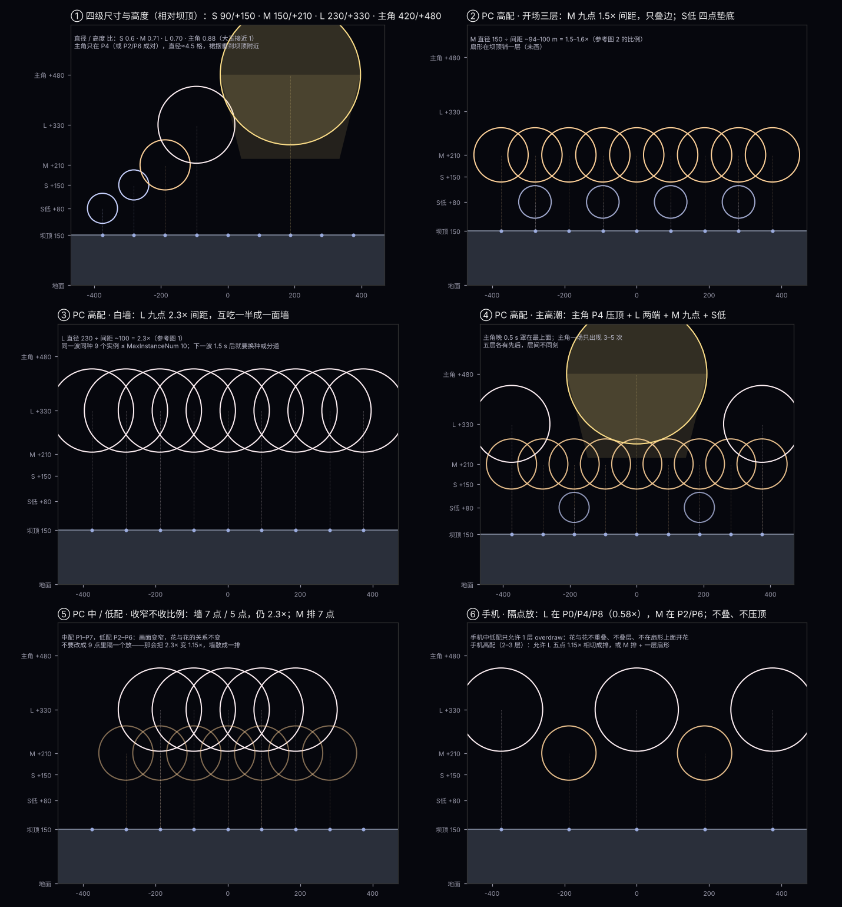

# 跨年烟花秀编排宪章（草案 v1）

跨年秀（22）· 2026-10-11 · 按用户 10-11 00:52 的回答与六个补充问题重写（v0 的「浪 / 渺」说法作废，主题回到计划书）

> **状态：草案，等用户批。** 批之前不约束任何人；R03 / R04 / 候选 A2 只作回滚样本，不修补（用户 10-11）。
> 证据：R03 的诊断在 [编排审查 R03](编排审查_R03_2026-10-10.md)；导演结构在 [手游编排评审](../对话记录/对话框手游编排.md)；点位坐标和参考图比例在 [计划书](跨年烟花秀编排计划书.md)。
> 标 **〔待定〕** 的数是我的建议，要你改或批；标 **〔待核对〕** 的是我没法在云端证实的事实（引擎里的发射器数、性能）。时间一律写**音乐时间**，演出 = 音乐 + 5（用户 10-11 定）。

## 0. 宪章管什么、层级

管：放什么、什么时候放、放多少、怎么配、三档和手机怎么减。不管：固定花型内部（只你改）、资源烘焙、8025 界面、UE 导入。

```
宪章（本文） → 逻辑方案（proposal：幕 / 构图 / 层 / 开花时刻） → 三表（编排模板 + 时序） → 导演 → UE 实播 → 你验收
```

上一层没批，下一层不做。你看画面提意见时，先落到宪章的某一条，再改方案；不逐条改发射。

## 1. 主题：回到计划书的十段

你 10-11：「之前的主题 = 你之前做的计划书」。所以主线就是计划书的十段，加上你 10-09 要的烟花倒计时和你给的 1:47 主高潮锚点，按音乐能量台阶（53.7 / 107.2 / 133.2 / 164.0 / 191.5，检测值，待试听）落到时间上。音乐的事你不用懂，只要知道：**每一发开花都落在一个鼓点上，大的落在小节第一拍上**，剩下的是我的活。

| # | 段（计划书名） | 音乐时间 | 演出时间 | 做什么（计划书原意） | 主角 / 大号 |
|---|---|---|---|---|---|
| 0 | 倒计时 | −5 → 0 | 0:00–0:10 | 烟花倒计时：P0+P8 → P1+P7 → P2+P6 → P3+P5 → P4，每秒一步；音乐在倒计时 5 进入 | 无 |
| 1 | 低位起势 → 开场 | 0:05–0:16 | 0:10–0:21 | 0 点从 P4 向外开，开场三层（M 九点 + S低 + 全宽扇形），前台先起 | 无 |
| 2 | 连续展开 | 0:16–0:28 | 0:21–0:33 | 坝顶每小节一排 M，银白 / 金交替；前台插在两波之间 | 无 |
| 3 | 密集问答 | 0:28–0:41 | 0:33–0:46 | 坝顶五点问，前台晚一拍答；开始加色（绿 / 橙 / 青柠点缀） | 无 |
| 4 | 往返扫射 | 0:41–0:54 | 0:46–0:59 | 17 点连扫往返，前台反向追 | 无 |
| 5 | 第一次抬升 | 0:54–1:07 | 0:59–1:12 | 能量台阶 1：M 排 + **L 三点压顶**，段末 **主角第一次露面**（P4 一发） | L ×6–9，主角 ×1 |
| 6 | 低位密奏 | 1:07–1:18 | 1:12–1:23 | 坝顶全停，前台独奏；第一小节完全空 | 无 |
| 7 | 第二次递进 | 1:18–1:47 | 1:23–1:52 | 六轮 M 排 + 两轮 L 三点；末 10 s 蓄势收窄到中心、鼓点七连 | L ×6 |
| 8 | **主高潮**（新增，你的 1:47） | 1:47.2–2:13 | 1:52–2:18 | 五层满构图：主角 P4 压顶 + L 两端 + M 九点 + S低 + 17 点扇；bar 81 金墙收 | 主角 ×1，L ×12–18 |
| 9 | 转场铺色 | 2:13–2:44 | 2:18–2:49 | 彩千轮 / 绿牡丹 / 青柠 的色彩段，两次小峰；为终章重新铺金 | L ×4 |
| 10 | 金色终章 | 2:44–3:11 | 2:49–3:16 | 三轮 M 金排 + 五点金裂星 + 金垂柳两波；能量最高点（3:09.9 检测）主角成对 P2/P6 | 主角 ×2，L ×12 |
| 11 | 白色收束 | 3:11–3:23 | 3:16–3:28 | **8 波 L 九点白墙，每小节一波**，前台已退场 | L ×72 |
| 12 | 余韵 | 3:23–3:31 | 3:28–3:36 | 墙余火；最后一发主角 P4 悬着熄灭；音乐 3:22.9 起淡出 | 主角 ×1 |

主角（金垂柳 · 四尺玉）全场 **5 次〔待定〕**：5 段末 1、8 段入口 1、10 段 2、12 段收尾 1。每次前后 1 小节不放 L。

色彩故事：银白（1–4）→ 金银交替（5–7）→ 满色（8）→ 彩色（9）→ 金（10）→ 白（11–12）。每段主色 1 个、点缀色 ≤ 1 个，点缀 ≤ 该段开花数 20%。

## 2. 比例高度构图（补充问题 1）



方法和计划书一样：不依赖镜头，用**花直径 ÷ 发射点间距**定构图（参考图 2 开场 = 1.5×，参考图 1 白墙 = 2.3×），用**开花高度（相对坝顶）**分层。坝顶 P 点沿弧每 100 m 一个，正面投影约 94 m。

### 2.1 四级尺寸〔待定〕

你 10-11 把主角单列出来，所以是四级，不是三级：

| 级 | 花 | 直径 m | 开花高度（相对坝顶） | 直径/高度 | 画面里占几格 | 全场次数〔待定〕 |
|---|---|---|---|---|---|---|
| 主角 | 金垂柳（四尺玉） | **420** | **+480** | 0.88 | 4.5 格 | 5 |
| 大 L | 金芒菊、金蕊青柠星、多重菊（你说的 200 多米）、银彩菊（白墙用，待你定） | 230 | +330 | 0.70 | 2.3 格 | 110–130（含白墙 72） |
| 中 M | 金曜菊、金锦菊、绿牡丹、彩千轮 | 150 | +210 | 0.71 | 1.5 格 | 150–200 |
| 小 S | 小银菊、金裂星、爆裂星、点灭星、小青柠、橙辉星 | 90 | +150；低层 +80 | 0.6 | 0.9 格 | 120–160 |
| 前台 F | 专用小花 | 24–40 | 花顶 ≤ 145 | — | — | 沿用计划书 |

- 主角直径 420 是「四尺玉」的游戏版：现实四尺玉直径约 750 m、高度约 750 m（烘焙器金芒菊规格 JMG40），缩到这个场地 0.55 倍，刚好盖住 P2–P6；金垂柳裙摆向下垂约 0.6 直径，底边落到坝顶附近。**这要你在资源上改 SizeScale 和尾缀终点，我只给比例。**
- 大玉的直径 / 高度接近 1（现实三尺玉约 600 / 600），所以主角比 L 更「矮胖」，是对的。
- 高度相对坝顶 +150 / +210 / +330 就是你 10-08 的数；R03 用的 190 / 265 / 410 要改回来（尾缀终点按级定，不按资源自带）。低层 +80 只给小银菊用。

### 2.2 高、中、低配：收窄，不收比例

**结论：三档点位坐标相同、每级高度相同；档位减的是点数（从两端往里收）、层数和波数，不是间距。** 隔一个点放会把 2.3× 变成 1.15×，墙散成一排、开场排变成一串孤立的花——画面变成另一场秀，而不是「省一点的同一场秀」。

| 构图 | 高配 | 中配 | 低配 | 比例保持 |
|---|---|---|---|---|
| M 排 ROW | P0–P8（9） | P1–P7（7） | P2–P6（5） | 1.5× |
| L 白墙 WALL | 9 点 × 8 波 | 7 点 × 6 波 | 5 点 × 4 波 | 2.3× |
| L 压顶 CROWN | P0 / P4 / P8 | 同 | 同（主角时刻不减） | 0.58× |
| 主角 | P4 或 P2+P6 | 同 | 同 | — |
| S低 垫底 | 4 点 | 2 点 | 0 | — |
| 17 点连扫 FAN17 | P+B 17 组、13 束 | 17 组、9 束 | B2–B5 + P2–P6（9 组）、5 束 | 扫线不断 |
| 前台 | F0–F6 | F1–F5 | F3 | — |

### 2.3 手机：隔点放，不叠

手机不是 PC 低配（见第 3 节 overdraw）。手机**允许隔点**，因为手机的约束不是「省一点」而是「任何像素上只能有 1–3 层半透明」：

| 构图 | 手机高（2–3 层） | 手机中 / 低（1 层） |
|---|---|---|
| L 排 | P0/P2/P4/P6/P8，1.15× 相切成排 | P0/P4/P8，0.58×，互不碰 |
| M 排 | P1/P3/P5/P7 或 P2/P6 | P2/P6 |
| 压顶 / 叠层 | 不叠；主角单独出现 | 不叠 |
| 扇形 | 只用中心件、≤5 束，不在花下面 | 不放，或只 B3/B4 各 1 束 |
| 尾缀 | L 和主角有，M / S 无 | 只主角有 |

## 3. 手机配置怎么规划（补充问题 2、3）

### 3.1 你给的规范，我是这样读的〔待核对〕

「手游资产高配最多 2–3 层 overdraw，每个发射器**能**超过 50 个 CPU 粒子」——我按「**不能**超过 50」读（否则这条没有约束意义），请确认。「中低配只能一层 overdraw，粒子发射器不能超过 3 层」= 每个粒子系统 ≤ 3 个发射器。

对烘焙序列贴图的烟花，这三条换算成：

| 约束 | 换算 | 对编排的含义 |
|---|---|---|
| overdraw 2–3 层（高）/ 1 层（中低） | 一个像素上同时覆盖的半透明大面片数 = 一朵花的层数 × 互相重叠的花数 + 尾缀 + 扇形 | **叠层构图（压顶、五层、白墙互吃一半）在手机上不成立**；中低配花与花不能重叠，花下面不能有扇形 |
| 每发射器 ≤ 50 CPU 粒子 | 序列贴图的花一个发射器只有 1 个大面片，不受限；**扇形**（11 筒 × 4–5 星 = 44–55 颗）、彗星、尾缀火花受限 | 扇形是手机上最贵的东西，先减它 |
| 每系统 ≤ 3 发射器 | 烘焙器一层 = 一个发射器 | 4 层的金蕊青柠星、多重菊、彩千轮要么出 2 层的 _L 版，要么手机不用 |

### 3.2 一个导演蓝图怎么配（沿用手游编排评审第四节，这里只定做法）

```
BP_NewYearFireworks_ShowDirector
├─ DefaultConfig            PlatformMask = PC(4)【主机 8 是否跟 PC 待你定】
│   └─ 三表：一张，条目带 Filter.MinQualityLevel（VeryLow = 低配核心 ⊂ Medium ⊂ High）
└─ PlatformOverrides[0]     PlatformMask = Mobile(2)
    └─ 三表：手机母版一张，同样三档嵌套；TotalDuration、音乐、倒计时与 PC 相同
ResourceFX（PC 表 / 手机表分开）
    FxSP / FxSP_Low / FxSP_High：同一个 FXResourceId 在不同画质解析成不同粒子（_H/_M/_L）
    MaxInstanceNum：同种同时存在上限（现在球花 / 扇形 10、尾缀 20）
```

三件事不混：**平台用 Config 分，画质用 Filter 分，换粒子用资源表分。** 现在工作台把三档出成三套表、导演里任何时刻只有一档，运行时切不了画质；要改成「每平台一张表 + 嵌套 Filter」——这是编排demo（24）的活，我在状态清单里排。

先决条件：手机 ResourceFX 现在**没有** 3.0 的任何一个资源（10-10 读回），手机编排之前先要有手机粒子（烘焙器导 `cascade_mobile.json` → 导入器）。

### 3.3 哪些效果能上手机〔待核对：层数要在引擎里数发射器〕

层数是我按烘焙器配方和你的话估的，**不是引擎读回**。我已把「读每个 ResourceFX 的发射器数」排给编排demo（24）。

| 花 | 估计层数（不含尾缀） | 手机高（≤3 层、2–3 overdraw） | 手机中低（1 overdraw） | 备注 |
|---|---|---|---|---|
| 金垂柳 GoldKamuro（主角） | 1（你说单层） | ✅ | ✅ 主角 | 面片大，占屏多，但只 1 层；是手机上最划算的「震撼」 |
| 金芒菊 GoldRayChry | 1（你说单层） | ✅ | ✅ | 手机的 L 主力 |
| 金曜菊 GoldChry | 1〔估〕 | ✅ | ✅ | 手机的 M 主力 |
| 绿牡丹 GreenPeony | 1〔估〕 | ✅ | ✅ | 唯一的绿 |
| 金锦菊 GoldSpark | 1–2〔估〕 | ✅ | 看发射器数 | |
| 银彩菊 SilverStrobeChry | 2〔估：菊 + 点灭〕 | ✅ | ✗ 或 _L 单层 | 白墙在手机上用它还是金芒菊换色，你定 |
| 金蕊青柠星 GoldCoreLime | 4（配方 JQ7：橙引 / 柠点星 / 金菊蕊 / 红点蕊） | ✗，除非出 2 层 _L | ✗ | 你已点名 |
| 多重菊 MultiLayerChry | ≥3 | ✗ / _L | ✗ | |
| 彩千轮 PrismWheels | ≥2（四组小玉） | ✗ / _L | ✗ | |
| 小银菊 SilverChry、点灭星 Strobe | 1 | ✅ | ✅ | 倒计时、低层 |
| 小青柠 Lime | 2（橙引 + 柠绿） | ✅ | ✗ | |
| 金裂星 GoldCrackle、爆裂星 Crackle、橙辉星 OrangeGlitter | 1–2 | ✅ | 看发射器数 | |
| 扇形（红彗星 / 银星 / 金扇 4 件） | 粒子型 | 中心件、≤5 束 | ✗ | 50 粒子上限卡在这 |
| 尾缀 _Small/_Medium/_Large | 1（火花） | L / 主角有 | 只主角 | |

手机的画面语言：**少、大、单层、靠轮廓和色块**。手机母版用 ≤ 8 种花（主角 + 金芒菊 + 金曜菊 + 绿牡丹 + 小银菊 + 点灭星 + 1–2 个单层小花），PC 母版用全部 15 种。

## 4. 模板链与命名（补充问题 4）

五层，一层一个名字规则，**搜任何一层的名字都能找到它上下游**：

| 层 | 是什么 | 在哪 | 命名〔待定〕 | 例 |
|---|---|---|---|---|
| 基础模板 | 引擎里的一个粒子系统（ResourceFX 行） | UE | `P_EFX_FireWorks_<Kind>`（已有，不改） | `P_EFX_FireWorks_GoldChry` |
| 固定子模板（花型） | 尾缀 + 开花 + 开花延迟 + 高度 / 大小版本；**只你改** | 三表 EffectSubTemplates | `<Kind>_H<相对坝顶高度m>` | `GoldChry_H210`、`SilverChry_H80`、`GoldKamuro_H480` |
| 编排模板（父模板） | 一个构图里**一种花的一层**：哪些点、点间顺序和间隔 | 三表 EffectTemplates | `<Kind>_<构图>_<点集>_<序号>` | `GoldChry_ROW9_P_01`、`GoldKamuro_CROWN_P4_02`、`FanGold_SWEEP17_PB_LR_03` |
| 模板库 | 可复用的编排模板目录 + 索引（构图 → 各层 → 父模板） | `FXtools/节目/<节目>/模板库索引.csv` | 构图代号固定：ROW / WALL / CROWN / FULL5 / FAN17 / COUNT / SOLO | 一个 FULL5 = 5 条父模板，共用构图编号 `FULL5a` |
| 时序 | 调度槽：哪一刻调哪个父模板（P / B / F 三组） | 三表 EffectScheduleGroups | 槽位本身没有名字；靠 `时序索引.csv`：段、小节、音乐秒、演出秒、构图编号、父模板、档位 | `8 \| bar66 \| 107.2 \| 112.2 \| FULL5a \| GoldKamuro_CROWN_P4_02 … \| VeryLow` |

规则：
1. 父模板**一种花一条**（混合构图拆成几条、共用构图编号），这样搜 `Lime` 一定能看到它所有的时序——这是你 10-10 在 24 里要的，v16.0.8 的 `Lime_P_C018_01` 已经做到一半，缺的是构图语义。
2. 开花时刻只写在逻辑方案和时序索引里；三表里是调用时刻 = 开花 − D。
3. 三表、模板库索引、时序索引由同一个编译器从逻辑方案生成，**不手改三表**；手改只在逻辑方案层。

## 5. 种类编排（补充问题 5）

### 5.1 出场份额〔待定〕

按「开花数」算（扇形另算，不计入）：

| 级 | 份额 | 规则 |
|---|---|---|
| 主角 | 1–2%（5 次） | 每次是事件：前后 1 小节不放 L；有预告（升空 7.4 s 的尾缀本身就是预告；再加一声前台或扇形） |
| 大 L | 30–35%（含白墙 72） | 只在释放段（5、7、8、10、11）；同一拍最多 L + 相邻一级 |
| 中 M | 35–40% | 骨干，承载节拍；每段主种 ≤ 3 |
| 小 S | 25–30% | 肌理、倒计时、低位回应；不独撑释放段 |
| 扇形 | 占调用 ≤ 40%，且每个时刻只一条扫线 | 背景光，不是开花 |

R03 对比：主角不存在、L 27% 但成簇、M 51%、扇形 59%。

### 5.2 每种花的角色与出场段

角色按烘焙器配方和名字拟（你 10-11：配方可以看）。**每种至少一次单独亮相**（静里只有它，或它领一句）。

| 级 | 花 | 性格（配方） | 角色 | 出场段 | 单独亮相 |
|---|---|---|---|---|---|
| 主角 | 金垂柳 | 锦冠大号，裙摆下垂、长时间悬着 | 事件 | 5 末、8 入口、10 ×2、12 末 | 12 末 |
| L | 金芒菊 | 单层金菊 + 芒，干净、亮 | 释放段骨干、金墙 | 5、7、8、10 | 7 第一轮 |
| L | 金蕊青柠星 | 4 层：橙引 → 柠绿点星，金菊芯，紫白小点 | 高潮里层的「变化」 | 8、10 | 8 bar 73（高频峰） |
| L | 多重菊 | 多芯同心 | 满构图里层 | 8、10 | 10 |
| L | 银彩菊 | 银菊 + 点灭 | 白墙、第一次抬升 | 5、8、11 | 11（8 波墙） |
| M | 金曜菊 | 金菊 | M 排主力 | 2、5、7、10 | 2 第一排 |
| M | 金锦菊 | 金 + 火花 | 推进的节拍点 | 3、7、9 | 3 |
| M | 绿牡丹 | 无尾绿 | 唯一的绿，点缀 | 3、9 | 9 小峰一 |
| M | 彩千轮 | 四组小玉各一色 | 转场的「彩」 | 9 | 9 小峰二 |
| S | 小银菊 | 小、银 | 倒计时、低层垫底 | 0、1、5、8 | 0 |
| S | 点灭星 | 一闪一闪 | 留白里的星光 | 6 | 6 |
| S | 金裂星 | 裂开的金 | 低位金色回应、终章五点 | 3、7、10 | 10 |
| S | 爆裂星 | 脆响质感 | 蓄势鼓点七连 | 7 末 | 7 末 |
| S | 小青柠 | 橙引转柠绿 | 青色点缀 | 3、9 | 3 |
| S | 橙辉星 | 暖色辉光 | 暖色点缀 | 2、9 | 2 |
| 扇 | 红彗星、银星、**金扇（4 件）** | 扫线 | 开场 / 往返 / 高潮铺底 | 1、4、8、10 | 4 |

规则：一段里主种 ≤ 3、点缀 ≤ 2；相邻两次开花种类不同、同种不连续超过 2 次（白墙这种刻意连波除外）；L 只有 4 种，层次靠构图（金 + 银、主角压 L、L 压 M），不靠种类。

### 5.3 高潮点怎么「倒退卡点」

- 以**开花时刻 H** 为准，H 落在鼓点 ±0.1 s；构图入口和主角落在小节第一拍。
- 调用时刻 = H − D：小 2.9544 / 中 4.3772 / 大 7.3651 s（R03 实测延迟；主角 420 m 版的 D 要你重新量）。取 0.1 s 网格后误差 ≤ 0.05 s。
- 例：主高潮入口音乐 1:47.2 = 演出 112.2。主角 H = 112.2 + 0.5（压顶晚半拍）= 112.7 → 调用 105.3；L 两端 H = 112.2 → 调用 104.8；M 九点里→外每格 0.1 s，H = 112.2…112.6 → 调用 107.8…108.2；S低 H = 112.4 → 调用 109.4；扇形即发 112.2。**所以从演出 104.8 起天上就有 3 条大尾缀在升，正好盖住蓄势的鼓点七连（103.98–105.60 音乐 = 109–110.6 演出）**——尾缀就是预告，这是叠层构图必须按层倒推的原因。
- 留白后的第一发必须在强拍；休止是设计，每个留白段至少一个整小节全空。
- 对拍指标〔待定〕：开花次落在鼓点 ±0.1 s ≥ 85%；构图入口 / 主角落强拍 ≥ 80%（R03：26% / 17%）。

### 5.4 密度：出三档让你感受（用户 10-11：都试试）

同一逻辑方案，三个密度预设，只改「每小节几次、每次几点」，构图和主角不变：

| 预设 | 推进段 次/小节 | 释放段 次/小节 | 同屏球花估计 | 像什么 |
|---|---|---|---|---|
| D1 疏 | 1–2 | 3–4 | 5–8 | 比 R03 密一倍，每发看得清 |
| D2 中 | 2–3 | 4–6 | 8–14 | 计划书的量 |
| D3 密 | 3–4 | 6–8 | 14–22 | 长冈凤凰那种铺满 |

三个预设都出 `.dfshow`，你在游戏里各看一遍，选一个再出三档。**密度（D1–D3）和画质（高中低）是两个轴，别混**：先选密度，再按第 6 节从它减出中低配。

## 6. 高中低配怎么分配（补充问题 6）

### 6.1 性能到底花在哪

| 开销 | 由什么决定 | 减它会不会伤画面 |
|---|---|---|
| 实例数（CPU、Tick） | 同时活着的粒子系统数 = 开花次 × 点数 × 寿命 | 减点数伤宽度，减次数伤节奏 |
| 填充（GPU overdraw） | 同时在屏的大面片面积 × 叠层 | 减叠层最省，伤「厚度」 |
| CPU 粒子 | 扇形束数 × 每束星数、尾缀火花 | **减扇形束数几乎不伤画面** |
| 单资源上限 | `MaxInstanceNum`：同种 ≤ 10 | 超了会被拒或挤掉——这是画面出错，不是变弱 |

### 6.2 减的顺序（高 → 中 → 低）

1. **先减扇形束**：13 → 9 → 5，在扇形子模板里按束标 Filter（一套子模板自动退化）。R03 扇形占 59% 调用，这一刀最省、最不伤。
2. **再减叠层**：五层 → 去 S低 → 去 M 中排（主角 + L 压顶 + 扇形保留）。
3. **再收宽**：9 → 7 → 5 点，从两端往里收，比例不变（第 2.2 节）。
4. **再减波数**：白墙 8 → 6 → 4 波；连扫往返 4 → 3 → 2 遍。
5. **再减前台**：7 → 5 → 1 点。
6. **永远不减**：主角 5 次、L 压顶、每段的入口、倒计时。

低配 = must，中配 = must + should，高配 = 全部；每条时序标一个，嵌套（低 ⊂ 中 ⊂ 高），一张表。

### 6.3 预算推演〔待定，待实测〕

同屏估算：球花按开花后 5 s（L 8 s、主角 12 s）算活着，尾缀按 D 算。

| | 高配 | 中配 | 低配 | 手机高 | 手机中低 |
|---|---|---|---|---|---|
| 同屏球花峰值（白墙） | 9 × 2 波 = 18 + 尾缀 9 | 7 × 2 = 14 | 5 × 2 = 10 | 5（一排） | 3 |
| 同屏扇形束峰值 | 17 × 13 = 221 | 17 × 9 = 153 | 9 × 5 = 45 | ≤ 5 × 5 | 0–2 |
| 同种同时（MaxInstanceNum 10） | 白墙 9 + 下一波 9 = **18 > 10** | 14 > 10 | 10 | 5 | 3 |

最后一行是硬伤：**白墙连波同种会超 10**。三个解法，要你定：① 两波换种（银彩菊 / 金芒菊银白交替）；② 分道副本 `@1…@5`（规范里早有）；③ 把 MaxInstanceNum 调到 ≥ 20（资源表改动）。另外导演到底受不受这个上限、满了是拒还是挤，要在编辑器用 `DebugPlatform / DebugQualityLevel` 预览一次〔待核对〕。

### 6.4 金扇

你 10-11：金扇有资源、4 件（中心 / 中间 / 左 / 右）拼一把、pivot 固定、之前卡顿。
- 角度复用：按计划书每个点的扇形 Yaw（P0 +30° … P4 0° … P8 −30°）在子模板条目里给旋转〔待核对：条目有没有旋转字段；R03 的花型有 `rollDeg`，应该有〕；左右两件只在两端点用，中段点只用中心 + 中间。
- 卡顿：先量，不猜。最可能是 4 件同刻出膛（4 个系统同一帧 spawn 44–55 颗星）+ 17 点同时 = 一帧几千颗粒子。宪章规则：**一把扇的 4 件错开 0.1 s，相邻点错开 ≥ 0.035 s（实拍逐筒规律），同一时刻只一条扫线**。手机只用中心件。

## 7. 验收与体检

**自检加一层「这场秀」**，脚本 `analysis/scripts/编排体检.py`（三表展开；逻辑方案有「段 / 构图」字段后再补后三行）：

| 指标 | R03 | 目标〔待定〕 |
|---|---|---|
| 对拍率（开花次，鼓点 ±0.1 s）/ 强拍命中 | 26% / 17% | ≥ 85% / ≥ 80% |
| 开花次 / 同屏球花 | 69 / ≈4 | 按密度预设 |
| 主角次数 / 第一次出现 | 0 / — | 5 / ≤ 音乐 1:07 |
| L 占释放段开花数（逐段） | 36 / 52 / 62% | ≥ 50% 且逐段递增 |
| 开花高度 ÷ 规范 | 1.24–1.27 | 1.00 ± 5% |
| 连续同种 / 同刻 ≥ 3 点 | 5 / 31 | ≤ 2 / 0 |
| 同种同时 ≤ MaxInstanceNum | 未查 | 0 违规 |
| 手机：任一像素叠层 ≤ 档位上限 | — | 0 违规（按面片几何算） |
| 每种花出场段 / 单独亮相 | 无 | 全满足 |

状态分开记：① 逻辑方案体检 → ② 三表体检 → ③ 8025 展开 → ④ UE 读回 → ⑤ UE 实播（你看）→ ⑥ 你通过。我做 ①–③，④ 归编排demo（24），⑤⑥ 归你。

## 8. 分工与顺序

1. 你批本文（改〔待定〕），答第 9 节的问题。
2. 我出逻辑方案 B（D1 / D2 / D3 三个密度），自己跑体检，全过后出预览页（含音乐轨、尾缀、档位开关）。
3. 逻辑方案 → 三表：我写编译器（用 `基础模板与尺寸.json` 的 20 基础 + v16.0.8 命名 + 第 4 节的构图语义）；编排demo（24）改「每平台一张表 + 嵌套 Filter」、导入、读回。已在状态清单排队，不让你转达。
4. 资源侧（你 / 烘焙器）：主角 420 m 版、尾缀终点改回 +150/+210/+330、手机 3.0 粒子、金扇错开。
5. 你在游戏里看三个密度，选一个；再出中低配和手机。

## 9. 还要你定 / 答的

1. 主角金垂柳做到 **420 m / +480** 可以吗（现在 230）？银彩菊算 L 还是也当主角？
2. 白墙用什么：20 个资源里没有「大型金芒菊银白」。用银彩菊？还是你做一个？
3. 手机规范那句「能超过 50」是「不能超过」吗？50 是每发射器同时活着的粒子数？
4. 白墙同种超 MaxInstanceNum 10：换种 / 分道副本 / 调上限，选哪个？
5. 主机（Gamepad 位）跟 PC 还是单独一套？PC 和手机同局吗（同局只要时间一致，内容可不同）？
6. 手机目标机型 / 观看视角和 PC 一样吗（决定 S 在手机上还看不看得见）？
7. 金蕊青柠星、多重菊、彩千轮要不要出 2 层的手机 _L 版？不出就手机不用。
8. 三个密度预设你要一次看三个，还是先看 D2？
9. 段落锚点（能量台阶）要你听过才算数；三个密度的预览页上会标出来，你听的时候顺手判。

不用你答、我直接做的：对拍、种类出场表、尾缀倒推、体检脚本、模板链命名的落地。
