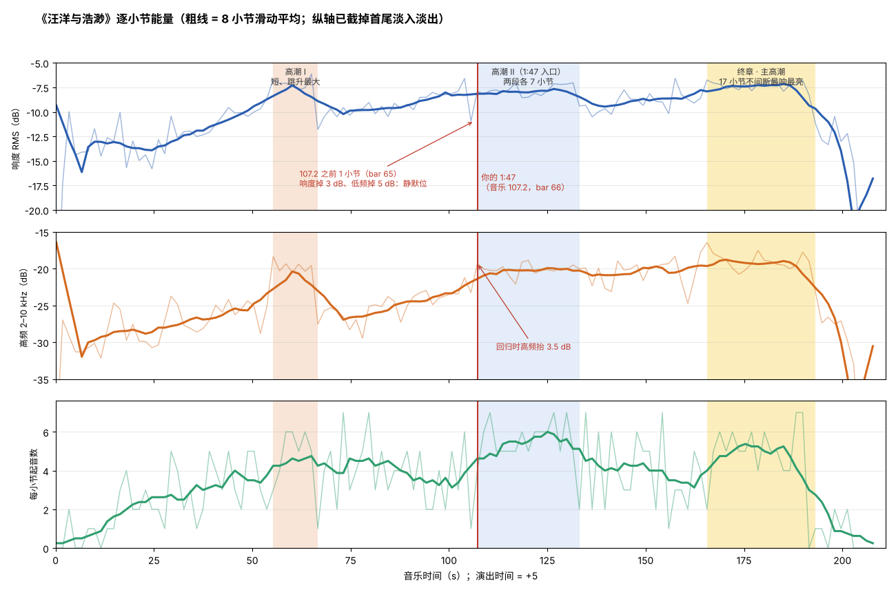
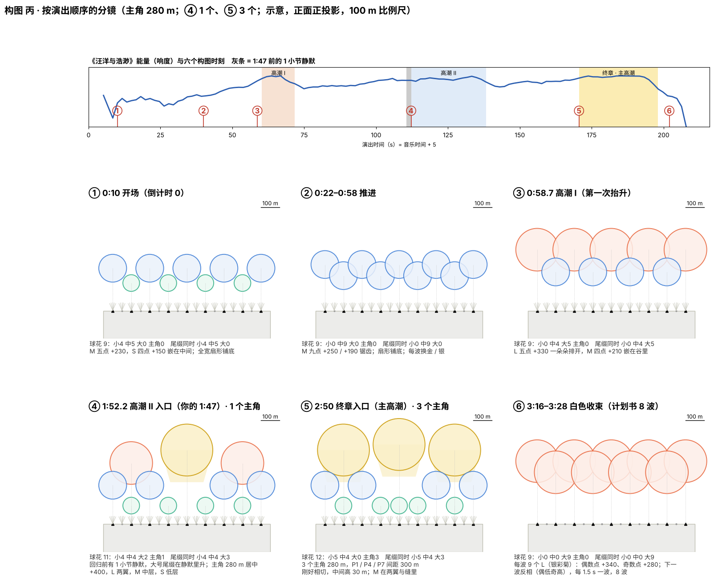

# 跨年烟花秀编排宪章（草案 v1.3）

跨年秀（22）· 2026-10-11 · v1.3 按用户 11:10 的回答和 24 的本机 UE 实测改：**构图选丙（六个时刻全用丙）**、主角 280 m（④ 1 个、⑤ 3 个，另出全程 1 个 / 3 个对比）、**并发上限模型推翻（导演不受 MaxInstanceNum 限制，瓶颈是 GPU 粒子池）**、1:47 是回归点而不是最高点（主高潮 = 终章）；v1.2 的要点（一个导演表、230 m 大号子模板可以做）保留；**状态、待办和批注入口在计划书文档（claude.ai）的「总纲」页**，本文是它的完整版

> **状态：草案，等用户批。** 批之前不约束任何人；R03 / R04 / 候选 A2 只作回滚样本，不修补（用户 10-11）。
> 证据：R03 的诊断在 [编排审查 R03](编排审查_R03_2026-10-10.md)；导演结构在 [手游编排评审](../对话记录/对话框手游编排.md)；点位坐标和参考图比例在 [计划书](跨年烟花秀编排计划书.md)。
> 标 **〔待定〕** 的数是我的建议，要你改或批；标 **〔待核对〕** 的是我没法在云端证实的事实（引擎里的发射器数、性能）。时间一律写**音乐时间**，演出 = 音乐 + 5（用户 10-11 定）。

## 0. 宪章管什么、层级

管：放什么、什么时候放、放多少、怎么配、三档和手机怎么减。不管：固定花型内部（只你改）、资源烘焙、8025 界面、UE 导入。

```
宪章（本文） → 逻辑方案（proposal：幕 / 构图 / 层 / 开花时刻） → 三表（编排模板 + 时序） → 导演 → UE 实播 → 你验收
```

上一层没批，下一层不做。你看画面提意见时，先落到宪章的某一条，再改方案；不逐条改发射。

## 1. 主题：回到计划书的十段

你 10-11：「之前的主题 = 你之前做的计划书」。所以主线就是计划书的十段，加上你 10-09 要的烟花倒计时和你给的 1:47 锚点（音频分析后是「高潮 II 入口」，主高潮是终章，见本节末），按音乐能量台阶（53.7 / 107.2 / 133.2 / 164.0 / 191.5，检测值，待试听）落到时间上。音乐的事你不用懂，只要知道：**每一发开花都落在一个鼓点上，大的落在小节第一拍上**，剩下的是我的活。

| # | 段（计划书名） | 音乐时间 | 演出时间 | 做什么（计划书原意） | 主角 / 大号 |
|---|---|---|---|---|---|
| 0 | 倒计时 | −5 → 0 | 0:00–0:10 | 烟花倒计时：P0+P8 → P1+P7 → P2+P6 → P3+P5 → P4，每秒一步；音乐在倒计时 5 进入 | 无 |
| 1 | 低位起势 → 开场 | 0:05–0:16 | 0:10–0:21 | 0 点从 P4 向外开，开场三层（M 九点 + S低 + 全宽扇形），前台先起 | 无 |
| 2 | 连续展开 | 0:16–0:28 | 0:21–0:33 | 坝顶一排 M（每小节 7–9 点），银白 / 金交替；前台插在两波之间 | 无 |
| 3 | 密集问答 | 0:28–0:41 | 0:33–0:46 | 坝顶五点问，前台晚一拍答；开始加色（绿 / 橙 / 青柠点缀） | 无 |
| 4 | 往返扫射 | 0:41–0:54 | 0:46–0:59 | 17 点连扫往返，前台反向追 | 无 |
| 5 | 第一次抬升 | 0:54–1:07 | 0:59–1:12 | 能量台阶 1：M 排 + **L 三点压顶**，段末 **主角第一次露面**（P4 一发） | L ×6–9，主角 ×1 |
| 6 | 低位密奏 | 1:07–1:18 | 1:12–1:23 | 坝顶全停，前台独奏；第一小节完全空 | 无 |
| 7 | 第二次递进 | 1:18–1:47 | 1:23–1:52 | 六轮 M 排 + 两轮 L 三点；末 10 s 蓄势收窄到中心、鼓点七连 | L ×6 |
| 8 | **高潮 II 入口**（新增，你的 1:47） | 1:47.2–2:13 | 1:52–2:18 | 入口前 1 小节静默；五层满构图：主角 P4 压顶 + L 两翼 + M + S低 + 17 点扇；bar 81 金墙收 | 主角 ×1，L ×12–18 |
| 9 | 转场铺色 | 2:13–2:44 | 2:18–2:49 | 彩千轮 / 绿牡丹 / 青柠 的色彩段，两次小峰；为终章重新铺金 | L ×4 |
| 10 | **终章 · 主高潮** | 2:44–3:11 | 2:49–3:16 | 三轮 M 金排 + 五点金裂星；能量最高段（演出 170.6–198.1）主角一组 3 个（P1 / P4 / P7 相切） | 主角 ×3（一组），L ×12 |
| 11 | 白色收束 | 3:11–3:23 | 3:16–3:28 | **计划书的 8 波银彩菊 L 九点白墙**，每 1.5 s 一波（波间隔不再受上限限制，见 6.3；银彩菊的发射器全是 CPU）；前台已退场 | L ×27–72（随密度） |
| 12 | 余韵 | 3:23–3:31 | 3:28–3:36 | 墙余火；最后一发主角 P4 悬着熄灭；音乐 3:22.9 起淡出 | 主角 ×1 |

主角（金垂柳 · 四尺玉）全场 **5 次〔待定〕**：5 段末 1 个、8 段入口 1 个、**10 段一组 3 个**、12 段收尾 1 个（用户 10-11 倾向 3 个；另出全程 1 个 / 全程 3 个的对比）。每次前后 1 小节不放 L。

### 1.1 音频分析：1:47 是回归点，主高潮是终章（用户 10-11 批注：「不一定是主高潮，只是类似的能量点」）

脚本 `analysis/scripts/音乐高潮分析.py`（输出 `analysis/music/汪洋与浩渺_高潮分析.json` 和 `跨年秀编排宪章_图/音乐能量.png`）按小节（1.6216 s）统计响度、高频、起音数。**你说得对：1:47（音乐 107.2，bar 66）不是全曲最高点。**



| 高潮 | 演出时间 | 响度 dB | 高频 dB | 起音 / 小节 | 响度 > −7.5 dB 的小节 | 特点 |
|---|---|---|---|---|---|---|
| I | 60.3–71.7 | −7.7 | −20.7 | 4.5 | 5 / 8 | 从安静里跳升最大（响度 +2.7 dB、高频 +5 dB），只有 7–8 小节 |
| II（含你的 1:47） | 112.2–138.2 | −7.9 | −20.1 | 5.4 | 5 / 17 | 前面 1 小节静默，回归时高频 +3.5 dB、响度不变；中间 1 小节回落；起音最密 |
| 终章 · 主高潮 | 170.6–198.2 | −7.6 | −19.4 | 4.8 | 11 / 17 | 17 小节不间断，最亮、持续最长；194 起收尾 |

- 1:47 的特点是「静默一小节再回来」：bar 65（演出 110.6–112.2）响度掉约 3 dB、低频掉约 5 dB，bar 66 回归时高频抬约 3.5 dB，响度和前 8 小节一样（−8.0 对 −8.1 dB）——**回归点，不是音量最高点**。
- 这首歌压得很满，55–193 s 的响度只差约 3 dB，排名看亮度、持续长度和起音密度；终章和高潮 II 的平均响度只差 0.3 dB。**把握：「1:47 是回归点、不是顶点」高，「终章最强」中等**；信号检测不判断旋律，主高潮要你试听确认。
- 对编排：主角一组 3 个放终章、1:47 只放 1 个；1:47 的戏剧点是静默——静默位（演出 110.6–112.2）不放新球花，大号尾缀在静默里升，回归强拍炸开；白色收束从 196 s 起，叠在终章尾部和尾声上。

色彩故事：银白（1–4）→ 金银交替（5–7）→ 满色（8）→ 彩色（9）→ 金（10）→ 白（11–12）。每段主色 1 个、点缀色 ≤ 1 个，点缀 ≤ 该段开花数 20%。

## 2. 比例高度构图（补充问题 1）

**用户 10-11：「420 太大」「现在的构图不好看」「计划书那个比例还不错、构图也比现在好」。** 所以：撤回 420 m；比例回到计划书；构图先做三版给你选（下面），不先排时间。

**先构图，再编排。** 构图 = 一句话的画面单元（哪些点、哪几层、多大、多高、间距），编排 = 把单元放到音乐的哪一拍、放几个。理由：① 单元决定每次点数和同屏数；② 换密度只改「放几个单元」，不改单元；③ R03 就是先排了「每拍放几点」，构图成了副产品。顺序：**构图 → GPU 预算核对（第 6.3 节）→ 编排 → 回看一遍**。

方法和计划书一样：不靠镜头，用**花直径 ÷ 发射点间距**定构图（开场 1.5×、白墙 2.3×），用**开花高度（相对坝顶）**分层。坝顶 P 点弧长每 100 m 一个，画法同计划书（正面正投影、横竖同一比例）。

### 2.0 构图：选丙，六个时刻全用丙（用户 10-11 批注）

甲 / 乙 / 丙是三种**排法**，每种都用同样的六个时刻画了一遍（开场 / 推进 / 抬升 / 高潮 II 入口 / 终章 / 收束）。我 v1.2 写的「开场甲、推进甲、抬升乙…」是想按时刻从三版里挑，不是开场一口气放甲的六格。**你批注说上一轮的「丙方案」就是选丙——我之前读成「只有终章用丙」，已改：六个时刻全用丙。** 甲、乙留作参考（图见 `跨年秀编排宪章_图/构图_甲.png` / `构图_乙.png`，图里的「每级上限 20」是推翻前的假设）。



按演出顺序的分镜（`分镜_丙.png`，`analysis/scripts/构图三版.py` 的 `storyboard()`）：

| 时刻 | 演出时间 | 画面（丙） | 主角 |
|---|---|---|---|
| ① 开场 | 0:10 | M 五点 +230，S 四点 +150 嵌在中间，全宽扇形铺底 | 无 |
| ② 推进 | 0:22–0:58 | M 九点 +250 / +190 锯齿，扇形铺底 | 无 |
| ③ 高潮 I | 0:58.7 | L 五点 +330 一朵朵排开，M 四点 +210 嵌谷 | 无 |
| ④ 高潮 II 入口（1:47） | 1:52.2 | 前面 1 小节静默；L P1 / P7 +330，M +210，S 低层 +100 | **1 个**（P4 +400） |
| ⑤ 终章入口（主高潮） | 2:50 | M 在两翼与缝里，S 低层 | **3 个**（P1 / P4 / P7，+400 / +430 / +400，间距 300 m 相切） |
| ⑥ 白色收束 | 3:16–3:28 | 8 波，每波 9 个 L：偶数点 +340、奇数点 +280，下一波反相，每 1.5 s 一波 | 无 |

丙的取舍：节奏感最强（一高一低 = 一拍一拍）、墙有纹理；缺点是 M 间距 2× 不相碰，开场不如甲连贯。高低错落怎么实现见第 2.1c 节。

### 2.1 四级尺寸（回到计划书；主角不放大）

| 级 | 花 | 直径 m | 开花高度（相对坝顶） | 直径 / 高度 | 画面里占几格 | 全场次数〔待定〕 |
|---|---|---|---|---|---|---|
| 主角 | 金垂柳 | **280**（用户 10-11 11:10；固定子模板由你改） | **+400 ~ +430** | 0.7 | 2.8 格 | ④ 1 个、⑤ 一组 3 个；另出全程 1 个 / 3 个对比 |
| 大 L | 银彩菊（= 大号金芒菊，用户 10-11）；金芒菊 / 金蕊青柠星 / 多重菊的 230 m 大号固定子模板（用户 10-11 01:52「可以做」） | 230 | +330 | 0.70 | 2.3 格 | 80–110 |
| 中 M | 金芒菊、金蕊青柠星、多重菊、金曜菊、金锦菊、绿牡丹、彩千轮 | 150 | +210 | 0.71 | 1.5 格 | 150–200 |
| 小 S | 小银菊、金裂星、爆裂星、点灭星、小青柠、橙辉星 | 90 | +150；低层 +80 | 0.6 | 0.9 格 | 120–160 |
| 前台 F | 专用小花 | 24–40 | 花顶 ≤ 145 | — | — | 沿用计划书 |

- **主角靠「稀少 + 位置 + 垂裙」成立，大小定 280 m**（用户 10-11 11:10），同屏 **1 个或 3 个**都试、倾向 3 个，图 `跨年秀编排宪章_图/主角方案.png`：① 1 × 280 m（P4 +420）；② 3 × 280 m 相切（P1/P4/P7，+400/+430/+400，间距 300 m = 1.07×）；③ 3 × 280 m 重叠（P2/P4/P6，间距 200 m = 1.4×，PC 才行）；④ 1 × 280 m + 两个 L 压两翼（P1 / P7）。我的默认：④ 入口 1 个、⑤ 终章一组 3 个，渐进加码；另出全程 1 个、全程 3 个两版对比。**改尺寸 / 高度后 D 要重量**（现在 7.3651 s 是 410 m 的 GoldKamuro）。
- 这里的「大 L」现成只有**银彩菊**一种 230 m 资源。你说的 200 多米的金芒菊 / 金蕊青柠星 / 多彩菊，在 R03 基础表里是 **150 m 的中号资源**。**用户 10-11 01:52：230 m 大号固定子模板「可以做」**——同一个 ResourceFX、放大、升高，不新增资源；它们和中号版**共用同一个 10 的实例上限**（上限在资源上，不在子模板上）。做完把名字和直径告诉我，L 就有 4 种，白墙和高潮层可以轮换种类（只为好看；上限已被实测推翻，第 6.3 节）。
- 高度相对坝顶 +150 / +210 / +330 就是你 10-08 的数；R03 用的 190 / 265 / 410 要改回来。低层 +80 只给小银菊用。


### 2.1b 主角的大面片：转镜头会跟着转（用户 10-11 01:52；24 已在 UE 里测，10-11）

用户观察：金垂柳现在是一张面朝摄像机的片，特别大时玩家转镜头，片会跟着转，很怪。

**实测（24，本机 UE 4.24 编辑器，`analysis/results/MOBILE_TEST_20261011/`）：**
- 金垂柳 = `P_EFX_FireWorks_GoldKamuro_HD`，6 个 CPU 发射器，原对齐方式是 **PSA_Square**——**我之前推断的 Rectangle 是错的**（Rectangle 是烘焙器导出大面片的默认值，这个资产不是烘焙器出的）。Square 和 Rectangle 一样平行于屏幕，所以「转镜头跟着转」的机理成立。
- 单发金垂柳放在 P4 上方 400 m，相机位置不动，正对 / 原地右转 28° / 左转 28° 各截一张；先拍原值，再在内存里把 6 个发射器改成 `PSA_FacingCameraPosition` 同机位重拍，最后改回 Square（资产没保存）。对比图 `金垂柳朝向对比.png`。
- 看到的：Square 下花在画面边缘仍端正朝上，像贴在屏幕上；FacingCameraPosition 下转到边缘时整朵花随透视倾斜、垂裙歪向画面外侧，大小一致。Square 发射器本来只用 X 尺寸，所以我担心的「X、Y 分开缩放」不存在。**我放大看静图：下垂的星线在 FacingCameraPosition 下比 Square 碎（像虚线），要你看动态确认碍不碍眼。**
- 没测：走动绕花、手机、性能。

| 办法 | 结论 |
|---|---|
| A Facing Camera Position | **有效，建议采用。** 要改的是资产本身（`GoldKamuro_HD` 的 6 个发射器），需要你确认：改原资产，还是复制一份只给主角用（原资产在游戏别处有没有用，我不知道）。烘焙器给新面片加这个选项属于另一件事（共享文件，先认领） |
| B 景深错层 | 不再必须；三个并排时加一点景深更好看，可选。**景深用局部 X（条目 `PositionOffset.X`），不是 Y**（第 2.1c 节实测），且每点朝向不同，正负要在视口里确认 |
| C 核 + 垂裙 | 不做 |
| D 轴锁定 | 不做 |

### 2.1c 丙的高低错落改哪一层（用户 10-11 01:52）

小幅错落（±30 m 内）改**编排模板条目**的 `PositionOffset.Z`，大差别换**固定子模板**的高度版本 `<花>_H<高度>`（你改）：条目偏移是整发（尾缀起点和爆点）一起抬，±30 m 以上尾缀会从半空才出现。三表每条条目有 `PositionOffset / RandomPositionRange / RotationOffset / RandomRotationRange / EffectScale / RandomScaleRatio`；R04 的固定子模板里，开花条目的 `PositionOffset` 就是开花点（金曜菊 Z = 267 m、金垂柳 Z = 408 m），尾缀条目的 `Roll` 是尾缀倾角，扇形用 `Roll` 展开束；**条目层和随机字段全是 0**。**实测（24，10-11）：条目层 `PositionOffset` 生效。Z 就是世界高度（+3000 cm 正好高 30 m）；X、Y 在发射点自己的坐标里（Y +5000 cm 移动 50 m）。P4 的局部 Y ≈ 沿坝体横向，局部 X ≈ 垂直坝体（景深）；各点 Yaw 不同（P0 −219°、P4 −251°、P8 81°），所以每个点的景深方向不一样，用之前要在视口里确认正负。`RandomPositionRange` 没测。** 规范补三条〔我的建议〕：① 高低错落用固定偏移（可复现、能对拍），不用随机；② 随机只给 S / M 的小幅度 ±10–15 m，不给主角和 L 白墙（墙要齐）；③ 角度只给扇形，球花不加（球花条目的 Roll 会让尾缀斜飞）。计划书已有的两条沿用：开场排「高度略有起伏」，前台「大小和高度的随机收在包络里」。

### 2.2 高、中、低配：收窄，不收比例

**结论：三档点位坐标相同、每级高度相同；档位减的是点数（从两端往里收）、层数和波数，不是间距。** 隔一个点放会把 2.3× 变成 1.15×，墙散成一排、开场排变成一串孤立的花——画面变成另一场秀，而不是「省一点的同一场秀」。

| 构图 | 高配 | 中配 | 低配 | 比例保持 |
|---|---|---|---|---|
| M 排 ROW | P0–P8（9） | P1–P7（7） | P2–P6（5） | 1.5× |
| L 白墙 WALL | 9 点 × 8 波（每 1.5 s 一波） | 7 点 × 同 | 5 点 × 同 | 2.3× |
| L 压顶 CROWN | P0 / P4 / P8 | 同 | 同（主角时刻不减） | 0.58× |
| 主角 | P4 或 P2+P6 | 同 | 同 | — |
| S低 垫底 | 4 点 | 2 点 | 0 | — |
| 17 点连扫 FAN17 | P+B 17 组、13 束 | 17 组、9 束 | B2–B5 + P2–P6（9 组）、5 束 | 扫线不断 |
| 前台 | F0–F6 | F1–F5 | F3 | — |

### 2.3 手机：隔点放，不叠

手机不是 PC 低配（见第 3 节 overdraw）。手机**允许隔点**，因为手机的约束不是「省一点」而是「任何像素上只能有 1–3 层半透明」：

| 构图 | 手机高（2–3 层） | 手机中 / 低（1 层） |
|---|---|---|
| L 排 | P0/P2/P4/P6/P8，1.15× 相切成排 | P0/P4/P8，0.58×，互不碰 |
| M 排 | P1/P3/P5/P7 或 P2/P6 | P2/P6 |
| 压顶 / 叠层 | 不叠；主角单独出现（用三个主角时手机只留中间 1 个） | 不叠 |
| 扇形 | 只用中心件、≤5 束，不在花下面 | 不放，或只 B3/B4 各 1 束 |
| 尾缀 | L 和主角有，M / S 无 | 只主角有 |

## 3. 手机配置怎么规划（补充问题 2、3）

### 3.1 你给的规范（用户 10-11 已更正）

「手游资产高配最多 2–3 层 overdraw，每个发射器**不能**超过 50 个同时活着的小粒子、存活时间不能长」（用户 10-11 更正：之前打成了「能」）。「中低配只能一层 overdraw，粒子发射器不能超过 3 层」= 每个粒子系统 ≤ 3 个发射器。

对烘焙序列贴图的烟花，这三条换算成：

| 约束 | 换算 | 对编排的含义 |
|---|---|---|
| overdraw 2–3 层（高）/ 1 层（中低） | 一个像素上同时覆盖的半透明大面片数 = 一朵花的层数 × 互相重叠的花数 + 尾缀 + 扇形 | **叠层构图（压顶、五层、白墙互吃一半）在手机上不成立**；中低配花与花不能重叠，花下面不能有扇形 |
| 每发射器 ≤ 50 个同时活着的小粒子，寿命短 | 序列贴图的花一个发射器只有 1 个大面片，不受限；**扇形**（11 筒 × 4–5 星 = 44–55 颗，每颗还带尾火花）、彗星、尾缀火花受限 | 扇形是手机上最贵的东西，先减它；手机只用扇形中心件，束数 ≤ 5 |
| 每系统 ≤ 3 发射器 | 烘焙器一层 = 一个发射器 | 金蕊青柠星（4 层）、多重菊（≥3）、彩千轮（≥2 组）**手机不用**（用户 10-11：不出 _L 版，没时间） |

### 3.2 一个导演表，不分平台（用户 10-11 01:52：「只有一个导演表，不分平台」）

```
BP_NewYearFireworks_ShowDirector            ← 全平台同一个蓝图、同一张三表
└─ 三表：一张；每一条（子模板条目 / 编排模板条目 / 时序槽）带 Filter {PlatformFlags, MinQualityLevel}
     PlatformFlags：全平台 14（= Mobile 2 + PC 4 + 主机 8）；手机不放的条目标 12   〔位序已实测：1<<枚举值；DebugPlatform=None 时这台编辑器按 Gamepad（8）判定，PC 内容标 12 不要只标 4；真机怎么判定待程序确认〕
     MinQualityLevel：VeryLow（低配核心）⊂ Medium ⊂ High，嵌套；「当前画质 ≥ MinQualityLevel 就播」（已实测）
ResourceFX（PC 表 / 手机表分开）
    FxSP / FxSP_Low / FxSP_High：同一个 FXResourceId 在不同画质解析成不同粒子（_H/_M/_L）
    MaxInstanceNum：实测导演不受它限制（第 6.3 节），不用动
```

**v1.1 写的「DefaultConfig 管 PC + PlatformOverrides[0] 管手机」作废。** 三件事不混：**平台用条目 PlatformFlags 分，画质用 MinQualityLevel 分，换粒子用资源表分。** 一个表 = 时间轴只有一份：手机条目是同一条时间轴上的子集，再加手机约束（第 3.3 节）。R04 现在每条都是 PlatformFlags 14 / VeryLow（即全放）；三档还是三套表、导演里任何时刻只有一档，运行时切不了画质 → 要改成「一张表 + 嵌套 Filter」，这是编排demo（24）的活，状态清单已排队。**24 已在 UE 里验证这条路可行（PC 编辑器）：R03 三档合成一张表（22 子模板 / 69 父模板 / 149 时序，条目 VeryLow 72 / Medium 87 / High 23），只改 DebugQualityLevel，113–119 s 激活数 高 115 / 中 88 / 低 30，和三张原表各自一致；单表编译器还没做。** `RequiredPointCount` 实测规则是 `SlotIndex < RequiredPointCount`、越界报 Error，**规范的固定容量 P9 / B8 / F7 是对的，不要改成实际点数**。**手机观看距离 / 视角与 PC 相同**（用户 10-11），S 在手机上也按 PC 的尺寸看。

先决条件：手机 ResourceFX 现在**没有** 3.0 的任何一个资源（10-10 读回，24 在 10-11 再读：手机表 15 行都是 2.0 旧资源、全是 CPU 发射器，R03 用到的 20 个一个都没有）；PC 版金垂柳是 6 个发射器，超过手机「≤ 3」的规则，手机要用烘焙器重出，手机编排之前先要有手机粒子（烘焙器导 `cascade_mobile.json` → 导入器）。

### 3.3 哪些效果能上手机〔待核对：层数要在引擎里数发射器〕

层数是我按烘焙器配方和你的话估的，**不是引擎读回**。我已把「读每个 ResourceFX 的发射器数」排给编排demo（24）。

| 花 | 估计层数（不含尾缀） | 手机高（≤3 层、2–3 overdraw） | 手机中低（1 overdraw） | 备注 |
|---|---|---|---|---|
| 金垂柳 GoldKamuro（主角） | 1（你说单层） | ✅ | ✅ 主角 | 面片大，占屏多，但只 1 层；是手机上最划算的「震撼」 |
| 金芒菊 GoldRayChry | 1（你说单层） | ✅ | ✅ | 手机的主力（按 M 150 用；手机没有大号版） |
| 金曜菊 GoldChry | 1〔估〕 | ✅ | ✅ | 手机的 M 主力 |
| 绿牡丹 GreenPeony | 1〔估〕 | ✅ | ✅ | 唯一的绿 |
| 金锦菊 GoldSpark | 1–2〔估〕 | ✅ | 看发射器数 | |
| 银彩菊 SilverStrobeChry | 2〔估：菊 + 点灭〕 | ✅ | ✗（手机中低没有大号排，白墙只放主角垂柳或不放） | 白墙用它（用户 10-11）；手机高配 ✅ |
| 金蕊青柠星 GoldCoreLime | 4（配方 JQ7：橙引 / 柠点星 / 金菊蕊 / 红点蕊） | ✗ | ✗ | **手机不用**（不出 _L 版） |
| 多重菊 MultiLayerChry | ≥3 | ✗ | ✗ | **手机不用** |
| 彩千轮 PrismWheels | ≥2（四组小玉） | ✗ | ✗ | **手机不用** |
| 小银菊 SilverChry、点灭星 Strobe | 1 | ✅ | ✅ | 倒计时、低层 |
| 小青柠 Lime | 2（橙引 + 柠绿） | ✅ | ✗ | |
| 金裂星 GoldCrackle、爆裂星 Crackle、橙辉星 OrangeGlitter | 1–2 | ✅ | 看发射器数 | |
| 扇形（红彗星 / 银星 / 金扇 4 件） | 粒子型 | 中心件、≤5 束 | ✗ | 50 粒子上限卡在这 |
| 尾缀 _Small/_Medium/_Large | 1（火花） | L / 主角有 | 只主角 | |

手机的画面语言：**少、大、单层、靠轮廓和色块**。手机母版用 ≤ 8 种花（主角 + 金芒菊 + 金曜菊 + 绿牡丹 + 小银菊 + 点灭星 + 1–2 个单层小花），PC 母版用全部 15 种。

## 4. 模板链与命名（补充问题 4）

五层，一层一个名字规则，**搜任何一层的名字都能找到它上下游**：

| 层 | 是什么 | 在哪 | 命名〔待定〕 | 例 |
|---|---|---|---|---|
| 基础模板 | 引擎里的一个粒子系统（ResourceFX 行） | UE | `P_EFX_FireWorks_<Kind>`（已有，不改） | `P_EFX_FireWorks_GoldChry` |
| 固定子模板（花型） | 尾缀 + 开花 + 开花延迟 + 高度 / 大小版本；**只你改** | 三表 EffectSubTemplates | `<Kind>_H<相对坝顶高度m>` | `GoldChry_H210`、`SilverChry_H80`、`GoldKamuro_H480` |
| 编排模板（父模板） | 一个构图里**一种花的一层**：哪些点、点间顺序和间隔 | 三表 EffectTemplates | `<Kind>_<构图>_<点集>_<序号>` | `GoldChry_ROW9_P_01`、`GoldKamuro_CROWN_P4_02`、`FanGold_SWEEP17_PB_LR_03` |
| 模板库 | 可复用的编排模板目录 + 索引（构图 → 各层 → 父模板） | `FXtools/节目/<节目>/模板库索引.csv` | 构图代号固定：ROW / WALL / CROWN / FULL5 / FAN17 / COUNT / SOLO | 一个 FULL5 = 5 条父模板，共用构图编号 `FULL5a` |
| 时序 | 调度槽：哪一刻调哪个父模板（P / B / F 三组） | 三表 EffectScheduleGroups | 槽位本身没有名字；靠 `时序索引.csv`：段、小节、音乐秒、演出秒、构图编号、父模板、档位 | `8 \| bar66 \| 107.2 \| 112.2 \| FULL5a \| GoldKamuro_CROWN_P4_02 … \| VeryLow` |

规则：
1. 父模板**一种花一条**（混合构图拆成几条、共用构图编号），这样搜 `Lime` 一定能看到它所有的时序——这是你 10-10 在 24 里要的，v16.0.8 的 `Lime_P_C018_01` 已经做到一半，缺的是构图语义。
2. 开花时刻只写在逻辑方案和时序索引里；三表里是调用时刻 = 开花 − D。
3. 三表、模板库索引、时序索引由同一个编译器从逻辑方案生成，**不手改三表**；手改只在逻辑方案层。

## 5. 种类编排（补充问题 5）

### 5.1 出场份额〔待定〕

按「开花数」算（扇形另算，不计入）：

| 级 | 份额 | 规则 |
|---|---|---|
| 主角 | 1–2%（5 次） | 每次是事件：前后 1 小节不放 L；有预告（升空 7.4 s 的尾缀本身就是预告；再加一声前台或扇形） |
| 大 L | 25–30%（白墙 8 波共 27–72，随密度） | 只在释放段（5、7、8、10、11）；同一拍最多 L + 相邻一级 |
| 中 M | 35–40% | 骨干，承载节拍；每段主种 ≤ 3 |
| 小 S | 25–30% | 肌理、倒计时、低位回应；不独撑释放段 |
| 扇形 | 占调用 ≤ 40%，且每个时刻只一条扫线 | 背景光，不是开花 |

R03 对比：主角不存在、L 27% 但成簇、M 51%、扇形 59%。

### 5.2 每种花的角色与出场段

角色按烘焙器配方和名字拟（你 10-11：配方可以看）。**每种至少一次单独亮相**（静里只有它，或它领一句）。

| 级 | 花 | 性格（配方） | 角色 | 出场段 | 单独亮相 |
|---|---|---|---|---|---|
| 主角 | 金垂柳 | 锦冠大号（现 230 m，280–300 m 版由你做），垂裙长、悬得久 | 事件（靠稀少 + 居中 + 垂裙） | 5 末、8 入口、10 ×2、12 末 | 12 末 |
| M↑ | 金芒菊 | 单层金菊 + 芒，干净、亮 | 释放段 M 骨干、金墙；有 230 m 大号子模板后也当 L | 5、7、8、10 | 7 第一轮 |
| M↑ | 金蕊青柠星 | 4 层：橙引 → 柠绿点星，金菊芯，紫白小点 | 高潮里层的「变化」；有 230 m 版后也当 L；**手机不用** | 8、10 | 8 bar 73（高频峰） |
| M↑ | 多重菊 | 多芯同心 | 满构图里层；有 230 m 版后也当 L；**手机不用** | 8、10 | 10 |
| L | 银彩菊 | 银菊 + 点灭（大号金芒菊，用户 10-11） | 白墙、第一次抬升 | 5、8、11 | 11（白墙） |
| M | 金曜菊 | 金菊 | M 排主力 | 2、5、7、10 | 2 第一排 |
| M | 金锦菊 | 金 + 火花 | 推进的节拍点 | 3、7、9 | 3 |
| M | 绿牡丹 | 无尾绿 | 唯一的绿，点缀 | 3、9 | 9 小峰一 |
| M | 彩千轮 | 四组小玉各一色 | 转场的「彩」 | 9 | 9 小峰二 |
| S | 小银菊 | 小、银 | 倒计时、低层垫底 | 0、1、5、8 | 0 |
| S | 点灭星 | 一闪一闪 | 留白里的星光 | 6 | 6 |
| S | 金裂星 | 裂开的金 | 低位金色回应、终章五点 | 3、7、10 | 10 |
| S | 爆裂星 | 脆响质感 | 蓄势鼓点七连 | 7 末 | 7 末 |
| S | 小青柠 | 橙引转柠绿 | 青色点缀 | 3、9 | 3 |
| S | 橙辉星 | 暖色辉光 | 暖色点缀 | 2、9 | 2 |
| 扇 | 红彗星、银星、**金扇（4 件）** | 扫线 | 开场 / 往返 / 高潮铺底 | 1、4、8、10 | 4 |

规则：一段里主种 ≤ 3、点缀 ≤ 2；相邻两次开花种类不同、同种不连续超过 2 次（白墙这种刻意连波除外）；L 只有 4 种，层次靠构图（金 + 银、主角压 L、L 压 M），不靠种类。

### 5.3 高潮点怎么「倒退卡点」

- 以**开花时刻 H** 为准，H 落在鼓点 ±0.1 s；构图入口和主角落在小节第一拍。
- 调用时刻 = H − D：小 2.9544 / 中 4.3772 / 大 7.3651 s（R03 实测延迟；主角用 L 的 D（7.3651 s））。取 0.1 s 网格后误差 ≤ 0.05 s。
- 例：主高潮入口音乐 1:47.2 = 演出 112.2。主角 H = 112.2 + 0.5（压顶晚半拍）= 112.7 → 调用 105.3；L 两端 H = 112.2 → 调用 104.8；M 九点里→外每格 0.1 s，H = 112.2…112.6 → 调用 107.8…108.2；S低 H = 112.4 → 调用 109.4；扇形即发 112.2。**所以从演出 104.8 起天上就有 3 条大尾缀在升，正好盖住蓄势的鼓点七连（103.98–105.60 音乐 = 109–110.6 演出）**——尾缀就是预告，这是叠层构图必须按层倒推的原因。
- 留白后的第一发必须在强拍；休止是设计，每个留白段至少一个整小节全空。
- 对拍指标〔待定〕：开花次落在鼓点 ±0.1 s ≥ 85%；构图入口 / 主角落强拍 ≥ 80%（R03：26% / 17%）。

### 5.4 密度：出三档让你感受（用户 10-11：都试试）

同一逻辑方案，三个密度预设，只改「每小节几次、每次几点」，构图和主角不变：

| 预设 | 推进段 次/小节 | 释放段 次/小节 | 同屏球花估计 | 像什么 |
|---|---|---|---|---|
| D1 疏 | 1–2 | 3–4 | 5–8 | 比 R03 密一倍，每发看得清 |
| D2 中 | 2–3 | 4–6 | 8–14 | 计划书的量 |
| D3 密 | 3–4 | 6–8 | 14–22 | 长冈凤凰那种铺满 |

三个预设都出 `.dfshow`，你在游戏里各看一遍，选一个再出三档。**同时出一版与 R04 的对比**（用户 10-11）：同一条演出时间轴上并排画 R04 与 D1 / D2 / D3 的开花次、同屏曲线、尺寸份额、对拍率、种类、并发峰值，用 `编排体检.py` + `并发预算.py` 出数；游戏里的实播对比由你来看。**密度（D1–D3）和画质（高中低）是两个轴，别混**：先选密度，再按第 6 节从它减出中低配。

## 6. 高中低配怎么分配（补充问题 6）

### 6.1 性能到底花在哪

| 开销 | 由什么决定 | 减它会不会伤画面 |
|---|---|---|
| 实例数（CPU、Tick） | 同时活着的粒子系统数 = 开花次 × 点数 × 寿命 | 减点数伤宽度，减次数伤节奏 |
| 填充（GPU overdraw） | 同时在屏的大面片面积 × 叠层 | 减叠层最省，伤「厚度」 |
| CPU 粒子 | 扇形束数 × 每束星数、尾缀火花 | **减扇形束数几乎不伤画面** |
| GPU 粒子池 | `fx.GPUSimulationTextureSize`（本机 256×256）；高档 104 束银扇同一秒时上万条「Failed to allocate tiles」、粒子被截断（实测，第 6.3 节） | 带 GPU 发射器的资源（三级尾缀、Strobe、金曜菊、扇形）同一秒起得太多就丢粒子——这是画面出错，不是变弱；编排要按 GPU 预算排 |

### 6.2 减的顺序（高 → 中 → 低）

1. **先减扇形束**：13 → 9 → 5，在扇形子模板里按束标 Filter（一套子模板自动退化）。R03 扇形占 59% 调用，这一刀最省、最不伤。
2. **再减叠层**：五层 → 去 S低 → 去 M 中排（主角 + L 压顶 + 扇形保留）。
3. **再收宽**：9 → 7 → 5 点，从两端往里收，比例不变（第 2.2 节）。
4. **再减波数**：白墙 8 → 6 → 4 波；连扫往返 4 → 3 → 2 遍。
5. **再减前台**：7 → 5 → 1 点。
6. **永远不减**：主角 5 次、L 压顶、每段的入口、倒计时。

低配 = must，中配 = must + should，高配 = 全部；每条时序标一个，嵌套（低 ⊂ 中 ⊂ 高），一张表。

### 6.3 并发：实测推翻了我的模型，瓶颈是 GPU 粒子池（用户 10-11 实测回传）

**结论：导演不受 ResourceFX 的 `MaxInstanceNum = 10` 限制，真正卡的是 GPU 粒子池。** v1.1 / v1.2 我按「球花 / 扇形同种同时 10 个、尾缀每级 20 个」算持续容量，白墙一波 9 点要隔 6.0 s（`并发预算.py`），这套模型不成立。24 在本机 UE 4.24 编辑器里用 R03 实测（以日志里的资源激活记录和 GPU 告警为准；证据 `analysis/results/MOBILE_TEST_20261011/看法.md`）：

| 我之前说 | 实测 | 现在怎么办 |
|---|---|---|
| 导演受上限约束，R04 的银扇严重超限 | 117.2 s 一次激活 104 个 FanSilver_01，日志数和场景组件数一致 | 上限不是约束；白墙 6.0 s 一波、M 每秒 4.6 朵这些数字作废 |
| （没想到）GPU 粒子池 | 这台机 `fx.GPUSimulationTextureSize` = 256×256。高档 104 束银扇时日志上万条「Failed to allocate tiles … particles truncated」；中档（78 束）和低档（26 束）0 条 | 要按 GPU 预算排 |
| （没想到）被截断的比例 | 被截断的那些生成里，FanSilver 只留 9%、GoldChry 19%、RiseTrail_L 11%、FanComet 6% | R03 / R04 的十三束银扇墙在高档下大部分粒子丢了，连带同一时段的别的 GPU 效果；你说的「播放太稀疏」，这可能是原因之一，要你对照 UE 画面确认 |
| 球花、尾缀的上限 R04 测不到 | 它们同样不受上限 | 不用管 |

测的是**编辑器预览**，不是打包的游戏；打包版有没有同样的行为、目标机器的 GPU 粒子池多大，都没测。

**含义**：① 密度可以比我之前画的更高：白墙回到计划书的 8 波 × 9 点、每 1.5 s 一波（银彩菊的发射器全是 CPU，不吃 GPU 池）；② 要省的是带 GPU 发射器的资源；③ 之前的 α 换种、β 放宽波间隔取消（换种只为好看）；δ 低配减点保留（同一段 R03 激活数：高 115、中 88、低 30，只有高档截断）。

**哪些资源带 GPU 发射器**（`资源发射器数.json` 明细重数：20 个资源里 12 个、共 31 个 GPU 发射器；峰值是资产里记录的上次预览统计，可能过期。24 的汇总写 13 个，census 脚本的 gpu 计数因大小写判断成 0，明细 typeData 是对的）：

| 资源 | GPU 发射器数 | GPU 粒子峰值 |
|---|---|---|
| 金曜菊 GoldChry | 2 | 2452 |
| Strobe | 5 | 2155 |
| 尾缀 Large / Small / Medium | 6 / 6 / 2 | 1238 / 941 / 189 |
| GoldCrackle | 2 | 502 |
| Lime / GreenPeony / MultiLayerChry | 各 1 | 501 / 421 / 421 |
| 银星扇 FanSilver | 3 | 135 |
| 红彗星扇 FanComet / PrismWheels | 各 1 | 15 / 1 |
| 其余 8 种（含金垂柳、银彩菊） | 0 | 0 |

**占位预算（等分级测试再改）**：78 束银扇 = 234 个 GPU 发射器实例，同一秒里没截断；104 束 = 312 个，截断。我用「每秒新起的 GPU 发射器实例 ≤ 200」当占位线。球花墙远低于它（一发 L 尾缀 6 个、一朵金曜菊 2 个）；会碰线的只有扇形：一条 13 束扫线 = 39 个，同一秒最多 5 条，R04 同一秒 8 点 × 13 束 = 312 个。我没能用粒子数解释截断（104 束 × 135 ≈ 1.4 万，远小于 256×256 = 6.5 万），更像按发射器实例分配，机制待测。

**要 24 补的测试（状态清单 ⑦）**：同一秒分别放 20 / 40 / 60 / 80 / 104 束银扇，再单独放 L 尾缀、金曜菊，记截断告警和保留比例；能的话把 GPU 粒子池调大一档重测；问程序：打包版 GPU 粒子池多大、`MaxInstanceNum` 对导演在打包版里是否也不起作用。

### 6.4 金扇

你 10-11：金扇有资源、4 件（中心 / 中间 / 左 / 右）拼一把、pivot 固定、之前卡顿。
- 角度复用：按计划书每个点的扇形 Yaw（P0 +30° … P4 0° … P8 −30°）在子模板条目里给旋转〔待核对：条目有没有旋转字段；R03 的花型有 `rollDeg`，应该有〕；左右两件只在两端点用，中段点只用中心 + 中间。
- 卡顿：先量，不猜。最可能是 4 件同刻出膛（4 个系统同一帧 spawn 44–55 颗星）+ 17 点同时 = 一帧几千颗粒子。宪章规则：**一把扇的 4 件错开 0.1 s，相邻点错开 ≥ 0.035 s（实拍逐筒规律），同一时刻只一条扫线；同一秒新起的 GPU 发射器实例 ≤ 200（占位，第 6.3 节），一条 13 束扫线 = 39 个**。手机只用中心件。

## 7. 验收与体检

**自检加一层「这场秀」**，脚本 `analysis/scripts/编排体检.py`（三表展开；逻辑方案有「段 / 构图」字段后再补后三行）和 `analysis/scripts/并发预算.py`（并发上限）：

| 指标 | R03 | 目标〔待定〕 |
|---|---|---|
| 对拍率（开花次，鼓点 ±0.1 s）/ 强拍命中 | 26% / 17% | ≥ 85% / ≥ 80% |
| 开花次 / 同屏球花 | 69 / ≈4 | 按密度预设 |
| 主角次数 / 第一次出现 | 0 / — | 5 次（④ 1 个、⑤ 一组 3 个…）/ ≤ 音乐 1:07 |
| L 占释放段开花数（逐段） | 36 / 52 / 62% | ≥ 50% 且逐段递增 |
| 开花高度 ÷ 规范 | 1.24–1.27 | 1.00 ± 5% |
| 连续同种 / 同刻 ≥ 3 点 | 5 / 31 | ≤ 2 / 0 |
| 同一秒新起的 GPU 发射器实例 ≤ 200（占位，第 6.3 节） | R04 117.2 s：8 点 × 13 束 × 3 = 312 | 0 违规（`并发预算.py` 待按 GPU 预算改写） |
| 手机：任一发射器同时活粒子 ≤ 50 | — | 0 违规（手机母版只留单层 + 扇形中心件） |
| 手机：任一像素叠层 ≤ 档位上限 | — | 0 违规（按面片几何算） |
| 每种花出场段 / 单独亮相 | 无 | 全满足 |

状态分开记：① 逻辑方案体检 → ② 三表体检 → ③ 8025 展开 → ④ UE 读回 → ⑤ UE 实播（你看）→ ⑥ 你通过。我做 ①–③，④ 归编排demo（24），⑤⑥ 归你。

## 8. 分工与顺序

用户 10-11：「先把构图处理好，再出三个密度对比，同时出一版和 R04 的对比」。现在构图（丙）和主角大小（280 m）已定，所以：

1. **你看第 2.0 节分镜、听第 1.1 节的高潮结论并点头**（要改的话批注在总纲对应行）。
2. 我出逻辑方案（段 / 构图 / 层 / 开花时刻），按丙和 GPU 预算（第 6.3 节占位线）排，跑体检；全过后出**三个密度 D1 / D2 / D3**（第 5.4 节，主角按分镜 ④ 1 个 ⑤ 3 个）、**D2 全程 1 个主角、D2 全程 3 个主角两版对比**（共 5 个节目），**和一版与 R04 的对比**（同一时间轴上并排：开花次、同屏曲线、尺寸份额、对拍、种类、GPU 预算）。
3. 逻辑方案 → 三表：我写编译器（`基础模板与尺寸.json` 的 20 基础 + v16.0.8 命名 + 第 4 节构图语义）；编排demo（24）做「一张表 + 嵌套 Filter」的导出（UE 验证已过）、GPU 分级测试 ⑦、打包版问题、导入。已在状态清单排队，不让你转达。
4. 资源侧（你 / 烘焙器）：做 230 m 大号固定子模板（金芒菊 / 金蕊青柠星 / 多重菊）；主角 280 m 版（改后重量 D）；尾缀终点改回 +150 / +210 / +330（R03 现在是 190 / 265 / 410 m）；金垂柳改 FacingCameraPosition（你定改原资产还是复制）；手机 3.0 粒子；金扇错开；烘焙器给新面片的 Screen Alignment 选项（视金垂柳改资产后再定）。
5. 你在游戏里看三个密度和 1 / 3 个主角的对比，选一个；再出中低配和手机（手机不出 _L 版）。

## 9. 已定 / 还要你定

### 已定（用户 10-11）

| 项 | 定了什么 |
|---|---|
| 主题 | 计划书的十段（加倒计时、1:47 锚点；主高潮 = 终章，第 1.1 节） |
| 构图 | **丙：六个时刻全用丙**（10-11 批注）；甲、乙留作参考 |
| 音乐偏移 | +5（演出 = 音乐 + 5） |
| 主角 | 金垂柳（四尺玉），很少出现；**280 m**（10-11 11:10），同屏 1 个或 3 个都试、倾向 3 个（取代 230 / 420） |
| 白墙 / 大号 | 银彩菊（= 大号金芒菊）；230 m 的金芒菊 / 金蕊青柠星 / 多重菊固定子模板**可以做**（10-11 01:52） |
| 手机粒子规范 | 每发射器**不能超过** 50 个同时活着的小粒子，寿命要短 |
| MaxInstanceNum | 不调；实测导演不受它限制，改按 GPU 预算排（第 6.3 节） |
| 导演 | **只有一个导演表，不分平台**（10-11 01:52）；手机视角与 PC 相同；UE 里验证可行 |
| 手机 _L 版 | 不出；多层花手机不用 |
| 顺序 | 先构图，再编排；构图定后出 D1 / D2 / D3 + 一版 R04 对比 |
| 旧编排 | R03 / R04 / A2 不修补，只作回滚样本 |

### 还要你定 / 答

1. **确认分镜**（第 2.0 节）：六个时刻全丙、④ 1 个主角 ⑤ 3 个主角，点头我就出 D1 / D2 / D3 等 5 个节目。
2. **试听确认主高潮**（第 1.1 节）：终章（演出 170.6–198.1）是主高潮、1:47 是回归点。
3. **金垂柳改 FacingCameraPosition**（第 2.1b 节）：改原资产，还是复制一份只给主角用？下垂星线变碎请看一下动态。
4. 230 m 大号子模板做完，把**名字和直径**告诉我；主角放大后重量开花延迟 D。
5. 你在 UE 里看 R03 117.2 s 的银扇墙：是不是缺粒子、稀。

不用你答、我直接做的：对拍、种类出场表、尾缀倒推、体检脚本、模板链命名的落地。
