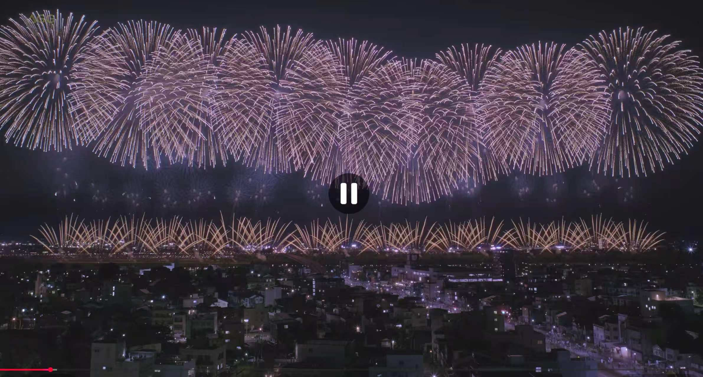
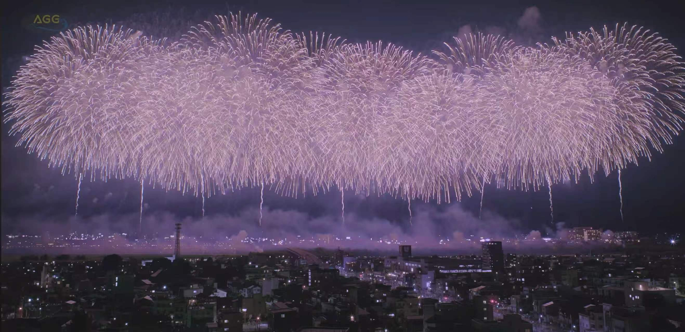
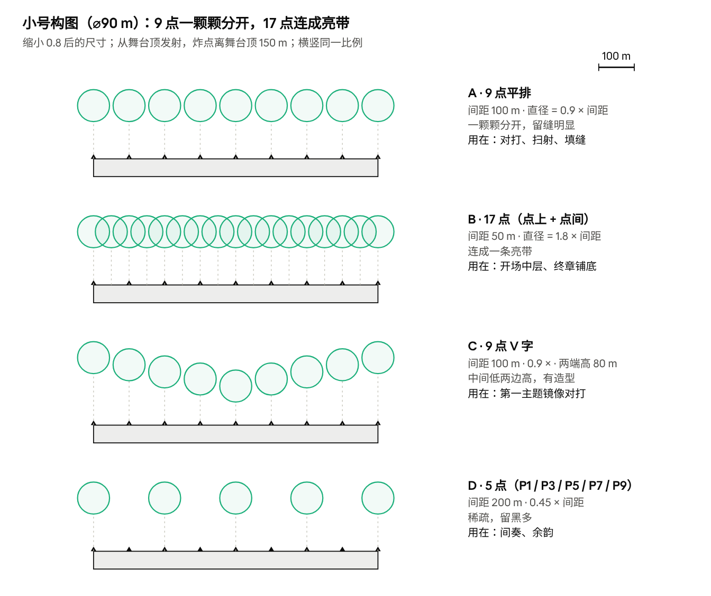
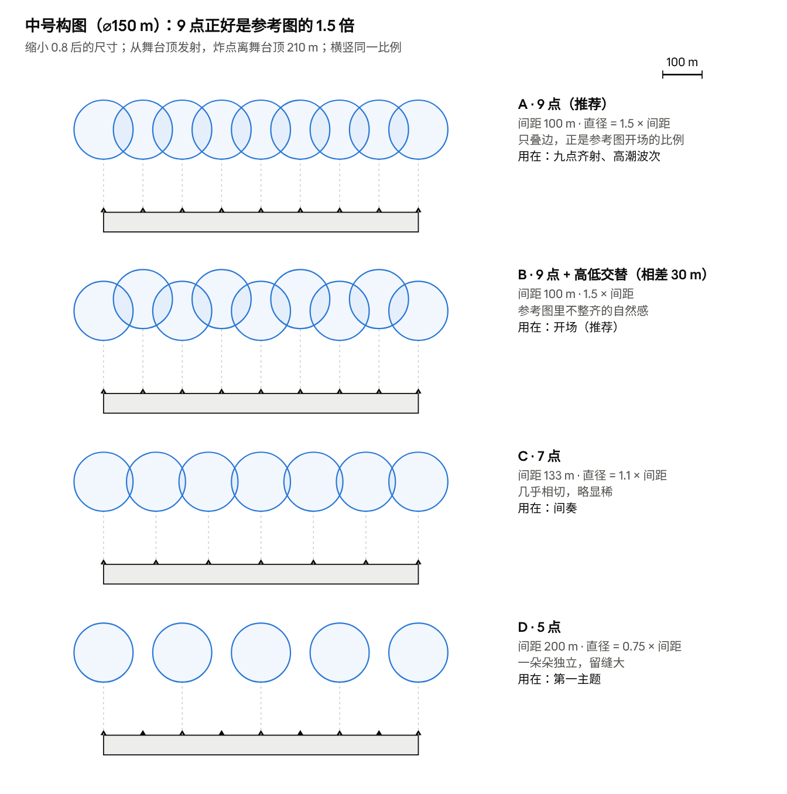
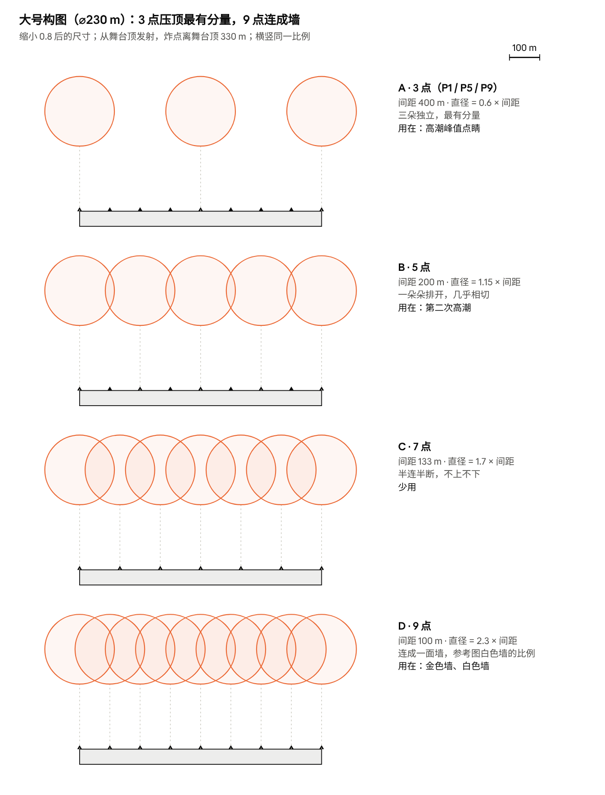
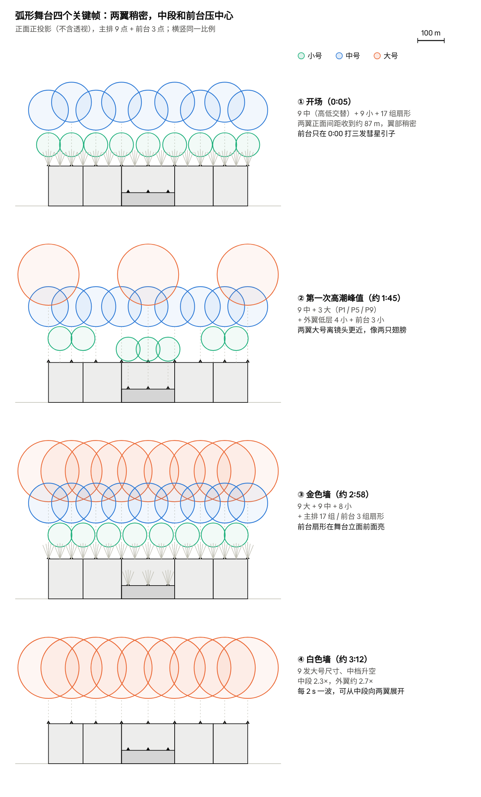
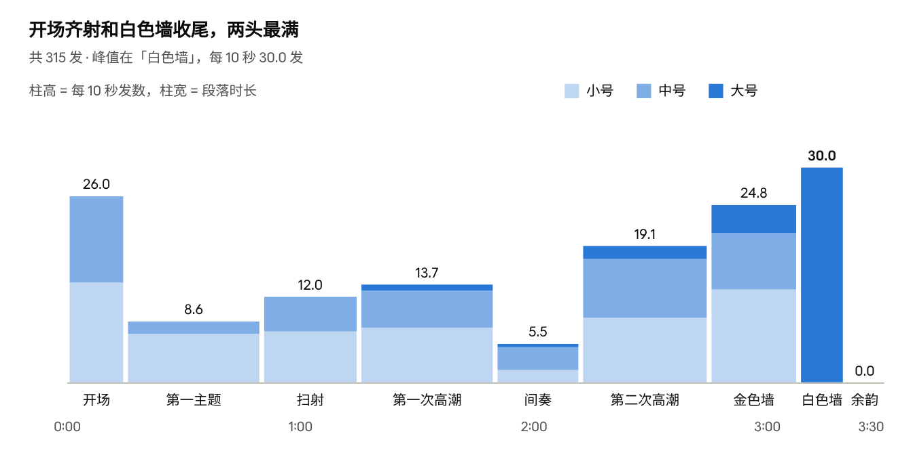
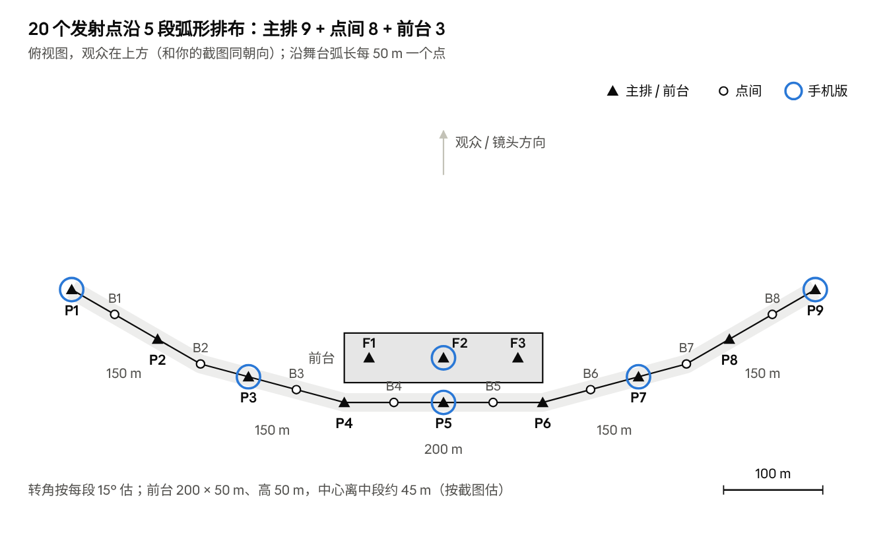

# 跨年烟花秀编排计划书（3 分 30 秒 · 参考长冈凤凰）

> 在线版（图可交互、可评论）：https://claude.ai/code/artifact/7af886ef-6a6f-4249-be42-00d66cedb354 · 本文件为 2026-10-05 导出，来自对话框22。

Oct 1, 2026 · @locc

**结论：需要缩小，整体按 0.8 倍：小号 ⌀90 m、中号 ⌀150 m、大号 ⌀230 m，炸点离发射面 150 / 210 / 330 m。这样沿 5 段弧形舞台顶放 9 个点（弧长间距 100 m）正好得到参考图的比例（开场 1.5 倍、白色墙 2.3 倍），最高点约 595 m，一个 16:9 画面装得下。前台（高 50 m、宽 200 m）放 3 个点，负责引子、中心单发和低空层，让画面多一层前后关系。全片 3 分 30 秒：154 发小 + 106 发中 + 55 发大，共 315 发，另有 85 组扇形；不用二尺玉，间奏改为前台中心一发银彩菊独开。**

参考：[長岡花火 復興祈願フェニックス 2025](https://www.youtube.com/watch?v=0aaYtL4XIlI)（AQUA Geo Graphic，高层屋顶视角）。凤凰是长冈花火最有名的一段：沿信浓川近 2 km 宽的宽幅 Star Mine，配平原绫香《Jupiter》，以金色为主，一波接一波地铺满整个河面（[Live Japan](https://livejapan.com/en/in-tohoku/in-pref-niigata/in-joetsu_uonuma_yuzawa/article-a3000355/)、[国交省多语解说](https://www.mlit.go.jp/tagengo-db/common/001557354.pdf)）。

**限制**：YouTube 页面被限流，我没能看到画面，只拿到了标题。下面的段落时间线是按凤凰的公开描述、宽幅 Star Mine 的常见编法排的**游戏版模板**，不是逐秒扒带。请你对着视频把第 2 节每段的起止秒数、峰值发射点数改成实际的，数量表会跟着改。

**怎么用**：先看「场地与发射位」和第 1 节尺寸，再看构图草稿和第 2 节时间表；第 5 节是每个资产在小 / 中 / 大、主排 / 前台各用几发。

## 目标画面：开场与结尾

开场和结尾用同一排发射点，差别只在开花尺寸：开场中号，花与花之间留缝；结尾大号，互相叠成一整面墙。

**开场**（图 2）是三层同时亮：

- 高层：9 发菊花一字排开，高度略有起伏，白金带淡紫，单朵分得清。直径约为发射点间距的 1.5 倍，相邻的只叠边 → 中型\_B\_金芒菊\_银白，缩小后直径 150 m，9 点间距 100 m 正好 1.5 倍；高低交替，相差 30 m。
- 中层：约 1/3 高度一排暗淡的小花 → 小型\_F\_小银菊，不带尾缀，炸点离舞台顶约 80 m（比标准小号低 70 m，升空时间相应缩短）。
- 低层：全宽一排金色扇形，17 组（P1–P9 + 点间 B1–B8）交叉成网 → 小型\_A\_金锦冠扇形：P5 用「中心」，P2–P4、P6–P8 和点间用「中间」，两端用「外左 / 外右」，扇面朝外张开。
- 节奏：0:00 前台三发小彗星当引子；0:00 主排点中号（升空 5 s），0:01.5 点小号，0:04 点扇形，0:05 三层同时最亮；0:10 第二波换金色（GoldRayChry\_M）。

**结尾**（图 1）是一面连续的白墙：

- 9 发大号同时开，直径约为间距的 2.3 倍，互相吃进一半，看不出单朵；花比开场大、下缘垂得更低 → 大型\_C\_金芒菊\_银白：大号尺寸（⌀230 m，SizeScale 11.5）配中档升空（5 s、离舞台顶 210 m），9 点间距 100 m 正好 2.3 倍。
- 墙下面还能看到 9 条正在上升的尾缀：这一波还亮着，下一波已在路上 → 每 2 s 一波、连打 4 波共 36 发，墙能连续亮约 8 s。
- 河面有一层被照亮的烟。游戏里可选：舞台顶放一层受光雾片。

**由此定下的两个参数**：

- 发射点间距 100 m：弧形舞台沿弧共 800 m，放 9 个点。尺寸整体缩到 0.8 后，开场 150 ÷ 100 = 1.5 倍、白色墙 230 ÷ 100 = 2.3 倍，和两张参考图一致。
- 两张图的粉紫色是烟和相机白平衡带来的；配色用银白偏暖（如 #fff0f4）即可。

## 场地与发射位（全局）

发射位分两组，前后各管一层；为什么缩小 0.8 见下面第 5 条。

- **舞台**：5 段弧形，从左到右 150 / 150 / 200 / 150 / 150 m，高 150 m。中段水平，每个转角按 15° 估，两翼端点比中段往观众方向靠前约 114 m，正面宽约 750 m。
- **主排 P1–P9**：舞台顶（150 m），沿弧长每 100 m 一个。P4、P6 正好在中段两端，点间 B2、B7 在内外段的转角上，4 个转角都有点。正面看，中段间距 100 m、内段约 97 m、外段约 87 m。
- **前台 F1–F3**：前台 200 × 50 m、高 50 m，在中段正前方；三个点在 X = −75 / 0 / +75 m。前台的尾缀从 50 m 升起，在舞台立面前面上升，小号炸在离地 200 m、刚过舞台顶，画面多一层前后关系。
- **各层离地高度**：前台扇形 50–110 m → 主排扇形 150–210 m → 前台小号 200 m → 主排低层小号 230–240 m → 主排小号 300 m → 中号和白色墙 360 m → 大号 480 m（顶部 595 m）。
- **为什么仍按 0.8 缩小**：① 正面间距 87–100 m 配 ⌀150 / ⌀230，中号 1.5–1.7 倍、白色墙 2.3–2.7 倍，仍接近参考图；② 画面按 16:9 约 1200 × 675 m 算，大号顶 595 m、白色墙连花宽约 980 m，都装得下；③ 每发面片面积变成 0.64 倍。
- **两翼偏密怎么处理**：外段（P1、P2、P8、P9）的中号和白色墙 SizeScale 可以乘 0.9，正面看就和中段一样疏密；不处理也行，两翼更密更亮，反而有「包住观众」的感觉。
- **待确认**：转角角度和前台中心离中段的距离，现在按截图估 15° 和约 45 m。

## 构图草稿：大 / 中 / 小发射点

按缩小 0.8 后的尺寸，每档模拟 4 种主排布局（前三张按弧长间距拉直画，弧形上两翼正面间距会收到 87–97 m，略密一点），再把三档和前台按弧形实际位置叠起来画 4 个关键帧。经验规律：直径 ≤ 1.5 倍间距时一朵朵分得清，2–2.3 倍连成墙，接近 3 倍就糊成一团。主排 9 点对三档都合适：小号 0.9×（点间加发变成 1.8× 亮带）、中号 1.5×、大号 2.3×；大号想要独立的一朵朵，就抽成 3 点或 5 点。

中号 9 点高低交替（B）最接近参考图开场：一朵朵排开，又不像排队一样整齐。

前台在高潮帧里补中间的空档：主排低层小号只放两侧，中间交给前台，前后两排错开，画面有纵深。金色墙仍是最满的一帧，但大号 2.3×、中号 1.5×，各层还分得开，不再像上一版那样糊成一片。

## 1. 尺寸标定（缩小 0.8 后）→ Cascade 参数

三档尾缀不用重烘贴图，只改 P\_ 里的初速和阻力；升空时间没变，寿命、帧号曲线和 Fade30 Delay 都不动。开花大小按金芒菊的实测比例换算：**SizeScale = 目标直径(m) ÷ 20**（Initial Size 不变，2200 / 2400 随机）。炸点高度都从发射面算，前台和主排用同一套参数。

| 档 | 现实大致对应 | 升空 s | 炸点离发射面 m | 离地（主排 / 前台）m | 开花直径 m | 尾缀贴图 | InitialVelocity Z (cm/s) | Drag | 帧号循环点（相对寿命） | 帧号末值 | Fade30 Delay s | 开花 SizeScale |
| --- | --- | --- | --- | --- | --- | --- | --- | --- | --- | --- | --- | --- |
| 小 | 约 3.5 号 | 3.5 | 150 | 300 / 200 | 90 | TR2S（V5 小） | 13190 | 0.651 | 0.6095 | 41.0 | 3.5 | 4.5 |
| 中 | 约 4.5 号 | 5.0 | 210 | 360 / 260 | 150 | TR2M（V5 中） | 10920 | 0.287 | 0.4267 / 0.8533 | 22.0 | 5.0 | 7.5 |
| 大 | 约 7 号 | 8.0 | 330 | 480 / 380 | 230 | TR2L（V5 大） | 8460 | 0.0185 | 0.2667 / 0.5333 / 0.8000 | 48.0 | 8.0 | 11.5 |
| 白色墙（大号尺寸、中档升空） | — | 5.0 | 210 | 360 / — | 230 | TR2M（V5 中） | 10920 | 0.287 | 0.4267 / 0.8533 | 22.0 | 5.0 | 11.5 |
| 开场低层小号 | — | 3.5（和中号同时开） | 80 | 230 / — | 90 | 不带尾缀 | — | — | — | — | — | 4.5 |

**怎么算的**：Cascade 里尾缀是「初速 + 线性阻力 + 重力 −981」，我按「升空时间正好到顶点（速度 0）、高度 = 炸点」解出初速和阻力。拿你给的 TR2L 验算：烘焙器里 V5 大是 600 m、9.78 s，导出 14930 cm/s、Drag 0.0972，和你实测「接近 10 秒、接近 15000、600 m」一致，所以这套换算可信。

**帧号曲线**：V5 尾缀一圈 = 64 帧 ÷ 30 fps = 2.133 s，跟寿命无关。寿命改了，Dynamic Parameter 的回零点要改到「2.133 ÷ 新寿命」的整数倍处（表里的循环点，每个点前一刻是 63.99、该点是 0），最后一个键（0.9999）填表里的末值。Fade30 发射器的 Delay = 新寿命。

**开花**：Lifetime 建议按小 ×0.85、中 ×1、大 ×1.2 拉伸母版时长（现实里越大的球燃烧越久，烘焙器号数表 4 号 1.7 s、7 号 2.3 s、10 号 2.8 s）；超过 ×1.2 帧会显卡，大型主角花另烘长版。开花发射器 Delay = 升空秒数，位置 Z = 炸点高度。

**两个要注意的**：

- 小档要 3.5 s 升到 150 m，初速是 V5 小原生（120 m / 4.2 s，7410 cm/s）的 1.8 倍，比上一版的 2.5 倍好很多。拖痕仍显短的话，就在烘焙器以 V5 小为底另导一份（只改 riseH = 150，不动正式库默认值）。
- 大档 8 s 升到 330 m，Drag 只剩 0.0185，几乎是匀减速，升空会显得偏慢。觉得拖沓就把大档升空改成 7 s，帧号循环点和 Fade30 Delay 要跟着重算。
- 金芒菊的「÷20」只对 Zoom 取景的金芒菊成立。别的效果画面占比不同，各自在 UE 里量一次「×15 时实际多大」，再按 15 × 目标直径 ÷ 实测直径 换算。

## 2. 编排结构（3 分 30 秒）

全片按「开场齐射 → 对打 → 扫射 → 高潮 → 前台独奏 → 更大的高潮 → 金色墙 → 白色墙」走。主排 P1–P9 沿弧形舞台顶、弧长间距 100 m，P5 居中；前台 F1–F3 在中段正前方（高 50 m）。开场和结尾都是主排九点齐射，两头最满；前台负责引子、中心单发、低空填缝，间奏由前台一发大号银彩菊独开。表里的花型都用「跨年烟花 3.0」的中文名。

两头最满，中间两次高潮逐级加码；间奏把天空空出来给前台的一发银彩菊；金色墙由金垂柳垂下来铺满，之后停一下中小号，再让白色墙收尾。

| # | 段落 | 时间 | 小 | 中 | 大 | 发射位 | 用的花型 | 编法 |
| --- | --- | --- | --- | --- | --- | --- | --- | --- |
| 1 | 开场齐射 | 0:00–0:15 | 21 | 18 | 0 | 前台 F1–F3 + 主排 9 点 | 小彗星（前台）、金芒菊\_银白 / 金芒菊（中）、小银菊、金锦冠扇形 | 0:00 前台三发小彗星当引子；两波三层齐射：0:05 银白、0:10 金色；每波 9 中（高低交替）+ 9 小（离地 230 m）+ 17 组扇形 |
| 2 | 第一主题 | 0:15–0:50 | 24 | 6 | 0 | 主排 P2↔P8、P3↔P7；前台 F2 | 小青柠、小银菊（小）、绿牡丹 / 金蕊青柠（中，前台）、银星扇 | 主排左右镜像每 3 s 一对（可用 V 字高低）；前台 F2 每 6 s 一发中号，在前排压中心；P1 / P9 银星扇 4 组 |
| 3 | 扫射 | 0:50–1:15 | 18 | 12 | 0 | 主排 9 点依次；前台 F2 | 小彗星、金裂星（小）、彩千轮（中，前台）、金曜菊（中）、红彗星扇 | 小彗星左→右、金裂星右→左各一轮，红彗星扇跟扫 9 组；前台穿插 3 发彩千轮；1:12 主排九点金曜菊齐射 |
| 4 | 第一次高潮 | 1:15–1:50 | 27 | 18 | 3 | 主排 9 点 + 前台 F1–F3 | 多重菊 / 金蕊青柠（中）、银彩菊（大）、小青柠（前台）/ 橙辉星 / 点灭星（小）、银星扇 | 多重菊、金蕊青柠各一波九点齐射；前台小青柠补中间、主排低层橙辉星和点灭星填两侧；峰值 P1 / P5 / P9 三发银彩菊；银星扇 9 组铺底 |
| 5 | 间奏 · 前台独奏 | 1:50–2:12 | 4 | 7 | 1 | 前台 F2 + 主排 P3 / P7 | 绿牡丹（中，前台）、彩千轮（中）、点灭星（小）、银彩菊（大，前台） | 1:50–1:58 稀疏几发；1:56 前台 F2 点一发大号银彩菊（升空 8 s），2:04 在空荡的天上独自开，主排全停，下落到 2:12 |
| 6 | 第二次高潮 | 2:12–2:45 | 30 | 27 | 6 | 主排 9 点 + 前台 F1–F3 | 金曜菊 / 多重菊 / 金芒菊（中）、银彩菊 / 金垂柳（大）、金裂星 / 橙辉星（小）、爆裂星（前台）、红彗星扇 | 中号三波；大号两组 × 3（P2 / P5 / P8），先银彩菊后金垂柳；前台连打 12 发爆裂星；红彗星扇做「翅膀」 |
| 7 | 终章 · 金色墙 | 2:45–3:08 | 30 | 18 | 9 | 主排 9 点 + 前台 F1–F3 | 金垂柳（大）、金曜菊 / 金芒菊（中）、爆裂星 / 金裂星（小）、金锦冠扇形（主排 17 + 前台 3） | 金曜菊、金芒菊各一波铺金色；2:58 九点金垂柳齐射（2.3×，连成金帘）；3:05 起停中小号 |
| 8 | 终章 · 白色墙 | 3:08–3:20 | 0 | 0 | 36 | 主排 9 点 | 金芒菊\_银白（大号尺寸、中档升空） | 3:05 起每 2 s 点一波 9 发，共 4 波；3:10–3:20 白墙连续亮 |
| 9 | 余韵 | 3:20–3:30 | 0 | 0 | 0 | — | — | 白墙下坠、烟慢慢散，不再发射 |

秒数和点数是模板，请按视频实际改；改了表里的数，第 3 节的合计照加即可。

## 3. 数量汇总

PC 版共 315 发开花（其中前台 37 发）、189 条尾缀、85 组扇形；手机版主排用 5 点、前台只留 F2，约 170 发。

| 项目 | PC 版 | 其中前台 | 手机版（主排 P1 / P3 / P5 / P7 / P9 + 前台 F2） | 说明 |
| --- | --- | --- | --- | --- |
| 小号开花 | 154 | 24 | 约 80 | 占 49% |
| 中号开花 | 106 | 12 | 约 64 | 占 34% |
| 大号开花 | 55 | 1 | 约 26 | 占 17%，其中 36 发是白色墙；手机白色墙减到 3 波 × 5 发 |
| 尾缀 · 小 | 28 | — | 约 14 | 只给第一主题和间奏的单发；齐射、扫射、填缝的小号不带 |
| 尾缀 · 中 | 142 | 12 | 约 79 | 中号 106 + 白色墙 36 |
| 尾缀 · 大 | 19 | 1 | 约 15 | 银彩菊 7 + 金垂柳 12 |
| 金锦冠扇形（组） | 54 | 3 | 约 30 | 开场两波各 17 组 + 金色墙主排 17 + 前台 3 |
| 红彗星扇（组） | 18 | — | 10 | 第 3、6 段 |
| 银星扇（组） | 13 | — | 7 | 第 2、4 段 |

**同屏峰值**在 2:58 金色墙：9 大 + 9 中 + 8 小 + 20 组扇形。缩小后每发面片面积是原来的 0.64 倍，这一帧的过度绘制比上一版少约三成。金垂柳燃烧时间长，所以 3:05 起停中小号，给白色墙留出画面和帧预算。

## 4. 现实品目 vs 游戏素材

现实里 3 分半的节目大约 20–25 个品目；你的库现在是 21 个 P\_，再加 2 个（金芒菊银白中 / 大）就够演完整编排。贴图只按花型分，尺寸和颜色都在 Cascade 里变。

| 层级 | 数量 | 由什么决定 |
| --- | --- | --- |
| 现实品目（烟花厂的「玉名」） | 约 20–25（估计） | 号数 × 花型 × 颜色 |
| 游戏贴图（烘焙器母版） | 约 21：18 种花型 + 3 档尾缀 | 金芒菊金 / 银白、中 / 大共用 1 张；金锦冠扇形四个方向如果只是旋转不同也共用 |
| Cascade 系统（P\_ 资产） | 23 + 3 条尾缀 | 现有 21 个 + 新增金芒菊银白 M / L；前台和主排共用同一套 P\_ |
| 编排里的发射实例 | 315 发 + 85 组 | 第 2 节的时间表 |

「20–25 个品目」是按常见编法估的，不是长冈的公开数据。

## 5. 资产大小配比（跨年烟花 3.0）

金芒菊一系（金 + 银白，中 + 大）共 72 发，是开场和白色墙的骨干；中号里金曜菊、金芒菊各 27 发；小号里金裂星、小银菊、爆裂星各 30 发。「前台」一栏是其中从前台打的发数。英文名省略前缀 P\_EFX\_FireWorks\_。

| 中文名 | 英文名 | 来源 | 小 | 中 | 大 | 合计 | 前台 | 段落 | 角色 |
| --- | --- | --- | --- | --- | --- | --- | --- | --- | --- |
| 小型\_A\_金锦冠（中心 / 中间 / 外左 / 外右） | FanGold\_Center / Mid / OuterL / OuterR\_S | 现有 | 低空 | — | — | 54 组 | 3 组 | 1、7 | 开场低层金色网格、金色墙前后两排底层 |
| 小型\_B\_红彗星 | FanRedComet\_S | 现有 | 低空 | — | — | 18 组 | — | 3、6 | 扫射跟随、第二次高潮的「翅膀」 |
| 小型\_C\_银星扇 | FanSilver\_S | 现有 | 低空 | — | — | 13 组 | — | 2、4 | 第一主题两端、第一次高潮铺底 |
| 小型\_D\_金裂星 | GoldSplit\_S | 现有 | 30 | 0 | 0 | 30 | — | 3、6、7 | 扫射反向一轮、高潮和金色墙填缝 |
| 小型\_E\_小彗星 | Comet\_S | 现有 | 12 | 0 | 0 | 12 | 3 | 1、3 | 开场引子、扫射左→右一轮 |
| 小型\_F\_小银菊 | SilverChry\_S | 现有 | 30 | 0 | 0 | 30 | — | 1、2 | 开场低层一排、第一主题对打 |
| 小型\_G\_爆裂星 | Crackle\_S | 现有 | 30 | 0 | 0 | 30 | 12 | 6、7 | 第二次高潮前台连打、金色墙填充 |
| 小型\_H\_小青柠 | Lime\_S | 现有 | 21 | 0 | 0 | 21 | 9 | 2、4 | 第一主题对打、第一次高潮前台填中间 |
| 小型\_I\_橙辉星 | OrangeGlitter\_S | 现有 | 18 | 0 | 0 | 18 | — | 4、6 | 两次高潮两侧填缝 |
| 小型\_J\_点灭星 | Strobe\_S | 现有 | 13 | 0 | 0 | 13 | — | 4、5 | 第一次高潮填缝、间奏点缀 |
| 中型\_A\_绿牡丹 | GreenPeony\_M | 现有 | 0 | 6 | 0 | 6 | 6 | 2、5 | 前台中心单发 |
| 中型\_B\_金芒菊 | GoldRayChry\_M | 现有 | 0 | 27 | 0 | 27 | — | 1、6、7 | 开场第二波（金）、高潮和金色墙的九点齐射 |
| 中型\_B\_金芒菊\_银白 | SilverRayChry\_M | 新增 | 0 | 9 | 0 | 9 | — | 1 | 开场第一波（银白） |
| 中型\_C\_彩千轮 | PrismWheels\_M | 现有 | 0 | 7 | 0 | 7 | 3 | 3、5 | 扫射时前台穿插、间奏 |
| 中型\_D\_金曜菊 | GoldChry\_M | 现有 | 0 | 27 | 0 | 27 | — | 3、6、7 | 扫射收尾齐射、第二次高潮、金色墙 |
| 中型\_E\_金蕊青柠 | GoldCoreLime\_M | 现有 | 0 | 12 | 0 | 12 | 3 | 2、4 | 前台中心单发、第一次高潮一波 |
| 中型\_F\_多重菊 | MultiLayerChry\_M | 现有 | 0 | 18 | 0 | 18 | — | 4、6 | 两次高潮各一波九点齐射 |
| 大型\_A\_金垂柳 | GoldWillow\_L | 现有 | 0 | 0 | 12 | 12 | — | 6、7 | 第二次高潮大号、金色墙九点金帘 |
| 大型\_B\_银彩菊 | SilverStrobeChry\_L | 现有 | 0 | 0 | 7 | 7 | 1 | 4、5、6 | 高潮峰值、间奏前台独奏 |
| 大型\_C\_金芒菊\_银白 | SilverRayChry\_L | 新增 | 0 | 0 | 36 | 36 | — | 8 | 白色墙 4 波 × 9 |
| **合计** |  |  | **154** | **106** | **55** | **315 发 + 85 组** | **37 发 + 3 组** |  |  |

新增只有 2 个，都是复制金芒菊的 P\_ 改颜色和 SizeScale：大型\_C\_金芒菊\_银白（36 发，结尾全靠它）先做，再做中型\_B\_金芒菊\_银白（9 发，开场第一波）。其余 19 个只需按第 1 节的新 SizeScale 改尺寸。

## UE 实现：发射点、子模板、BP 分组

一共 20 个发射点（主排 9、点间 8、前台 3），沿 5 段弧形舞台顶按弧长每 50 m 一个点（主排每 100 m）；子模板 28 个不变；BP 仍按「阵型」分 8 个，但组改成按舞台段分，这样能做「从中段向两翼展开」和「两翼包夹」。定序器里约 75 个触发键。PC 上跑得动：同屏最多约 60 个 Cascade 系统，压力在大面片半透明叠加。

**发射点**（原点 = 舞台中心地面，单位 cm）

| 点 | 所在段 | X | Y（朝观众为正） | Z | 扇形 Yaw | 金锦冠方向 |
| --- | --- | --- | --- | --- | --- | --- |
| P1 | 左外段端点 | −37479 | 11382 | 15000 | +30° | 外左 |
| B1 | 左外段 | −33149 | 8882 | 15000 | +30° | 外左 |
| P2 | 左外段 | −28819 | 6382 | 15000 | +30° | 外左 |
| B2 | 左外 / 左内转角 | −24489 | 3882 | 15000 | +22.5° | 外左 |
| P3 | 左内段 | −19659 | 2588 | 15000 | +15° | 中间 |
| B3 | 左内段 | −14830 | 1294 | 15000 | +15° | 中间 |
| P4 | 左内 / 中段转角 | −10000 | 0 | 15000 | +7.5° | 中间 |
| B4 | 中段 | −5000 | 0 | 15000 | 0° | 中间 |
| P5 | 中段中心 | 0 | 0 | 15000 | 0° | 中心 |
| B5 | 中段 | 5000 | 0 | 15000 | 0° | 中间 |
| P6 | 中段 / 右内转角 | 10000 | 0 | 15000 | −7.5° | 中间 |
| B6 | 右内段 | 14830 | 1294 | 15000 | −15° | 中间 |
| P7 | 右内段 | 19659 | 2588 | 15000 | −15° | 中间 |
| B7 | 右内 / 右外转角 | 24489 | 3882 | 15000 | −22.5° | 外右 |
| P8 | 右外段 | 28819 | 6382 | 15000 | −30° | 外右 |
| B8 | 右外段 | 33149 | 8882 | 15000 | −30° | 外右 |
| P9 | 右外段端点 | 37479 | 11382 | 15000 | −30° | 外右 |
| F1 | 前台 | −7500 | 4500 | 5000 | 0° | — |
| F2 | 前台 | 0 | 4500 | 5000 | 0° | — |
| F3 | 前台 | 7500 | 4500 | 5000 | 0° | — |

单位 cm，原点取中段中点的地面；X 沿中段向右，Y 指向观众，Z 向上，按你关卡的朝向旋转即可。转角按 15°、前台中心离中段 45 m 估的，实测后只需改这两个数。扇形的 Yaw 跟所在段一致，转角上的点取两段的中间值；正负号按关卡朝向调。炸点高度写在子模板里，同一个点可以打不同高度。手机版只用 P1 / P3 / P5 / P7 / P9 + F2 这 6 个点。

**子模板**（尾缀 + 开花，28 个）

| 子模板 | 尾缀 | 开花 P\_ | 炸点离发射面 | 用在 |
| --- | --- | --- | --- | --- |
| S1 小银菊 · 低层 | 无 | SilverChry\_S | 80 m | 开场低层 |
| S2 小银菊 | TR2S | SilverChry\_S | 150 m | 第一主题对打 |
| S3 小青柠 | TR2S | Lime\_S | 110–190 m（V 字） | 第一主题对打 |
| S4 小青柠 · 填缝 | 无 | Lime\_S | 150 m | 前台填中间 |
| S5 金裂星 | 无 | GoldSplit\_S | 150 m | 扫射、填缝 |
| S6 爆裂星 | 无 | Crackle\_S | 150 m | 前台连打、金色墙 |
| S7 橙辉星 | 无 | OrangeGlitter\_S | 150 m | 填缝 |
| S8 点灭星 · 填缝 | 无 | Strobe\_S | 150 m | 第一次高潮 |
| S9 点灭星 | TR2S | Strobe\_S | 150 m | 间奏单发 |
| S10 小彗星 | 彗星本身 | Comet\_S | — | 开场引子、扫射 |
| M1 / M1H 金芒菊\_银白 | TR2M | SilverRayChry\_M | 210 / 240 m | 开场第一波（高低交替） |
| M2 / M2H 金芒菊 | TR2M | GoldRayChry\_M | 210 / 240 m | 开场第二波、齐射 |
| M3 绿牡丹 | TR2M | GreenPeony\_M | 210 m | 前台单发 |
| M4 彩千轮 | TR2M | PrismWheels\_M | 210 m | 前台、间奏 |
| M5 金曜菊 | TR2M | GoldChry\_M | 210 m | 齐射 |
| M6 金蕊青柠 | TR2M | GoldCoreLime\_M | 210 m | 前台、齐射 |
| M7 多重菊 | TR2M | MultiLayerChry\_M | 210 m | 齐射 |
| L1 银彩菊 | TR2L | SilverStrobeChry\_L | 330 m | 峰值、前台独奏 |
| L2 金垂柳 | TR2L | GoldWillow\_L | 330 m | 第二次高潮、金色墙 |
| W1 白色墙 | TR2M | SilverRayChry\_L | 210 m | 白色墙 |
| G1–G4 金锦冠 中心 / 中间 / 外左 / 外右 | 无 | FanGold\_\*\_S | 低空 | 开场、金色墙 |
| G5 红彗星扇 | 无 | FanRedComet\_S | 低空 | 扫射、第二次高潮 |
| G6 银星扇 | 无 | FanSilver\_S | 低空 | 第一主题、第一次高潮 |

**BP 分组**：一个 BP = 一种阵型，组 = 阵型里的一层（一组点 + 一个子模板）。BP 只管「这一下怎么发」，节奏交给定序器。

| BP | 发射点 | 组（每组一个子模板） | 发射方式 | 用在段落 | 定序器触发 |
| --- | --- | --- | --- | --- | --- |
| BP\_Open 开场三层 | P1–P9、B1–B8 | ① P 单数点 M1 / M2 ② P 双数点 M1H / M2H ③ P1–P9 S1 ④ 17 点 G1–G4（左外段外左、右外段外右、P5 中心、其余中间） | 中号 0 s、小号 +1.5 s、扇形 +4 s | 1 | 2 |
| BP\_Salvo9 九点齐射 | P1–P9 | 按段分 3 组，用同一个子模板：① 中段 P4 / P5 / P6 ② 内段 P3 / P7 ③ 外段 P1 / P2 / P8 / P9（M5 / M7 / M6 / M2 / L2 / W1） | 同时；或「中→翼」每组 +0.3 s；或「翼→中」 | 3、4、6、7、8 | 13 |
| BP\_Peak3 三点压顶 | P1 / P5 / P9 或 P2 / P5 / P8 | ① 翼尖 + 中心 ② 外段 + 中心（L1 / L2） | 同时 | 4、6 | 3 |
| BP\_Sweep 扫射 | P1–P9 | ① 小号（S10 / S5）② 扇形 G5 | 沿弧依次，点间延迟 0.3 s，可正可反 | 3 | 2 |
| BP\_Mirror 两翼镜像 | P2 / P8、P3 / P7 | ① 外段 P2 + P8（S3，V 字高低）② 内段 P3 + P7（S2；间奏换 M4 / S9） | 两翼对称同时 | 2、5 | 约 16 |
| BP\_Fill 低层填缝 | B1–B8 | ① 全部点间 ② 只外侧 B1 / B2 / B7 / B8（S5–S8） | 同时或随机 0–0.5 s | 4、6、7 | 约 13 |
| BP\_FanLine 扇形铺底 | P1–P9、B1–B8 | ① 17 点金锦冠（按段转 Yaw）② P1–P9 银星扇 ③ P1–P9 红彗星扇 ④ P1 / P9 银星扇 | 同时 | 2、4、6、7 | 约 5 |
| BP\_Front 前台 | F1–F3 | ① F1–F3 同一子模板 ② 只 F2 | 同时 / 单发 | 1–7 | 约 22 |

**定序器怎么摆**：每个 BP 一条轨道，按第 2 节时间表打键；换花型时切该组的子模板。弧形舞台推荐两种走法：九点齐射用「中→翼」（中段先开、两翼晚 0.3–0.6 s），像花从中间向两边打开；白色墙 4 波可以「中→翼」「翼→中」交替，在 3:05 / 3:07 / 3:09 / 3:11 各打一个键。如果定序器里不能切子模板，BP\_Salvo9 拆成 6 个、BP\_Front 拆成 5 个，总数约 17 个 BP。

**能不能跑**

- 峰值在 2:58 金色墙：9 大 + 最多 18 中（两波叠在一起）+ 8 小 + 20 组扇形 + 正在升的尾缀，约 60 个系统。每个系统是 2–3 个发射器、各 1 块面片，CPU 开销很小；要盯的是大面片半透明叠加。
- 同一个点 2 s 后再发时，上一发还没结束（中号升空 5 s + 开花约 4 s）。每个点要能同时挂 3–4 个实例，不要用同一个组件重新 Activate，否则会把上一波提前掐掉。白色墙 4 波尤其要注意。
- 组件尽量预先放好或池化，不要每发现 Spawn；手机版只用 6 个点。

## 6. 制作顺序与待你核对

先在 UE 里搭好场地、验证新尺寸和两个目标画面，再补 2 个新 P\_，最后放整套编排。

1. 按命名表改名：先改 7 条重名的 GreenPeony / GoldSpark，再改 2803 红彗星、2805 金裂星、2818 金垂柳；顺手修「小形」和「I\_\_」两处中文笔误。
2. UE 搭场地：按「UE 实现」一节的坐标摆 17 个舞台点和 3 个前台点，扇形按段转 Yaw。放一波开场和一波白色墙，截图和两张目标画面对比；顺便确认镜头能装下 595 m 高、约 980 m 宽。
3. 按第 1 节改尺寸：尾缀改初速和 Drag，开花改 SizeScale（小 4.5 / 中 7.5 / 大 11.5）；两翼偏密的话，外段再乘 0.9。
4. 新增 2 个 P\_：SilverRayChry\_L → SilverRayChry\_M。
5. 金垂柳量一下实际燃烧时长：超过 8 s 的话，金色墙的齐射提前到 2:55。
6. 把第 2 节的时间表按发细化成 CSV（时刻、发射位、P\_ 名、尺寸、尾缀），给 UE 里放编排用。

**待你决定**

- [ ] 弧形每个转角是不是约 15°、前台中心离中段多远？现在按截图估 15° 和 45 m。
- [ ] 镜头大概从哪里看、画面多大？如果画面比 1200 × 675 m 更高，可以回到原尺寸 + 主排 7 点。
- [ ] 金锦冠扇形的四个方向是不是同一张贴图、只是旋转不同？
- [ ] 手机版主排 5 点 + 前台 1 点、白色墙 3 波够不够？
- [ ] 要不要我把第 6 步的逐发 CSV 做出来？
